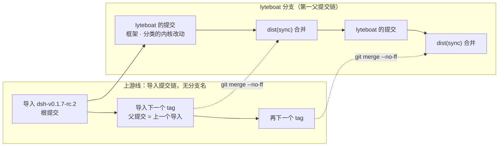
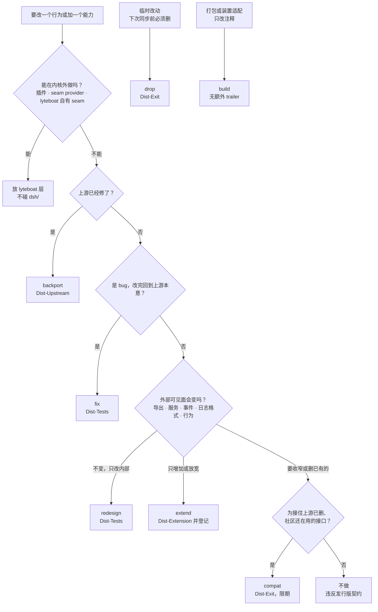
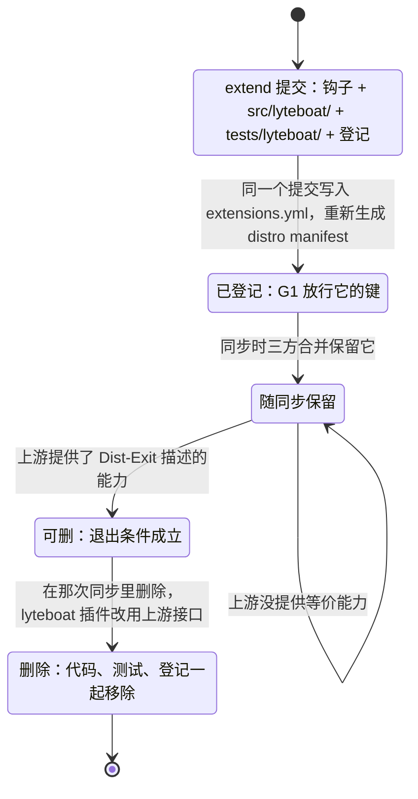

# lyteboat 发行版：内核、上游线、闸门与同步

> **读者**：熟悉参考实现（Python 前身）、刚接触 dsh（DeepSeek Harness）的工程师。第一次读，先看 §0.6 的术语表。
>
> **范围**：本文讲发行版这一层：lyteboat 拥有哪些 dsh 包（内核），怎么从上游 tag 导入它们，怎么改它们，怎么证明改完仍与官方兼容，以及怎么跟进上游的新 tag。lyteboat 自己的插件与 agent 见 `docs/01-architecture.md` 和 `docs/03-agent-development.md`。
>
> **路径写法**：不带前缀的路径相对仓库根。`up:` 开头的路径相对跟踪版本的上游 checkout，即 `dsh-v0.1.7-rc.2`（上游提交 `477b4f42`，`dsh.upstream.json`）。
>
> **数字出处**：标 **[实跑]** 的输出都在本文对应的代码上执行过：临时的 `LYTEBOAT_HOME`/`DSH_HOME`，`DSH_TELEMETRY_DISABLED=1`，脚本化模型，G4–G6 的安装树放在单独的 `$LYTEBOAT_DIST_CACHE`；没有用真实 key。复现方法见 §6.12。

---

## 0. 一页纸总结

### 0.1 lyteboat 作为发行版承诺什么

- **内核归 lyteboat。** lyteboat 拥有 dsh 14 个核心包的源码，放在 `dsh/`，清单是 `dsh/kernel.json`。这些包保留上游发布时的 `@deepseek-ai/dsh-*` 包名。
- **其余原样。** 上游 0.1.7-rc.2 一共 312 个 dsh 包，内核之外的 298 个 lyteboat 不改源码。lyteboat 工作区从 npm 安装其中 265 个（它的依赖闭包），全部是 `0.1.7-rc.2`（§0.4）。
- **承诺范围**（`dsh-compat/COMPAT.md` §1）：
  - 针对 `dsh.upstream.json` 钉住的版本，即 `0.1.7-rc.2`。
  - 按该版本写的插件，从 lyteboat 内核看到的**协议、接口、行为**与官方包相同。
  - 唯一例外是登记过的追加项（§4）。
  - 对内核之外的包，lyteboat 只承诺"不打补丁"。
  - 明确**不承诺**的东西见 §4.6。

### 0.2 为什么要这么重

lyteboat 同时要两样东西：

1. **能直接改内核。** 参考实现的实践（技能路由、工具可见性、会话状态……）要落到 harness 层，不能只在外面绕。
2. **生态照常跑。** 官方插件和社区插件不改一行就能跑在 lyteboat 上。

只满足第一条就是一个普通 fork，生态会分裂；只满足第二条，lyteboat 就只是 dsh 的使用者。

lyteboat 的解法照搬 Android 的 CDD/CTS：`COMPAT.md` 写"必须成立什么"，`scripts/dist/` 和 `dsh-compat/tests/` 证明它成立（`dsh-compat/COMPAT.md` 开头一段）。

### 0.3 五个机制与仓库落点

| 机制 | 在仓库里是什么 | 本文 |
|---|---|---|
| 原样上游 + 显式差量 | 每个上游 tag 一个导入提交（带 `Dist-Import` trailer），第一个导入就是整段历史的根；lyteboat 的改动是其上的提交，靠三方合并跟进新 tag | §2 |
| 差量分类 | 七类 `Dist-Change` + 每类必需的 trailer；`pnpm run dist:delta -- --check` 校验 | §3 |
| 稳定面清单 + 机器检查 | `dsh-compat/contract/dsh-0.1.7-rc.2/` 契约快照 + `extensions.yml` 登记表；每次 `pnpm run test` 在构建之后跑 G1 | §4 |
| 兼容性由测试定义 | G1–G6 六道兼容闸门，加上 persistence、typert 两道叠加闸门 | §6 |
| 扩展点优先于补丁 | 上游文件只加几行 `// lyteboat:` 钩子，逻辑放在上游没有的 `src/lyteboat/` | §3.5 |

### 0.4 数字一览

| 项 | 值 | 出处 |
|---|---|---|
| 跟踪的上游 | dsh `0.1.7-rc.2`，tag `dsh-v0.1.7-rc.2`，上游提交 `477b4f42` | `dsh.upstream.json` |
| 内核包数 | 14 | `dsh/kernel.json` |
| 上游包总数 / 不在内核的 | 312 / 298，全部是 `@deepseek-ai/dsh*` | `ls up:packages/*/*/package.json` |
| 工作区实际装的 npm dsh 包 | 265 个，全部 `0.1.7-rc.2` | **[实跑]** `ls node_modules/.pnpm \| grep -o '^@deepseek-ai+dsh[^@]*' \| sort -u \| wc -l` |
| lyteboat 在内核上的差量 | agent-loop：上游文件 2 个 +49/−0，自有文件 4 个 +268/−0；session：上游文件 1 个 +9/−2，自有文件 2 个 +98/−0；session-persistence：自有测试 1 个 +33/−0；session-controller：上游文件 5 个 +66/−46（2 个是重新生成的 Typert 文件，`build` 与 `extend` 各重新生成一次），自有文件 2 个 +114/−0；其余 10 个包没有差量 | **[实跑]** `pnpm run dist:delta` |
| 登记的扩展 | 4 个：`agent-loop-intake`、`agent-loop-pre-assemble`、`session-append-ignorable`、`session-controller-prompt-source`，共 10 个契约键 | `dsh-compat/contract/extensions.yml` |
| G1 | `G1 contract vs dsh 0.1.7-rc.2: 21 registered difference(s), 0 failure(s)` | **[实跑]** |
| `pnpm run test` | 212 个文件，3644 通过，1 跳过（含 G1、G2） | **[实跑]** |
| G2 | 133 个测试文件：上游 128 个，lyteboat 放在内核包 `tests/lyteboat/` 下的 5 个 | 按 `vitest.config.ts` 的 glob 与排除表静态计数 |
| `pnpm run dsh-compat` | 3 个文件、32 个测试全部通过：G4 7 个，G5 23 个，G6 2 个；冷树上约 3 分钟 | **[实跑]** |
| `pnpm run dist:delta -- --check` | 退出码 0，无输出 | **[实跑]** |
| persistence | 62 根、587 类型、0 差异，约 30 秒 | **[实跑]** |
| typert | dsh-llm、dsh-api-session-controller，0 失败，约 15 秒 | **[实跑]** |
| G3 | 188 个依赖内核的上游包、946 个测试文件；原样 tag 的基线 21610 个通过；lyteboat 内核上 0 个回归 | **[实跑]** `pnpm run dist:overlay <checkout> g3` |

### 0.5 最重要的五条规则

1. **内核外优先。** 新行为先做成 lyteboat 插件、seam provider 或 lyteboat 自有 seam；实在不行才改内核，而且内核只收 harness 级能力（`CLAUDE.md`「Architecture boundaries」的 **Outside the kernel first**）。
2. **内核只通过分类提交改变。** 碰 `dsh/<group>/<package>/` 的提交必须带 `Dist-Change` 和该类要求的 trailer（同节 **The kernel changes only by classified commits**）。
3. **契约只增不减，而且要登记。** 删除必定失败；改动（只能是放宽）和追加都必须在 `extensions.yml` 登记，并由一个 `extend` 提交点名（同节 **The contract only grows, by registration**；实现是 `scripts/dist/contract-check.ts` 的 `compareContract`）。
4. **上游测试永不修改。** 环境差异只在测试装置里适配（同节 **Upstream's tests are never edited**）。
5. **历史不改写。** 跟进上游用合并；不 force-push，不改写已推送的提交（`CLAUDE.md`「Unattended runs」、「Upstream sync (the distribution)」）。

### 0.6 与参考实现对照，以及术语

| 话题 | 参考实现 | lyteboat |
|---|---|---|
| 引擎代码的归属 | `core/` 是自己写的引擎，规则是 core 自包含（参考实现 `CLAUDE.md`「Architecture boundaries」） | 引擎是 dsh 的 14 个包。源码在 `dsh/`，但包名和契约属于上游；lyteboat 的改动都是登记过的差量 |
| 组件怎么接起来 | `Lifecycle` / `Plugin` 协议 + `AppContext`，由组装根装配（参考实现 `CLAUDE.md`「Lifecycle vs Plugin」） | cordis 插件 + `ctx` 上的服务 + `inject`；组合是 YAML 数据（profile、bundle、patch） |
| 版本号 | `x.y.z.n`，用 release commit 的短 SHA 作下次发版的边界（参考实现 `docs/RELEASING.md`） | 仓库里保持上游版本号，打包时才盖 `+lyteboat.<commit>`（§8.1）；差量的边界是最近一次 `Dist-Import` 提交 |
| "兼容"指什么 | wheel 使用方看到的公开 API（发版说明里的 Breaking Changes） | 与同版本官方 dsh 在协议、接口、行为上一致，由 G1–G6 机器证明 |
| 发版产物 | wheel + 发版说明 | 还没有发版：仓库没有 git tag，29 个 `@lyteboat/*` 包（`lyteboat/` 下 28 个，加上 `examples/agents/finance`）都是 `0.0.1`、`private: true`。业务 agent 的发布是另一回事：agent 目录里的发布锁 `agent.release.json`（§9.3） |

正文直接用到的 dsh 词汇：

| 词 | 意思 | lyteboat 里的例子 | 出处 |
|---|---|---|---|
| cordis 插件、服务、`inject` | cordis 是 dsh 底下的插件框架。插件是带 `apply(ctx)` 的对象或 `Service` 子类；服务在 `ctx` 上占一个稳定的键（`ctx.llm`、`ctx.sessions`）；`inject` 列出依赖的服务，服务不在，插件就停在等待状态 | `lyteboat/plugins/distro/src/index.ts` 用 `super(ctx, 'lyteboatDistro')` 发布服务；第三方插件以 `inject = ['lyteboatDistro']` 依赖它（§4.4） | `up:docs/cordis-primer.md`「Cordis In Five Ideas」 |
| 事件与派发模式 | 服务用声明合并声明事件名，按 `emit`、`waterfall`、`parallel`、`serial`、`bail` 之一派发；**派发模式是事件公开契约的一部分** | 契约快照 `events.json` 为每个事件记下模式，G1 比对它（§4.1） | `up:docs/cordis-primer.md`「Dispatch Modes」 |
| waterfall 与 `next()` | 环绕式中间件：监听器收到 `(...args, next)`，调 `next()` 交给下一个，不调就短路后面所有监听器 | 内核在 `dsh/core/agent-loop/src/agent.ts:279-282` 派发 `lyteboat/intake`，链尾的默认值是 `{ kind: 'pass' }` | `up:docs/cordis-primer.md`「Cordis Waterfall Semantics」 |
| seam、provider | seam 是一个可替换的能力：一个服务定义（占 `ctx.<key>`）、一个或多个 provider、一个或多个消费方 | `ctx.llm` 由内核 `dsh-llm` 定义，npm 上的 `dsh-llm-deepseek` 是 provider（它对 `dsh-llm` 是 peer 依赖） | `up:docs/glossary.md`「capability-seam」 |
| profile、bundle、patch、行（row） | bundle 是作者分发的组合，profile 是用户用 `--profile <名字>` 启动的东西；patch 是一个 YAML 数组，里面是插件"行"（`id` + 包名 `name` + 可选 `config`/`disabled`），或按 `id` 覆盖已有行、用 `- insert:` 插入新行的操作 | `lyteboat/bundles/host/cordis.patch.yml` 先按 `id` 覆盖 dsh-base 的两行，再用 `- insert:` 插入以 `lyteboat-distro` 开头的 lyteboat 服务行 | `up:docs/user/develop/basic/publish.md`「Two concepts, two manifests」「The loading order」 |
| 准入（admission） | `dsh-app-boot` 在启动时读每一行所属包的磁盘清单，`@deepseek-ai/dsh*` peer 与运行版本不匹配就禁用该行 | 这条规则让 lyteboat 包的非内核 dsh peer 必须写精确版本（§8.2） | `up:packages/boot/app-boot/src/plugin-compatibility.ts:61-88` |
| Typert Host face、Remote client | 上游生成器从 TypeScript 类型生成的运行时反射产物：包导出 `./typert`（Host face）和 `./remote`（Remote client），文件是 `lib/typert.*` | dsh-llm 的 `lib/typert.host.{js,d.ts}`、`lib/typert.remote-client.{js,d.ts}`（§5.3） | `up:packages/typert/generator/README.md`；`up:packages/typert/protocol/README.md` |
| 契约键 | 契约快照里一条 JSON 路径，用 `' › '` 连接 | `events › @deepseek-ai/dsh-agent-loop › lyteboat/intake` | `scripts/dist/contract-check.ts` 的 `KEY_SEPARATOR` |
| 内核、原样层、晋升 | lyteboat 拥有源码的 dsh 包；从 npm 原样安装的其余 dsh 包；把原样层的包收进内核 | 见 §1、§5 | `dsh/kernel.json`；`CLAUDE.md`「Architecture boundaries」的 **Promotion** |

---

## 1. 三层包与同名接管

### 1.1 三层

| 层 | 是什么 | 在哪里声明 | 怎么解析 | 怎么跟上游 |
|---|---|---|---|---|
| **内核** `dsh/` | lyteboat 拥有的 14 个 dsh 包，保留 `@deepseek-ai/dsh-*` 包名：`llm/llm`、`core/session`、`core/system-prompt`、`core/tools`、`skill/skill`、`core/agent`、`core/agent-loop`、`session/session-projection`、`session/session-persistence`、`session/session-persistence-jsonl`、`compaction/compaction`、`compaction/compaction-basic`、`test-support/agent-loop-testkit`、`api/session-controller` | 权威清单是 `dsh/kernel.json`。`pnpm-workspace.yaml:16-30` 的 overrides 和根 `tsconfig.json` 的 references 是它的镜像；`scripts/upstream-pins.spec.ts:31-34` 核对 overrides 与清单一致 | overrides 把每个内核包名改写成 `workspace:*`；lyteboat 自己的清单也写 `workspace:*` | 每个 tag 一个导入提交，三方合并（§2） |
| **npm 原样层** | 上游其余 298 个 dsh 包都不改源码；工作区实际装其中 265 个：seam 与 provider、可选插件、基础设施、Web 产品等 | `pnpm-workspace.yaml:79-179` 的 `catalogs.dsh`（100 项）、`:180-185` 的 `catalogs.cordis`、`dsh.upstream.json` | `.pnpmfile.cjs` 把所有非内核的 `@deepseek-ai/dsh*` 依赖改写成 `dsh.upstream.json` 里的版本 | 改 catalog、版本钉文件和精确 peer（§7、§8） |
| **lyteboat 层** `lyteboat/` | `@lyteboat/*`：`apps/cli`、`bundles/{host,business-base,try,serve,eval,web,studio}`、`plugins/{distro,agent-catalog,eval-runner,web-pages,chat-api,tool-policy,aux-llm,request-context,intake-guard,skill-router,a2ui,history-import,agent-inspector,session-index,run-metrics,studio-auth,studio-api,studio-web}`、`core/contracts`、`tooling/testing`，共 28 个（`CLAUDE.md`「Repository layout」）；示例 agent `examples/agents/finance` 在这一层旁边 | 工作区 glob `lyteboat/*/*`（`pnpm-workspace.yaml:7`）；示例 agent 是 `examples/*/*`（`:8`） | `workspace:*` | 不适用 |

**一个包归哪一层？** 规则见 `CLAUDE.md`「Architecture boundaries」的 **Promotion**，满足任一条就进内核：

- lyteboat 必须**改它的实现**。只是配置它，或用 provider 替换它，都不算。
- 它是**每个 lyteboat 组合启动都离不开的能力**。llm、skill 与 tools、sessions 一样属于这一类。

原样层要定制时，只走配置、provider、bundle 与 patch 层或 lyteboat 插件，永远不改源码。晋升的做法见 §5。

### 1.2 同名接管：怎么让整张依赖图只有一份内核

同名接管靠四个机制配合。

**机制一：`overrides`**（`pnpm-workspace.yaml:12-30`）把 14 个内核包名都改写成 `workspace:*`，而且作用于整张依赖图。

为什么必须是 override，而不是 lyteboat 自己在 dependencies 里写 `workspace:*`？因为引用内核的不只是 lyteboat 的包：

- dsh-base 的服务行按包名挂载，例如 `up:packages/bundle/base/cordis.patch.yml:35` 的 `name: '@deepseek-ai/dsh-llm'`。
- npm 上的包以 **peerDependencies** 声明内核包：`dsh-llm-deepseek` 对 `dsh-llm` 是 peer；`dsh-tool-skill` 对 `dsh-llm`、`dsh-skill`（以及 `dsh-agent`、`dsh-tools`）都是 peer。
- 社区插件同样以 peer 形式依赖内核包。

只有 override 能改写整张图里每一处对这些名字的解析，peer 也不例外。

**机制二：`.pnpmfile.cjs` 钉其余一切**（`.pnpmfile.cjs:1-14`）。上游发布的 dsh 包彼此之间用 caret 范围互相依赖，不钉的话一次干净安装会漂到更新的预发布版本。`readPackage` 钩子把每个非内核的 `@deepseek-ai/dsh*` 依赖改写成 `dsh.upstream.json` 的 `dsh`，cordis 各包改写成它的 `cordis` 表；内核包名跳过，因为钩子在 overrides 之后运行，钉它们会撤销路由。


**机制三：公开提升**（`pnpm-workspace.yaml:48-56`）。`publicHoistPattern` 把 `@deepseek-ai/*` 和 `@lyteboat/*` 提升到根 `node_modules`，原因有两个：

- agent 目录（`lyteboat try --agents`、`lyteboat serve --agents`、`lyteboat eval --agents`、`lyteboat web --agents`、`lyteboat studio --agents`）里的行用裸包名，从 agent 目录向上查找；
- 组合测试从仓库根解析行。

pnpm 的隔离布局下，只有提升到根的包才能被这两种查找找到。所有包都被机制二钉在同一个版本，所以提升不会产生版本冲突。

**机制四：`rolldown` 钉版本**（`pnpm-workspace.yaml:31-33`）。把打包器钉在上游 lockfile 的 `1.1.1`，未改动的内核包就能构建出与 npm 发布物逐字节相同的 bundle。这是 G4–G6 能做"两棵树只差内核"对照的前提（§6.6）。

**谁守着这些配置？** `scripts/upstream-pins.spec.ts` 属于 vitest 项目 `source`（`vitest.config.ts:25` 收 `scripts/**/*.spec.ts`），`pnpm run test` 跑它，CI 每次都跑。它断言：

- dsh catalog 每一项都是 `dsh.upstream.json` 的版本（`:19-23`），cordis catalog 同理（`:25-29`）；
- overrides 恰好路由内核（`:31-34`）；
- dsh catalog 不含任何内核包（`:36-38`）；
- lyteboat 包的 dsh peer 规则成立（`:40-54`，见 §8.2）。

### 1.3 例子：证明只有一个实例

**[实跑]** 从仓库根执行：

```console
$ readlink node_modules/@deepseek-ai/dsh-llm node_modules/@deepseek-ai/dsh-agent-loop
../../dsh/llm/llm
../../dsh/core/agent-loop
$ ls node_modules/.pnpm | grep -cE '^@deepseek-ai\+dsh-(llm|session|system-prompt|tools|skill|agent|agent-loop|session-projection|session-persistence|session-persistence-jsonl|compaction|compaction-basic|agent-loop-testkit|api-session-controller)@'
0
```

第二条命令输出 0：store 里没有任何内核包的 npm 副本。

再把 `node_modules/`、`lyteboat/`、`dsh/` 下所有名为内核包名的符号链接都数一遍，看它们指向哪里。**[实跑]**（`$SCRATCH` 是任意临时目录）：

```console
$ names=$(node -p "Object.keys(require('./dsh/kernel.json').packages).map(n => n.split('/')[1]).join(' ')")
$ for n in $names; do find node_modules lyteboat dsh -path "*/node_modules/@deepseek-ai/$n" -type l; done > $SCRATCH/kernel-links.txt
$ wc -l < $SCRATCH/kernel-links.txt
504
$ xargs -a $SCRATCH/kernel-links.txt -n1 readlink -f | grep -vc "^$PWD/dsh/"
0
```

504 个链接，没有一个落在 `dsh/` 之外。

**运行时装进来的插件也一样。** G5 用 `dsh plugin --profile headless add` 把 23 个社区插件分别装进官方树和 lyteboat 树的 headless profile；`dsh-compat/tests/canaries/g5.spec.ts` 的 `kernelCopiesInProfile` 列出 profile 自己的 store 里的内核包副本，并断言结果为空（`:70`）。上游文档说的是同一条解析规则："peers present in the running dsh's runtime resolution use the installation's copy"（`up:docs/user/develop/basic/publish.md:103`，上下文是本地路径链接进来的插件）。

### 1.4 三种插件怎么用上 lyteboat 的内核

| | 社区插件（不认识 lyteboat） | lyteboat 自己的插件 | 想用 lyteboat 扩展的第三方插件 |
|---|---|---|---|
| 怎么写 | 按官方 dsh 写，peer 依赖 `@deepseek-ai/*` | 工作区包，内核 peer 写 `workspace:*`；类型直接来自 `dsh/` 源码 | 同社区插件，另加 `inject: ['lyteboatDistro']`；agent-loop 两个扩展的类型从 `@lyteboat/contracts` 引，`LyteboatAppendOptions` 从 `@deepseek-ai/dsh-session` 引（`dsh-compat/COMPAT.md` §4） |
| 自动得到 lyteboat 的内部改进（fix、redesign、compat） | 是 | 是 | 是 |
| 能用追加能力（extend） | 不用，也不受影响 | 能 | 能 |
| 放到官方 dsh 上 | 照常工作 | 不能（本来就是 lyteboat 的一部分） | 停在 `pending (waiting for service: lyteboatDistro)`，不会半工作 |

第三种插件的实跑例子见 §4.4。

---

## 2. 内核怎么导入：上游线

### 2.1 导入提交

**规则**（`CLAUDE.md`「Upstream sync (the distribution)」的 **The upstream line.**）：

- 每个 tag 的内核是**一个导入提交**，由 `pnpm run dist:import <checkout>` 写出。
- 它的树里只有 `dsh/<dir>/`：
  - 文件逐字节来自 tag；
  - `package.json` 用 npm 为这个版本发布的清单；
  - `tsconfig.json` 的 references 只保留内核内的包。
- **第一个导入是整段历史的根。** 在还没有任何提交的仓库里（unborn `HEAD`）运行 `dist:import`，它写出一个没有父提交的导入提交，并提示用 `git switch -c <分支> <导入提交>` 从它开出分支。lyteboat 的一切提交都在这个根之上。
- **之后的每个导入以上一个导入为父提交**（按 `Dist-Import` trailer 找到），不挂在任何分支上；分支用 `git merge --no-ff` 把它合进来。于是下一次同步就是一次普通的三方合并：上一个 tag、新 tag、lyteboat 的提交。

**实现** 在 `scripts/dist/import-upstream.ts`：

| 做什么 | 代码位置 | 为什么 |
|---|---|---|
| `IMPORT_TRAILER = 'Dist-Import'`；`lastImport()` 用 `git log --grep=^Dist-Import: ` 找从 `HEAD` 可达的最近一次导入 | `:51`、`:63-68` | 不需要分支名，就能找到上游线的末端 |
| unborn `HEAD` 上 `lastImport()` 返回 `undefined`，不调用 `git log` | `:54-56`、`:65`；测试 `scripts/dist/import-upstream.spec.ts` | `git log` 对不指向提交的修订号以 128 退出；返回 `undefined` 让第一个导入成为根提交 |
| 要求 checkout 的 `HEAD` 正好在一个 tag 上（`git describe --tags --exact-match HEAD`） | `:173` | 导入提交的标题和 `Dist-Import` 值就是这个 tag |
| 在 `$LYTEBOAT_DIST_CACHE` 下用 npm 装一棵该版本的原版树（`vanillaTree('import', …)`） | `:176`；`scripts/dist/trees.ts:123-129` | 发布清单只能从 registry 拿到，所以导入需要能访问 registry |
| `package.json` 取 npm 发布的清单 | `:136-138` | 上游源码里的 `workspace:` 范围要经过 `pnpm publish` 解析；不用发布清单，lyteboat 工作区装不上 |
| 包根目录的每个 `tsconfig*.json` 只留指向内核包和本包兄弟配置的 references，有浏览器面的包再去掉 `tsconfig.client.json` | `:80-110`、`:139-140` | 指向原样层包的引用在 lyteboat 里没有源码可引；浏览器面 lyteboat 不编译（§5.4） |
| 包若导出 `./typert` 或 `./remote`，拷入发布的 `lib/typert.*` | `:112-118`、`:128` | 这些文件只能由上游全仓分析生成（§5.3） |
| 包若在清单里声明 `dsh.client`，拷入发布的 `lib/client.js` 和 `lib/types/client/` | `:127`、`:129`；`scripts/dist/client-face.ts` | 上游的客户端打包预设在 lyteboat 里跑不了（§5.4） |
| 按工作区里的 `dsh/kernel.json` 决定导入哪些包 | `:121`；`scripts/dist/kernel.ts` 的 `kernelPackages` | 晋升先改清单，再对同一个 tag 导入一次（§5.2） |
| 用 `git add --all --force` → `write-tree` → `commit-tree [-p <上一次导入>]` 生成提交，不经工作区 | `:148-161` | `--force` 保证 lyteboat 的 `.gitignore` 不会漏掉 tag 里的文件 |
| 提交信息写 `Dist-Import: <tag>` 与 `Dist-Upstream-Commit: <sha>`，之后可跟 `--trailer "Key: value"` 传入的额外 trailer | `:181-196` | 前者给下一次导入找父提交，后者记录精确的上游提交 |
| 树与上一次导入相同则打印 `nothing to merge` | `:198-201` | 上游这个 tag 没动内核时，不产生空合并 |
| 打印下一步：有父提交时是 `git diff --stat <父> <新>` 和 `git merge --no-ff <新>`；unborn `HEAD` 上是 `git switch -c <分支> <新>`；仓库已有提交但没有导入时是 `git merge --no-ff --allow-unrelated-histories <新>` | `:71-78` | git 拒绝往一个没有提交的分支做 `--no-ff` 合并 |

跟踪版本的导入提交信息就是工具写出的模板。**[实跑]** `git log -1 --format=%B --grep='^Dist-Import: '`：

```text
dist(import): dsh-v0.1.7-rc.2 kernel

The 14 kernel packages of deepseek-ai/deepseek-harness at dsh-v0.1.7-rc.2, as
scripts/dist/import-upstream.ts writes them: every file byte for byte, except
package.json (the manifest npm publishes for this version) and the tsconfig
files (references limited to kernel packages and the package's own Node-face
configs); a package with a Typert Host face or Remote client also carries its
published lib/typert.* files, and one with a browser face its published
lib/client.js and lib/types/client/.

Dist-Import: dsh-v0.1.7-rc.2
Dist-Upstream-Commit: 477b4f420553e8a52c2fbccc464d7561b239c443
```

### 2.2 历史的形状



- 分支的第一父提交链从根导入开始；之后的导入只作为同步合并的**第二个父提交**出现。
- 列出整条上游线：`git log --format='%h %p %s' --grep='^Dist-Import: '`。每一行的父提交就是上一个导入，最后一行没有父提交。
- 同一个 tag 可以导入不止一次：晋升把新包加进清单后，对同一个 tag 再导入，得到一个只多出新包的导入提交（§5.2）。

### 2.3 为什么是三方合并，而不是 rebase 或补丁文件

| 方式 | 代表 | 代价 |
|---|---|---|
| rebase | OpenShift | 每次同步改写历史，违反"不 force-push" |
| 补丁文件 | Electron | 要一套导入导出工具，冲突发生在补丁文本上 |
| **合并（lyteboat 采用）** | git-buildpackage | 不改写历史；git 做三方合并（旧 tag、新 tag、lyteboat 分支）；冲突就在代码里 |

合并式的另一个好处：lyteboat 在内核上的全部差量，随时可以用一条 `git diff` 看到。**[实跑]**：

```console
$ git diff --stat "$(git log -1 --format=%H --grep='^Dist-Import: ')" HEAD -- dsh/
 dsh/core/agent-loop/src/agent.ts                   |  46 +++++++++
 dsh/core/agent-loop/src/index.ts                   |   3 +
 dsh/core/agent-loop/src/lyteboat/intake-reply.ts   |  58 ++++++++++++
 dsh/core/agent-loop/src/lyteboat/step-hooks.ts     |  64 +++++++++++++
 dsh/core/agent-loop/tests/lyteboat/intake.spec.ts  | 103 +++++++++++++++++++++
 .../agent-loop/tests/lyteboat/pre-assemble.spec.ts |  43 +++++++++
 dsh/core/session/src/index.ts                      |  11 ++-
 dsh/core/session/src/lyteboat/append-ignorable.ts  |  40 ++++++++
 .../tests/lyteboat/append-ignorable.spec.ts        |  58 ++++++++++++
 dsh/kernel.json                                    |  18 ++++
 .../tests/lyteboat/reopen-ignorable.spec.ts        |  33 +++++++
 dsh/tsdown.config.ts                               |  21 +++++
 12 files changed, 496 insertions(+), 2 deletions(-)
```

`dsh/kernel.json` 和 `dsh/tsdown.config.ts` 属于发行版自身，不在任何内核包目录里；其余 10 个文件分属 agent-loop、session、session-persistence 三个包，逐包的统计见 §0.4。`pnpm run dist:delta` 把同一份差量拆成"上游文件里的改动"和"lyteboat 自有文件"两列（§3.3）。

---

## 3. 改动分类与提交约定

### 3.1 先问：能不能不碰内核

这是 §0.5 的第一条规则。

- 能在内核外做的，放 lyteboat 层。
- 内核只接 harness 级能力，从不接业务词汇（资产、人设、产品文案都在 `examples/agents/*`，`CLAUDE.md`「Architecture boundaries」的 **Framework packages stay domain-neutral**）。
- 能折进已有信封的事实（`tool/result.meta`、消息的 `source`），不开新的内核入口（同节 **Model-visible ⟺ logged**、**A new session event type is proven reopenable before it ships**）。

改内核是一个设计决定：先写明为什么放不到外面、属于下面哪一类，并在动手前和维护者确认（`CLAUDE.md`「Workflow」的 **Task types**）。



### 3.2 七类改动

机器可读的定义是 `scripts/dist/delta-report.ts:30-38` 的 `CHANGE_CLASSES`。

| 类 | 含义 | 契约影响 | 同步时怎么处理 | 代码要求的 trailer | 惯例上还带 |
|---|---|---|---|---|---|
| `backport` | 提前拿来的上游修复 | 无 | 基线包含它之后变成空改动，删除 | `Dist-Upstream` | — |
| `fix` | lyteboat 修的内核 bug，行为回到上游本意 | 无 | 上游也修了就删 | `Dist-Tests`（先失败后通过的回归测试） | — |
| `extend` | 追加能力或扩展点 | 只增（含放宽签名），并在 `extensions.yml` 登记 | 保留，直到上游提供等价能力 | `Dist-Extension` | `Dist-Contract`、`Dist-Exit`、`Dist-Tests`、`Dist-Upstream` |
| `redesign` | 内部重写：几行钩子加一个 `src/lyteboat/` 模块 | 无，由 G1–G6 证明 | 保留；上游对被替换逻辑的改动要移植过来 | `Dist-Tests` | — |
| `compat` | 为还在用的社区插件保留上游已删的接口 | 追加（旧接口） | 到期删除 | `Dist-Exit` | 在 `COMPAT.md` §5 与 `Dist-Exit` 写到期版本，即某个 dsh release |
| `drop` | 临时改动（生成物、试验开关） | 无 | 下次同步前必须删除 | `Dist-Exit` | — |
| `build` | 打包与装置适配、内核里只改注释 | 无 | — | 无 | — |

适配工作几乎都在内核外（根配置、`dsh-compat/tests/upstream-harness`），所以 `build` 类很少碰 `dsh/`。`COMPAT.md` §5 没有列出任何 `compat` 改动。

### 3.3 trailer：哪些是机器强制，哪些是惯例

`pnpm run dist:delta -- --check`（`scripts/dist/delta-report.ts:8-15`、`:64-86`）强制以下四条：

1. 第一个导入之后，每个碰内核包目录的**非合并**提交都带 `Dist-Change`，而且是已知类别（`:51` 用 `--no-merges`，`:72-76`）。导入提交本身跳过（`:70`）。
2. 该类别要求的 trailer 存在（`:77-78`）。
3. 每个 `Dist-Extension` 的 id 都在 `extensions.yml` 里（`:79-81`）。
4. `extensions.yml` 里每个 id 至少被一个提交点名（`:84`），所以不会有从未落地的登记。它读的范围是"第一个导入..HEAD"（`:143-145`），点名过某条登记的提交永远在范围内；代码删掉而登记还留着的情况由 G1 的 stale 规则拦住（§4.2）。

它**不检查**的：

- `Dist-Contract` 是否存在，`extend` 是否带 `Dist-Exit`。这两项是惯例（`CLAUDE.md`「Architecture boundaries」的 **The kernel changes only by classified commits**："wherever the contract or an exit condition is involved"）。
- **合并提交**。同步或晋升的合并提交里如果夹带了 `dsh/<pkg>/` 下的 lyteboat 改动，这个检查看不见。核对办法：让 git 算出"干净合并"的树，再和实际的合并提交比：

  ```sh
  T=$(git merge-tree --write-tree <合并>^1 <合并>^2 | head -1)
  git diff --stat $T <合并> -- $(node -p "Object.values(require('./dsh/kernel.json').packages).map(d => 'dsh/' + d + '/').join(' ')")
  ```

  最后一条没有输出，说明合并自带的改动都在内核包目录之外。
- **浅克隆**。它打印 `delta report: no Dist-Import commit in this shallow clone's history; skipped (fetch more history to report)` 后以 0 退出（`:136-141`）。CI 的默认 checkout 就是浅克隆，所以这项检查不在 CI 里生效（§6.2）。

不带 `--check` 时，`pnpm run dist:delta` 打印一份 Markdown 报告（`:103-131`）：逐包的"上游文件里的改动（文件数、+/−）"与"lyteboat 自有模块（`src/lyteboat/`、`tests/lyteboat/`）"、按类别的提交数、最早的差量日期；逐个提交的类别、扩展、`Dist-Exit`；以及登记表。同步时看的就是 `Dist-Exit` 那一列。

**[实跑]** `pnpm run dist:delta -- --check`：退出码 0，无输出。

**一个 `extend` 提交的 trailer**，以及每个 trailer 回答的问题：

```text
<包名> — extend: <交付什么>

<为什么放不到内核外；上游文件里改了哪几行，逻辑在哪个 src/lyteboat/ 模块；
跑了什么闸门、结果如何>

Dist-Change: extend
Dist-Extension: <extensions.yml 里的 id>
Dist-Contract: additive — <契约上多了什么>
Dist-Exit: <上游做了什么之后它就该删>
Dist-Upstream: none (deepseek-ai/deepseek-harness accepts no external pull requests)
Dist-Tests: dsh/<group>/<pkg>/tests/lyteboat/<name>.spec.ts
```

| trailer | 回答的问题 | 谁读它 |
|---|---|---|
| `Dist-Change` | 这是哪类改动，同步时怎么处理？ | `delta-report` 按类统计与校验 |
| `Dist-Extension` | 它对应登记表里哪一条？ | `delta-report` 双向校验（上面第 3、4 条） |
| `Dist-Contract` | 契约上多了什么？ | 人；机器侧由 G1 按登记表比对 |
| `Dist-Exit` | 上游做了什么之后它就该删？ | 同步的人，以及报告的 exit 列 |
| `Dist-Upstream` | 回馈上游了吗？ | 人；dsh 不接受外部 PR（`up:CONTRIBUTING.md:9`："we cannot accept external pull requests at the moment"），所以写明原因 |
| `Dist-Tests` | 什么测试证明它？ | 人；该测试跑在 G2 项目里 |

一个提交若既碰内核又碰内核外的文件，而内核里那部分只是跟着改注释（例如登记表的路径），就拆成两个提交：内核外的改动一个，内核里的注释改动一个 `Dist-Change: build`。否则 `--check` 会把整件改动当成未分类的内核提交拒绝。

### 3.4 提交标题的格式

| 形式 | 用在哪 | 例子 |
|---|---|---|
| `<包名> — <类别>: <交付什么>`，可带 conventional 前缀 | 碰 `dsh/<group>/<pkg>/` 的提交；类别写在破折号后，与 `Dist-Change` 一致 | `@deepseek-ai/dsh-session — extend: Session.append can mark a record ignorable` |
| `dist(import): <tag> kernel` | 导入提交（工具生成） | `dist(import): dsh-v0.1.7-rc.2 kernel` |
| `dist(sync): track <tag>` | 同步合并 | `dist(sync): track dsh-v0.1.7-rc.2` |
| `dist(promote): …` | 晋升合并 | `dist(promote): <包> enters the kernel` |
| `fix:` / `chore:` / `docs:` | 其他 | — |

提交正文写明能跑什么、跑了哪些闸门、结果如何；提交、PR、代码注释和文件里一律不出现模型标识（`CLAUDE.md`「Unattended runs」）。

### 3.5 钩子写法：上游文件只加几行

lyteboat 在上游文件里的改动都以 `// lyteboat:` 注释开头，逻辑放在上游不存在的 `src/lyteboat/`。**[实跑]** `grep -n 'lyteboat' dsh/core/agent-loop/src/agent.ts dsh/core/session/src/index.ts` 列出全部位置：

| 文件 | 行 | 做什么 | 逻辑所在 |
|---|---|---|---|
| `dsh/core/agent-loop/src/agent.ts` | `:36-37` | 导入 | — |
| 同上 | `:58-59` | `PreparedStep` 多一种 `reply` | — |
| 同上 | `:276-289` | `preStep` 在装配提示词之前派发 `lyteboat/intake` 与 `lyteboat/pre-assemble` | 声明在 `src/lyteboat/step-hooks.ts`（事件在 `:55`、`:62`） |
| 同上 | `:339-362` | `turn()` 把一个 `reply` 当作不发请求的一步：开步、写入、关步 | 写入的节点由 `src/lyteboat/intake-reply.ts` 的 `appendLyteboatIntakeReply` 负责，上游文件里只有一次调用（`:347`） |
| 同上 | `:435-437`、`:441` | 会话还没有 `request/header` 时开新的请求序列 | 一个子句，挨着上游 `toolUpdate` / `toolsChanged` 的条件（§6.6） |
| `dsh/core/agent-loop/src/index.ts` | `:243-245` | 从包根导出扩展的声明 | — |
| `dsh/core/session/src/index.ts` | `:26-27`、`:39-40` | 导入与导出 `LyteboatAppendOptions` | — |
| 同上 | `:729-733` | 放宽 `append` 的签名；尾参数先交给 `lyteboatAppendOptions` 拆开 | `src/lyteboat/append-ignorable.ts:28-36` |
| 同上 | `:756` | 把标记摊进事件信封 | 同上 |

为什么这样写：

- git 的冲突只发生在上游和 lyteboat 都改过的同一段或相邻的行。lyteboat 在上游文件里只动这几行，冲突也就只会落在它们附近（`CLAUDE.md`「Architecture boundaries」："a smaller carried hunk is a cheaper sync"）。
- `src/lyteboat/` 与 `tests/lyteboat/` 是上游不存在的目录，永远不会冲突。这是 Brave 的 `chromium_src` 手法在 TypeScript 里的样子。
- 内核里的 lyteboat 测试只用内核和上游自己的测试辅助，不引 `@lyteboat/*`（`CLAUDE.md`「Testing」的 **Kernel tests**；`scripts/check-layers.ts` 的 `checkKernel` 强制"内核不认识任何 lyteboat 包"）。

---

## 4. 契约与扩展登记（G1）

### 4.1 契约快照里有什么

快照在 `dsh-compat/contract/dsh-0.1.7-rc.2/`，仓库里只保留跟踪版本的这一份。它对应 `COMPAT.md` §2 列出的稳定面；会话写出的 JSONL 文件本身没有快照，由 G6 证明。

| 文件 | 内容 | 规模 **[实跑]** | 比对者 |
|---|---|---|---|
| `api.json` | 每个包、每个导出子路径下的每个导出名及其归一化 `.d.ts` 声明（类与接口逐个成员）；每个包另有 `augmentations`，记 cordis `Context`/`Events` 之外的模块增广 | 14 个包，858 个导出名 | G1 |
| `services.json` | cordis `Context` 上的服务键及类型 | 11 个：`agents`、`agentLoop`、`configuredAgentIdentities`、`compaction`、`llm`、`sessions`、`sessionPersistence`、`sessionProjections`、`skills`、`systemPrompt`、`tools` | G1 |
| `events.json` | cordis 事件、派发模式（emit/serial/parallel/waterfall）、签名 | 29 个 | G1 |
| `config.json` | 每个入口和导出插件类的 `name`、`inject`、schemastery `Config` | 14 个包 | G1 |
| `persistence.json` | 上游 `docs/persistence-schema.json` 的指纹：`sha256`、`formatVersion`、根摘要、类型摘要 | formatVersion 2，62 个根，587 个类型摘要 | overlay `persistence` |

持久化只存指纹：比对只需要摘要，完整的 schema 留在上游。

**快照怎么生成。** `pnpm run dist:snapshot <checkout>`（`scripts/dist/snapshot.ts:38-53`）：

1. 在仓库外装一棵该版本的原版树（需要 registry），对它跑 `scripts/dist/contract-gen.ts`；
2. 写入持久化指纹，读的是 checkout 里的 `docs/persistence-schema.json`；
3. 若 `dsh.upstream.json` 钉住的版本已有快照，**而且与这次的版本不同**，打印两者差异：`contract <旧> → <新>: N removed, N changed, N added`，然后逐键列出（`:20-36`、`:52`）。同版本重写（例如晋升）什么差异也不打印。

### 4.2 G1 的规则

实现在 `scripts/dist/contract-check.ts`。

- **比什么。** lyteboat 工作区构建出的契约，按键逐个与快照比对。键是把 JSON 路径用 `' › '` 连起来的扁平路径（`KEY_SEPARATOR`、`flatten`），例如 `events › @deepseek-ai/dsh-agent-loop › lyteboat/intake › mode`。
- **规则**（`compareContract`，`:88-113`）：
  - 上游有、lyteboat 没有的键 → 失败，**永远**。
  - 值变了的键，或只有 lyteboat 有的键 → 失败，除非某条登记列出了这个键或它的前缀。
  - 登记里列出、却已经没有差异的键 → 失败，报 `stale registration`。这条保证登记表不会比扩展活得更久。
- **输出。** `G1 contract vs dsh <v>: N registered difference(s), N failure(s)`（`:130`）。
- **什么时候跑。** `pnpm run build` 不跑它；`pnpm run test` 先构建，再跑 `contract:check`（`package.json:15`）。

**[实跑]**：

```console
$ node --import tsx scripts/dist/contract-check.ts
G1 contract vs dsh 0.1.7-rc.2: 21 registered difference(s), 0 failure(s)
```

登记了 10 个键，却有 21 个"登记差异"：登记用前缀匹配，而 G1 按成员逐个计数。**[实跑]** 用 `compareContract` 列出的 21 个键按扩展分组：

| 扩展 | 登记的键 | G1 数到的差异 |
|---|---|---|
| `agent-loop-intake` | 5：事件 `lyteboat/intake`，导出 `LYTEBOAT_ASSISTANT_PROVIDER`、`LyteboatIntakeDecision`、`LyteboatIntakeReply`、`LyteboatStepPayload` | 14：事件的 `mode` 与 `signature` 两个；两个类型别名各一个；`LyteboatIntakeReply` 的 `$declaration` 和 3 个成员；`LyteboatStepPayload` 的 `$declaration` 和 5 个成员 |
| `agent-loop-pre-assemble` | 1：事件 `lyteboat/pre-assemble` | 2：`mode`、`signature` |
| `session-append-ignorable` | 2：`Session › append`、导出 `LyteboatAppendOptions` | 3：`append` 的声明变了；`LyteboatAppendOptions` 的 `$declaration` 和成员 `ignorable` |
| `session-controller-prompt-source` | 2：`.` 与 `./types` 两个导出下的 `SessionPromptRequest › sourceFields` | 2：同一个字段在两个导出下各一个 |

**一次失败长什么样。** 每个问题各打一行，写在 stderr（`:124-128`）：

```text
G1 removed: <key>
G1 unregistered addition: <key>
  upstream: (absent)
  lyteboat:     <declaration>
G1 unregistered change: <key>
  upstream: <declaration>
  lyteboat:     <declaration>
G1 stale registration: <extension> lists <key>, which does not differ from upstream
```

加一个扩展时，先不登记跑一遍 G1：它列出的 `unregistered addition` / `unregistered change` 就是要登记的键（§10.2）。

### 4.3 `extensions.yml` 逐字段

登记表是 `dsh-compat/contract/extensions.yml`，`readExtensions()`（`scripts/dist/contract-check.ts:41-54`）读它时校验字段：

| 字段 | 含义 | 谁用它 | 为什么需要 |
|---|---|---|---|
| `id` | 扩展的唯一名，必填且不能重复 | `Dist-Extension` trailer、`delta-report`、`ctx.lyteboatDistro.has(id)` | 把代码、提交、登记、运行时四处连起来 |
| `package` | 扩展所在的内核包 | 差量报告、distro manifest | 同步时知道去哪个包看上游变化 |
| `kind` | `event` \| `api` \| `api-option` \| `service` \| `config` | distro manifest | 第三方插件据此知道扩展的形状 |
| `surface` | 插件看到的是什么，给人读 | `COMPAT.md` §4 的读者 | 契约键说不清行为语义 |
| `contract` | G1 放行的键（前缀匹配） | G1；persistence 闸门只看其中以 `persistence ›` 开头的 | 精确划定"允许不同"的范围；多一个差异都会失败 |
| `exit` | 让它变得多余的上游变化 | 同步的人、差量报告 | 扩展默认是**临时**的；这是删除它的触发条件 |
| `tests` | 证明它的测试 | 人；这些测试跑在 G2 项目里 | 追加的行为也要有测试兜住 |

四条登记：

| id | 包 · kind | 插件看到什么 | 退出条件 | 测试 | lyteboat 里的使用者 |
|---|---|---|---|---|---|
| `agent-loop-intake` | `@deepseek-ai/dsh-agent-loop` · `event` | `lyteboat/intake` waterfall：收件箱认领之后、装配提示词之前派发；`reply` 在一步之内、不发模型请求地回答认领的消息（助手消息的 source provider 是 `lyteboat`）。会话的第一个请求在任何路由上都开新的请求序列 | 上游派发一个装配之前、能不发请求就回答一步的 waterfall（`agent/pre-step` 在装配之后，做不到） | `dsh/core/agent-loop/tests/lyteboat/intake.spec.ts` | `@lyteboat/intake-guard` |
| `agent-loop-pre-assemble` | `@deepseek-ai/dsh-agent-loop` · `event` | `lyteboat/pre-assemble` waterfall：`lyteboat/intake` 放行之后、装配提示词之前派发，所以技能路由和工具激活能影响同一步的请求 | 上游在 `systemPrompt.assemble` 之前派发一个还能改这一步提示词与工具集的事件 | `dsh/core/agent-loop/tests/lyteboat/pre-assemble.spec.ts` | `@lyteboat/tool-policy`、`@lyteboat/skill-router` |
| `session-append-ignorable` | `@deepseek-ai/dsh-session` · `api-option` | `Session.append(type, data, { ignorable: true })` 给本构建不认识的非 surface 类型写 `ignorable: true`，读者不认识这个类型就跳过它，而不是拒绝整份日志；本构建认识的类型（含 surface 类型）要求标记一律拒绝 | 上游给 `Session.append`（或别的写入口）一个设置 `SessionEvent.ignorable` 的办法 | `dsh/core/session/tests/lyteboat/append-ignorable.spec.ts`、`dsh/session/session-persistence/tests/lyteboat/reopen-ignorable.spec.ts` | `@lyteboat/aux-llm`（`lyteboat/aux-llm-call` 记录） |
| `session-controller-prompt-source` | `@deepseek-ai/dsh-api-session-controller` · `api-option` | `SessionPromptRequest.sourceFields`：`prompt` 把调用方的字段并进它追加的用户消息的 source，与控制器自己写的 `kind`、`rpcId`、`clientTimeZone` 并列；设置这三个字段的请求以 `gateway/bad-request` 拒绝，消息不到 agent。Typert 的 Host face 和 Remote client 认这个字段 | 上游让 prompt 能把调用方的字段带到用户消息的 source 上 | `dsh/api/session-controller/tests/lyteboat/prompt-source.host.spec.ts` | `@lyteboat/request-context` 的 `sourceFields()`（S2 起 `/chat` 用它） |

### 4.4 `lyteboatDistro`：把登记表带到运行时

- **为什么需要它。** 装好的构建里没有 `extensions.yml` 和 `dsh.upstream.json`。插件想知道自己是否跑在 lyteboat 上、某个扩展在不在，需要运行时的事实。
- **怎么生成。** `scripts/dist/gen-distro-manifest.ts` 把两个文件编译成 `lyteboat/plugins/distro/src/distro-manifest.ts`：`DSH_BASE = '0.1.7-rc.2'`、`DISTRO_EXTENSIONS` 四条（id、package、kind）。
- **服务。** `@lyteboat/distro` 发布 `ctx.lyteboatDistro`，提供 `dsh`、`extensions`、`has(id)`（`lyteboat/plugins/distro/src/index.ts:16-27`）。
- **挂载位置。** host bundle 把 `lyteboat-distro` 行放在 lyteboat 所有服务行的第一个（`lyteboat/bundles/host/cordis.patch.yml:21-24`）。
- **防过期。** `pnpm run lint` 带 `--check` 跑一次生成器，产物过期就失败（`package.json:14`）。
- **谁 inject 它。** lyteboat 里用到 `agent-loop-intake`、`agent-loop-pre-assemble`、`session-append-ignorable` 的插件都 inject 它：`@lyteboat/tool-policy`、`@lyteboat/skill-router`、`@lyteboat/intake-guard`、`@lyteboat/aux-llm`（各自 `src/index.ts` 的 `static inject`）。放到官方 dsh 上，它们与第三方插件一样停在等待状态。`@lyteboat/chat-api` 经 `sessionController.prompt` 的 `sourceFields` 用 `session-controller-prompt-source`，没有 inject 它；它只挂在 lyteboat 的 serve 组合里（`lyteboat/plugins/chat-api/src/index.ts:100`）。`@lyteboat/eval-runner` 也一样，只挂在 eval 组合里（`lyteboat/plugins/eval-runner/src/index.ts:100`）；`@lyteboat/web-pages` 也一样，只挂在 web 组合里（`lyteboat/plugins/web-pages/src/index.ts:76`）。

**例子：按第三方写法的插件。** 仓库里的 fixture `lyteboat/bundles/try/tests/fixtures/plugins/distro-aware.mjs`：

```js
export const name = 'example-distro-aware'
export const inject = ['lyteboatDistro']

export function apply(ctx) {
  ctx.on('lyteboat/intake', async () => ({
    kind: 'reply',
    plugin: name,
    content: [{ type: 'text', text: `lyteboat on dsh ${ctx.lyteboatDistro.dsh}: ${ctx.lyteboatDistro.extensions.map(extension => extension.id).join(', ')}` }],
  }))
}
```

**[实跑]** 用 §6.12 的脚本（起脚本化模型、临时 `LYTEBOAT_HOME`，再调用构建好的 launcher）：

```console
$ node <临时目录>/scripted-run.mjs try --plugin lyteboat/bundles/try/tests/fixtures/plugins/distro-aware.mjs "hello"
exit=0 requests=0 []
stdout: lyteboat on dsh 0.1.7-rc.2: agent-loop-intake, agent-loop-pre-assemble, session-append-ignorable, session-controller-prompt-source
stderr: lyteboat: session session-5de1ce2b-7853-472c-b261-f6830b152d16
```

脚本化模型收到 **0** 次请求：`lyteboat/intake` 的 `reply` 不发模型请求。作为对照，不带插件的 `try "hello"` 输出 `exit=0 requests=1 [loop]`：一次主循环请求（业务底座关掉了会话标题的旁路请求）。stderr 那一行是会话 id，供 `--session-id` 续写。

放到官方 dsh 上，同一个插件没有 `lyteboatDistro` 可注入，cordis 让它停在 `pending (waiting for service: lyteboatDistro)`，而不是监听一个没人派发的事件（`dsh-compat/COMPAT.md` §4）。

### 4.5 一个扩展的生命周期



- **进内核**：一个 `extend` 提交同时带上游文件的钩子行、`src/lyteboat/` 模块、`tests/lyteboat/` 测试和登记条目；lyteboat 插件要用的新类型从 `@lyteboat/contracts` 再导出（`lyteboat/core/contracts/src/index.ts:49-50`），只放宽已有方法签名的扩展不必再导出。`delta-report --check` 校验 trailer 与登记，G1 放行登记的键，`gen-distro-manifest --check` 保证 `ctx.lyteboatDistro.has(<id>)` 为真。
- **跨同步**：三方合并保留它；上游改了钩子附近的代码时，冲突就落在那几行上。
- **退出**：上游提供了退出条件描述的能力，lyteboat 插件改听上游事件或改用上游接口，在那次同步里删掉钩子、模块、测试和登记条目。漏删登记，G1 的 stale 规则失败；只写登记而没有提交点名，`delta-report` 第 4 条失败。

### 4.6 不承诺的东西

`COMPAT.md` §6 列出 lyteboat **不**承诺与官方一致的五样东西；插件依赖它们，换到 lyteboat 上出了问题，不算 lyteboat 违约：

- 包内模块结构、`lib/` 下的文件名，以及任何从包的 `exports` 够不到的东西：契约只按 `exports` 生成（§4.1），而 lyteboat 在包里加的 `src/lyteboat/` 本来就改变了内部结构；
- 未导出的符号，私有或 `#private` 类成员：G1 只比公开声明；
- 性能特征、时序，以及派发模式本身不规定的事件顺序：G4 的归一化专门去掉计时字段（§6.6）；
- 会话日志和 dsh 文档声明为持久的文件以外的缓存与文件：只有会话日志有 G6 证明；
- 版本字符串：lyteboat 打的包是 `<上游版本>+lyteboat.<commit>`（§8.1）。

---

## 5. 晋升进内核

### 5.1 规则

`CLAUDE.md`「Architecture boundaries」的 **Promotion** 规定，npm 上的 dsh 包在以下任一情况下进入内核：

- lyteboat 必须改它的实现（不是配置它，也不是用 provider 替换它）；
- 它是每个 lyteboat 组合启动都需要的能力。

进了内核，它就受 G1–G3 管；发布 Typert 文件的还受 typert 闸门管（§5.3）。

### 5.2 步骤

以 `<包名>` 表示要晋升的包，`<group>/<pkg>` 是它在上游 `packages/` 下的目录，`<checkout>` 是停在跟踪 tag 上、装好依赖的上游 checkout。

1. 写明它符合上面哪一条。
2. `dsh/kernel.json` 加一行 `"<包名>": "<group>/<pkg>"`（目录与上游 `packages/` 下一致）。
3. `pnpm-workspace.yaml`：overrides 加 `"<包名>": "workspace:*"`，`catalogs.dsh` 删掉它。
4. 根 `tsconfig.json` 的 references 加 `./dsh/<group>/<pkg>`；引用它的 lyteboat 包的 `tsconfig.json` 也加上。
5. 把 lyteboat 各清单里对它的引用（peer、dependencies、devDependencies）都改成 `workspace:*`。`scripts/upstream-pins.spec.ts` 会检查 peer 与 overrides。
6. 以上改动**先不提交**。`pnpm run dist:import <checkout>`：工具按工作区里的 `dsh/kernel.json` 导入，得到同一个 tag 的又一个导入提交，父提交是上一个导入，与它只差新包，以及已有内核包 `tsconfig.json` 里恢复的、指向新包的 references。
7. `git merge --no-ff --no-commit <新导入>`，把第 2–5 步的改动（以及第 8–10 步的产物）一起加进暂存区，以 `dist(promote): <包名> enters the kernel` 为标题提交。路由改动放进合并提交本身，因为路由和源码必须同时生效：只有路由没有源码，overrides 指向一个工作区里还不存在的包，安装解析不了；只有源码没有路由，npm 副本仍在 store 里，接管不成立。代价是这些改动躲过 `delta-report --check`（它跳过合并提交），所以提交后用 §3.3 的 `git merge-tree` 办法确认合并自带的改动都在内核包目录之外。
8. 若它导出 `./typert` 或 `./remote`，确认 `lib/typert.*` 随导入进来了，并跑 `pnpm run dist:overlay <checkout> typert`。若它在清单里声明了 `dsh.client`（有浏览器面），确认 `lib/client.js` 和 `lib/types/client/` 随导入进来了，见 §5.4。
9. `pnpm run dist:snapshot <checkout>` 重写快照。同版本重写时它不打印差异，所以用 `git diff --stat dsh-compat/contract/` 确认只多出新包的几节，没有删除。
10. 若 G2 需要新的环境适配，加进 `dsh-compat/tests/upstream-harness/README.md` 的表格。
11. `pnpm install` 后确认 store 里没有它的 npm 副本：`ls node_modules/.pnpm | grep '^@deepseek-ai+<名字>@'` 应为空。再确认它的依赖没有多出第二份：新包成了自己的 importer，pnpm 按它声明的 peer 解析它依赖的 peer；它的依赖若经 peer 连到它自己没声明的内核包，pnpm 就只为它另装一份那个依赖，从一份导入的错误类对另一份做 `instanceof` 会失败。这时在 `pnpm-workspace.yaml` 的 `packageExtensions` 里给它补上这些 peer（session-controller 补了 dsh-compaction、dsh-system-prompt、dsh-tools）。
12. 跑全部闸门，包括 G3：依赖内核的包集合变了，G3 的基线缓存键随之改变，会自动建一份新基线（§6.4）。

### 5.3 Typert 文件：为什么随导入带进来，以及怎么保证它不过期

**运行时需要它们：**

- `dsh-typert-loader` 导入每个已挂载包的 `./typert`（`up:packages/typert/loader/src/index.ts:40`，`TYPERT_HOST_EXPORT = './typert'`）；
- `dsh-api-remotes` 导入 `@deepseek-ai/dsh-llm/remote`（`up:packages/api/remotes/src/client/index.ts:11`）。

**lyteboat 自己生成不了。** 上游的生成器要分析**整个上游 workspace**：Host face 还反映了其他包合并进 dsh-llm 类型里的声明（`scripts/dist/overlay.ts:253-255` 的注释）。lyteboat 的工作区容纳不了这种分析。

**规则：**

1. 导入时拷入发布的 `lib/typert.*`（`scripts/dist/import-upstream.ts:128`，筛选逻辑是 `scripts/dist/typert.ts` 的 `publishedTypertFiles`）。
2. 每次 `pnpm run build` 都对发布 Typert 文件的包跑 `checkTypert`（`scripts/dist/bundle-kernel.ts:70-89`）：
   - 文件缺了就失败；
   - 在 `HEAD`（同步进行中还有 `MERGE_HEAD`）的历史里找最近一次导入提交；**一个都找不到就直接返回，不做比较**；
   - 找到时，接受条件二选一：`src/` 和 Typert 文件都等于某个导入；或 `dsh/typert.json` 记录的摘要等于当前 `src/` 的摘要（摘要算法是 `scripts/dist/typert.ts` 的 `typertSourceDigest`）。
3. 两者都不满足时，构建抛错，提示去跑 `pnpm run dist:overlay <checkout> typert --write`。
4. `--write` 在上游 checkout 里用 lyteboat 的源码重新生成文件，并把摘要写进 `dsh/typert.json`（`scripts/dist/overlay.ts:264`）。

14 个内核包里发布 Typert 文件的有两个：dsh-llm 和 dsh-api-session-controller，各 4 个（`lib/typert.host.*`、`lib/typert.remote-client.*`）。lyteboat 没有改这两个包的源码，但 session-controller 的 Host face 还带着它引用的内核类型：扩展 `session-append-ignorable` 放宽了 `Session.append`，上游生成器从 lyteboat 源码生成的 `lib/typert.host.js` 因此与发布的不同。晋升后用 `--write` 重新生成，以 `Dist-Change: build` 提交，`dsh/typert.json` 记下两个包的摘要。

第 2 条的摘要只算包自己的 `src/`：别的内核包改了它引用的类型，构建察觉不到，只有 `dist:overlay … typert` 能发现。

CI 用默认的浅克隆（`.github/workflows/ci.yml:26`），浅克隆里找不到导入提交，第 2 条直接返回。所以这项校验只在本地完整克隆上生效；改了 dsh-llm 的 `src/` 却没有重新生成 Typert 文件，CI 不会报错。


### 5.4 浏览器面：按发布的样子带进来

有的 dsh 包同时有 Node 面和浏览器面：清单里声明 `dsh.client`，发布 `lib/client.js`（浏览器打包）和 `./client` 的声明文件 `lib/types/client/`。上游用 `packages/client/tsdown.client.ts` 打包浏览器面，这个预设引用上游仓库自己的脚本，在 lyteboat 里跑不了。lyteboat 只改内核包的 Node 面，所以：

1. 导入时拷入发布的浏览器面文件（`scripts/dist/client-face.ts` 的 `clientFaceFiles`），和 Typert 文件同一套做法；包根目录下所有 `tsconfig*.json` 都做引用规范化，solution 形式的 `tsconfig.json` 不再引用 `tsconfig.client.json`，`tsc -b` 只编译 Node 面。
2. 构建时这类包不用自己的 `tsdown.config.ts`（它用的是上游的客户端预设），改用 `dsh/tsdown.config.ts` 打包 Node 面；同时检查 `src/client/`、`lib/client.js`、`lib/types/client/` 仍等于某个导入，不等就报错。lyteboat 要改浏览器面，得先有构建它的办法。
3. G2 排除这类包的浏览器面测试（`tests/**/*.client.spec.ts`），它们在上游的 DOM 通道里针对浏览器打包运行（`dsh-compat/tests/upstream-harness/README.md`）。

第一个这样的内核包是 `@deepseek-ai/dsh-api-session-controller`。

**lyteboat 自己的浏览器面不走这条路。** lyteboat 的包也可以在清单里声明 `dsh.client`（目前只有 `@lyteboat/web-pages`），但它的浏览器面由 lyteboat 编写、由 lyteboat 构建（`CLAUDE.md`「Repository layout」）：

1. 源码在 `src/client/`（TSX），不在包的 `tsconfig.json` 里。另一份 `tsconfig.client.json` 照 dsh 编译自己客户端包的方式（DOM、React JSX、不带 Node 类型）编译到 `lib/client-tsc/`；根 `tsconfig.json` 引用它，`tsc -b` 一起编（`tsconfig.json:86-88`）。`tsconfig.tests.json` 排除 `lyteboat/plugins/*/src/client/**`，这部分的类型检查归那份配置（`tsconfig.tests.json:27-34`）；knip 对插件也收 `src/**/*.tsx`（`knip.jsonc:30-34`）。
2. `pnpm run build` 的最后一步 `scripts/dist/bundle-clients.ts` 找出 `lyteboat/*/*` 和 `examples/*/*` 下声明了 `dsh.client` 的包（`:41-56`），用 tsdown 把 `lib/client-tsc/client/index.js` 打成 `lib/client.js`：一个 CommonJS 工厂，套在 dsh web 模块加载器的信封 `window.__ModuleLoader__.load({ id, factory })` 里；dsh web 的 9 个平台模块（`react`、`react-dom`、`@deepseek-ai/cordis`、`dsh-client-ui-primitives`、`dsh-client-ui-slots` 等）留给页面提供，其余打进包里（`:28-32`、`:62-93`）。包的 `./client` 导出的 `default` 就是这个文件，`types` 是 `lib/client-tsc/client/index.d.ts`（`lyteboat/plugins/web-pages/package.json:14-18`）。
3. 平台模块表是 `@deepseek-ai/dsh-client-web` 里 `PLATFORM_MODULES` 的一份拷贝：那个包的入口是页面外壳，在 Node 里加载不了。`scripts/dist/bundle-clients.spec.ts` 拿它和安装的声明文件对照（`:7-12`），并断言声明了 `dsh.client` 的只有 `@lyteboat/web-pages`（`:14-16`）。

`@lyteboat/studio-web` 不是 dsh web 里的一个面，不声明 `dsh.client`：它的 `src/client/` 是一个独立的 React 单页应用，`tsconfig.client.json` 只做类型检查（`pnpm run typecheck` 的最后一步，`package.json:13`），`pnpm run build` 的最后一步 `scripts/dist/build-studio-web.ts` 用 Vite 把它打到 `lib/web/`（`package.json:12`），由这个包自己的 Node 面在 `/studio` 下提供（`CLAUDE.md`「Repository layout」）。

---

## 6. 闸门

### 6.1 总表

`dsh-compat/README.md` 的闸门表是原文；下表补上本文对应代码上的结果。

| 闸门 | 证明什么 | 在哪里 | 怎么跑 | 何时 | 结果 |
|---|---|---|---|---|---|
| **G1** 契约 | lyteboat 内核构建具有该版本的契约；每处差异都已登记 | `scripts/dist/contract-check.ts`、`dsh-compat/contract/` | `pnpm run test`（先构建再 `contract:check`）；单独：构建后 `pnpm run contract:check` | 每次改动，CI | 21 登记 / 0 失败 **[实跑]** |
| **G2** 上游测试 | 上游的内核测试原样跑在 lyteboat 源码上并通过 | vitest 项目 `dsh`（`vitest.config.ts:28-40`）、`dsh-compat/tests/upstream-harness/` | `pnpm run test`；单独：`npx vitest run --project dsh` | 每次改动，CI | 133 个文件，在 `pnpm run test` 的 193 文件 / 3459 通过 / 1 跳过之中 **[实跑]** |
| **G3** 跨包 | 依赖内核的官方包，在 lyteboat 内核上仍通过它们自己的测试 | `scripts/dist/overlay.ts` 的 `g3`（`:173-203`） | `pnpm run dist:overlay <checkout> g3 [--match <regex>]` | 每次同步；晋升 | 980 个测试文件，原样 tag 基线 22418 个通过；lyteboat 内核上的一轮本文没有重跑 |
| **persistence** | 上游从 lyteboat 源码推导出的持久化 schema 等于该版本的；`known-event-types.ts` 等于上游生成的 | `overlay.ts` 的 `persistence`（`:94-121`） | `pnpm run dist:overlay <checkout> persistence` | 每次同步；任何可能触及持久化类型的内核改动 | 62 根、587 类型、0 差异 **[实跑]** |
| **typert** | lyteboat 构建用的 `lib/typert.*` 等于上游生成器从 lyteboat 源码生成的 | `overlay.ts` 的 `typert`（`:244-271`）、`scripts/dist/typert.ts` | `pnpm run dist:overlay <checkout> typert [--write]` | 每次同步；任何改动发布 Typert 文件的内核包时 | dsh-llm，0 失败 **[实跑]** |
| **G4** 日志等价 | 同一脚本化运行，官方版本与 lyteboat 写出相同的归一化会话日志 | `dsh-compat/tests/scenarios/` | `pnpm run dsh-compat` | 合入 lyteboat-next 前；每次同步 | 7/7 **[实跑]** |
| **G5** 金丝雀 | 锁定版本的社区插件用 `dsh plugin --profile headless add` 安装后，在两边行为相同，且绑定到 lyteboat 内核 | `dsh-compat/tests/canaries/` | `pnpm run dsh-compat` | 同上 | 23/23 **[实跑]** |
| **G6** 会话往返 | 一方写的会话，另一方续写的结果与写方自己续写的相同 | `dsh-compat/tests/roundtrip/g6.spec.ts` | `pnpm run dsh-compat` | 同上 | 2/2 **[实跑]** |

### 6.2 CI 跑什么

`.github/workflows/ci.yml`：Node 22 和 24 两个矩阵（`:24`），环境变量 `DSH_TELEMETRY_DISABLED: '1'`（`:10-11`），`actions/checkout@v4` 取默认的浅克隆（`:26`），依次运行 `pnpm install --frozen-lockfile`、`pnpm run lint`、`pnpm run typecheck`、`pnpm run test`（`:32-35`）。所以：

- G1、G2 在 CI 里；
- 构建内的 Typert 校验在浅克隆上跳过（§5.3）；
- lint 里的敏感词检查在 CI 里打印 skipped 后通过，因为 CI 不提供词表（§6.9）；
- 不在 CI 的：`dist:delta --check`（浅克隆上同样跳过）、三个 overlay 闸门（需要装好依赖的上游整仓）、G4–G6（需要联网装树）。它们在碰内核的改动和每次同步时手动跑（§6.11、§7）。

### 6.3 G2：上游测试怎么原样跑

**原则**（`dsh-compat/tests/upstream-harness/README.md`；`CLAUDE.md`「Architecture boundaries」的 **Upstream's tests are never edited**）：测试文件逐字节来自最近一次导入，仓库里没有任何东西修改它们；环境差异只能在装置里加一行适配，并写进 README 的表格；实在无法不改就跑的测试就排除，写明理由，交给在上游仓库里运行的 overlay 闸门覆盖。

适配清单是 README 里的表格，要点是：内核包名与导出子路径解析到 `dsh/<dir>/src/…`，保证只有一个模块实例；其余 `@deepseek-ai/*` 包由 vite 内联，让它们对内核的导入走同一条路径；cordis 的 `declare const enum` 补运行时对象；四个垫片；标准装饰器先用 `ts.transpileModule` 降级（dsh-llm 的 `@Remote`）；测试在一个 `packages/` 链到 `dsh/` 的目录里运行；上游的不变量宿主 `test-invariants.ts` 改为在 `dsh/` 下找 companion。

排除的 3 个文件（`dsh-compat/tests/upstream-harness/harness.ts:52` 的 `UPSTREAM_TEST_EXCLUDES`，`vitest.config.ts:36` 引用）测的都是上游的仓库脚本，不是内核包本身：`gen-tool-catalog.spec.ts`、`gen-persistence-catalog.spec.ts`、`verify-export-jsdoc.spec.ts`。另外，有浏览器面的内核包的 `tests/**/*.client.spec.ts` 也不在 G2 里（§5.4）：session-controller 有 17 个。

G2 的 glob（`vitest.config.ts:35`：`dsh/*/*/tests/**/*.spec.ts`）也收 lyteboat 放在内核包 `tests/lyteboat/` 下的测试：agent-loop 的 `intake.spec.ts`、`pre-assemble.spec.ts`，session 的 `append-ignorable.spec.ts`，session-persistence 的 `reopen-ignorable.spec.ts`，session-controller 的 `prompt-source.host.spec.ts`。它们和上游测试跑在同一个装置、同一个不变量宿主下。

G2 只收 `*.spec.ts`。内核包的 `tests/` 里另有 4 个非 spec 文件不在 G2 里：`dsh/core/agent-loop/tests/request-cache.e2e.ts`，`dsh/session/session-persistence-jsonl/tests/` 下的 `built-migration-worker.e2e.ts`、`lease.two-process.e2e.ts`、`catalog-migration.perf.ts`（**[实跑]** `find dsh -path '*/tests/*' \( -name '*.e2e.ts' -o -name '*.perf.ts' \)`）。

### 6.4 G3：跨包测试怎么判定"回归"

**先决条件与成本：**

- checkout 在 `dsh.upstream.json` 的 `commit` 上，并已在 checkout 里 `pnpm install`；
- 一次完整运行要把依赖内核的上游包的全部测试文件（跟踪版本上是 946 个）在原样树和叠加树上各跑一遍；原样树那一遍按版本和文件清单缓存；
- 每次运行前后都会 reset 这个 checkout：`git checkout --force HEAD -- packages docs`，再 `git clean -fdq` 内核包目录（`overlay.ts:47-50`）。checkout 的 `packages/` 和 `docs/` 里不要留自己的改动；几个 overlay 闸门也不能同时在同一个 checkout 上跑。

**步骤**（按 `overlay.ts:173-203` 的实际顺序）：

1. **列测试。** 找出所有声明依赖内核包的上游包的 `*.spec.ts`（`dependentTestFiles`，`:133-149`；`--match` 按包目录过滤）。
2. **跑基线（若无缓存）。** 缓存文件是 `$LYTEBOAT_DIST_CACHE/g3-baseline-<钉住的 dsh 版本号>-<测试文件清单 sha256 的前 12 位>.json`（`:176`）。没有缓存时，reset checkout，在原样树上跑一遍并写缓存（`:180-184`）。
3. **铺上 lyteboat 内核。** `applyOverlay` 这时才核对 `HEAD` 是否等于钉住的提交，不是就报 `… is at <head>; dsh.upstream.json pins <commit>` 退出（`:55`、`:185`）。然后把 lyteboat 的 `dsh/<dir>` 拷到 `packages/<dir>`（`package.json` 和 `tsconfig.json` 除外），删掉 lyteboat 删过的文件（`:52-72`）。
4. **再跑一遍，之后 reset**（`:186-191`）。

**这个顺序有一个坑。** checkout 不在钉住的提交上时，第 2 步已经在错误的树上跑完基线，并以钉住版本的名字缓存下来，第 3 步才报错；以后每次运行都会读这份错误的基线。所以跑 g3 之前先确认 `git -C <checkout> rev-parse HEAD` 等于 `dsh.upstream.json` 的 `commit`；跑错了，就手动删掉 `$LYTEBOAT_DIST_CACHE/g3-baseline-*.json`。persistence 和 typert 没有这个问题，它们一上来就调用 `applyOverlay`。

**什么算回归。** 在原样 tag 上通过、铺上 lyteboat 内核后不通过的测试（`:192-199`）。原样上就失败或跳过的不计入：跟踪版本的缓存基线里是 21610 个通过、376 个失败、42 个跳过，那 376 个是上游测试在这个环境里本来就过不了的。

输出行（`:201`）：`G3 vs dsh <v>: <N> test files of kernel dependents, <N> passing on the pristine tag, <N> regression(s) on lyteboat's kernel`。

依赖内核的包集合由 `dsh/kernel.json` 和上游清单决定：跟踪版本上是 188 个包、946 个测试文件，清单哈希 `9e50ce57a669`（按上面的算法对 checkout 静态计算）。晋升改变这个集合，缓存键随之改变，G3 会自动重建基线。

### 6.5 persistence 与 typert：在上游仓库里跑上游自己的生成器

两者的先决条件同 G3：checkout 在钉住的提交上、装好依赖（它们用 checkout 里的 `node_modules/.bin/tsx` 和上游的生成器），运行前后 reset checkout。

**persistence**（`overlay.ts:94-121`）：

1. 铺上 lyteboat 内核后，运行上游自己的 `scripts/gen-persistence-catalog.ts`。
2. 用 G1 同样的比较逻辑，把重新生成的指纹与 `persistence.json` 比对；只接受登记表里以 `persistence ›` 开头的键（`:104`）。
3. 另外检查 `dsh/core/session/src/known-event-types.ts` 是否等于上游从 lyteboat 源码生成的版本（`:110-114`）。

这个检查要紧，因为持久化层拒绝读取带有目录外事件类型的日志（`COMPAT.md` §3）。事件目录一旦漂移，会话就打不开。

**[实跑]**：

```console
$ node --import tsx scripts/dist/overlay.ts <checkout> persistence
gen-persistence-catalog: wrote docs/persistence-catalog.md.
gen-persistence-catalog: wrote docs/persistence-catalog.zh.md.
gen-persistence-catalog: wrote docs/persistence-catalog.i18n.yaml.
gen-persistence-catalog: wrote packages/core/session/src/known-event-types.ts.
gen-persistence-catalog: wrote docs/persistence-schema.json.
persistence vs dsh 0.1.7-rc.2: 62 roots, 587 types, 0 registered difference(s), 0 failure(s)
```

`session-append-ignorable` 放宽了 `Session.append`，但信封上的 `ignorable?: true` 字段本来就在上游的类型里，所以持久化指纹没有差异，登记表里也没有 `persistence ›` 键。

**typert** 用上游的 `WorkspaceTypertGenerator` 做同样的事（`overlay.ts:244-271`）：一次分析所有发布 Typert 文件的包，把生成结果与 lyteboat 的 `lib/typert.*` 逐个比对。**[实跑]**：

```console
$ node --import tsx scripts/dist/overlay.ts <checkout> typert
typert vs dsh 0.1.7-rc.2: @deepseek-ai/dsh-llm, @deepseek-ai/dsh-api-session-controller; 0 failure(s)
```

### 6.6 G4：比什么，怎么比

**两棵树。** `scripts/dist/trees.ts` 在仓库外（`$LYTEBOAT_DIST_CACHE`，默认 `~/.cache/lyteboat-dist`，`:22`）装两棵树：

- **原版树**：npm 上的 `0.1.7-rc.2`；
- **lyteboat 树**：同一份清单，只是每个内核包换成 lyteboat 打的包（`0.1.7-rc.2+lyteboat.<commit>`，§8.1）。

树必须在仓库外，否则 Node 向上查找会退回到工作区的 `node_modules`（`:1-11`）。两棵树只差内核，所以任何差异都是内核造成的。

**跑什么。** 两边都用官方 CLI `dsh headless` 对着上游的 `@deepseek-ai/dsh-llm-mock-server` 运行（`dsh-compat/tests/support/official-cli.ts`）。七个场景（`dsh-compat/tests/scenarios/scenarios.ts:105-121`），每个走内核的一条不同路径：

| 场景 | mock 序列 | 走的内核路径 |
|---|---|---|
| `answer` | `success` | 直接回答 |
| `tool-read` | `tool_call_success` → `success` | 工具往返（`read` README） |
| `reasoning` | `reasoning_success` | 推理块 |
| `retry` | `server_error` → `success` | 服务端错误后重试 |
| `max-tokens` | `max_tokens` | 截断的回答 |
| `tool-switch-addition-only` | `tool_call_success` → `success` | 会话中途工具集变化，路由声明 `toolUpdate: addition-only` |
| `tool-switch-no-tool-update` | `tool_call_success` → `success` | 同一个变化，路由不声明 `toolUpdate` |

**断言**（`dsh-compat/tests/scenarios/g4.spec.ts:28-37`）：退出码、模型请求数、stdout、归一化后的会话日志四项都相等；有 `witness` 的场景，原版日志还必须呈现预期的节点。

**会话中途工具集变化的两个场景。** 它们覆盖 dsh 0.1.7-rc.2 在工具集变化时的行为：两次请求之间工具集变了，dsh 追加一条 source kind 为 `tool-registry` 的 `developer/message`，内容是 tool-addition / tool-removal 块，并用 `headerSeq` 指向这次请求的 `request/header`；路由是否声明 `toolUpdate` 决定这次变化开不开新的请求序列。

- **夹具。** `dsh-compat/tests/scenarios/fixtures/tool-switch.mjs` 只通过公开的 `ctx.tools` 与 `ctx.systemPrompt` 注册工具：`g4_retired` 和 `g4_switch_tools`，每个固定工具带一段自己的提示词。模型调用 `g4_switch_tools`，它卸掉 `g4_retired`、挂上 `g4_added`，于是同一轮的第二个请求工具集和提示词都变了。夹具不 import 任何包：官方 CLI 按路径加载它，一个包导入会从本仓库解析，而不是从被测的安装树。
- **两条路由。** patch 用 `llm-deepseek` 的模型目录给出两个只差 `toolUpdate` 的模型（`scenarios.ts:28-36`）：`g4-addition-only`（`toolUpdate: addition-only`）和 `g4-no-tool-update`（不声明）。两者都声明 `systemPromptUpdate: in-history`，所以"开不开新序列"在日志里看得见：新序列替换提示词头，延续的序列把新提示词追加在历史里。
- **witness。** `toolSwitchNodes`（`scenarios.ts:61-83`）读原版日志第 1 轮第 2 步的提示词提交、`request/header` 和开发者消息，必须等于预期（`:103`、`:118-120`）：

  | 场景 | 第 2 步的节点 |
  |---|---|
  | `tool-switch-addition-only` | `system/message append`；`request/header change`；`developer/message tool-registry: tool-addition g4_added, tool-removal g4_retired, headerSeq = that header` |
  | `tool-switch-no-tool-update` | `system/message replace`；`request/header change startsSeries`；同一条 `developer/message` |

  witness 挡住一种假通过：夹具没加载时，两棵树会写出同样的失败，四项断言照样相等。
- **不比什么。** G4 不比较请求体。在声明 `toolUpdate` 的路由上，新可见的工具在请求里以 `defer_loading` 声明、由一个 `tool_addition` 块宣布；这一步序列化在 npm 上原样的 `dsh-llm-deepseek` 里（`up:packages/llm/llm-deepseek/src/serialize.ts`），两棵树用的是同一份。
- **为什么 lyteboat 要这两个场景。** "开不开新序列"的条件里有 lyteboat 的一个子句：会话还没有 `request/header` 时开新序列（`dsh/core/agent-loop/src/agent.ts:441`），与上游的 `toolUpdate` / `toolsChanged` 子句（`:443`）同在一个条件里。lyteboat 的 tool-policy 又恰好会在两次请求之间改变可见工具集（`visibility: 'auto'` 的工具随技能激活才可见，`CLAUDE.md`「Agent design」），而 dsh 默认的 `deepseek-flash` 路由声明了 `addition-only`（`up:packages/llm/llm-deepseek/src/models.ts:13`）。这两个场景证明，无论路由是否声明 `toolUpdate`，lyteboat 内核在工具集变化时写出的日志都与官方一致。

**归一化做什么**（`lyteboat/tooling/testing/src/session-log.ts` 的 `normalizeSessionLog`）：

- 去掉计时字段（`TIMING_KEYS`：`time`、`time0`、`dt`、`createdAt`、`delayMs`）；
- 看起来像 epoch 毫秒的整数换成 `<epoch-ms>`；
- UUID 按首次出现编号；
- 工作区和 home 路径换成 `<cwd>`、`<home>`；
- 丢掉 `session/title*` 事件，因为它们落在依赖时序的位置；
- **保留 `seq`**，所以事件顺序必须一致。

### 6.7 G5：金丝雀怎么选

金丝雀不是挑热门插件，而是挑"最容易被内核改动打破"的用法。选法记在 `dsh-compat/tests/canaries/canaries.yml` 的文件头：

1. 从社区插件样本出发，每个风险类别取若干宿主侧候选，优先 peer 范围够得着跟踪版本的。
2. 每个候选先在**官方**版本上安装并跑一次。只有装上、所有行激活、回答、自己退出的才合格；在官方版本上本身就坏的（被 peer 检查拒装，或败在 dsh 自己的变化上）不当金丝雀，它们是 compat 决策的输入。
3. 从合格的里面按排序每类最多取 3 个，锁定版本。

为什么必须先在官方版本上跑通？金丝雀要证明的是"官方上能跑的，lyteboat 上也能跑"。在官方上就坏的插件，对 lyteboat 说明不了任何问题（`dsh-compat/README.md`「Canaries」）。

结果是 23 个金丝雀，覆盖 9 个风险类别：persistence-files、appends、prompt、tools-pre-execute、llm、session-host 各 3 个，projections 2 个，tools 2 个，step 1 个（`canaries.yml:19-42`）。

**断言**（`dsh-compat/tests/canaries/g5.spec.ts:66-72`）：

- 两边退出码为 0，stderr 里都没有 `did not activate`；
- lyteboat 这边的 profile 里没有任何内核包副本；
- stdout 相同，归一化日志相同。

**维护规则**（`dsh-compat/README.md`「Canaries」）：

- 跟踪版本变了就重选；
- 同步后在官方新版本上开始失败的金丝雀要替换：按同一排序往后取，找不到干净候选时这一类就少一个，并在文件头注释里写明；
- 只在 lyteboat 上失败的，就是 G5 失败，要修 lyteboat，不能换掉金丝雀。

### 6.8 G6：会话往返

`dsh-compat/tests/roundtrip/g6.spec.ts` 做两个方向，每个方向的流程是：

1. 一棵树写一个会话：工具往返后回答 `G6-FIRST`。
2. 把写方的 home 拷两份。
3. 两棵树分别用 `dsh headless --session-id` 续写同一个会话（`and now summarize`）。

断言（`:43-47`）：读方续写的归一化日志，等于写方自己续写的。这证明 lyteboat 写的 JSONL 能被官方版本原样续上，反过来也一样。

范围要看清：两棵树跑的都是官方 CLI `dsh headless`，装的都是官方包，只差内核。G6 证明的是 lyteboat 的内核写出的会话互通。lyteboat 插件自己写的记录（`lyteboat/aux-llm-call`）在官方版本上被跳过，靠的是内核层的证据：`reopen-ignorable.spec.ts` 用持久化层的 `validateStoredEvents` 读同一条未知记录，带标记放行、不带标记拒绝；而读路径（`dsh/session/session-persistence/src/storage-contract.ts`）和 seed 路径（`dsh/core/session/src/surface.ts:311-312`）在 lyteboat 内核里都是上游原样的代码。

### 6.9 lint 阶段的检查

`pnpm run lint`（`package.json:14`）依次运行：

- `oxlint`；
- `knip --include unlisted,unresolved,exports,types`：每个导入都必须由该包声明的依赖解析，没人用的导出和类型也算失败；
- `scripts/check-layers.ts`：层间依赖方向；其中 `checkKernel`（`:118`）保证内核的清单、源码、测试里都不出现 `@lyteboat/*`；
- `gen-distro-manifest --check`；
- `scripts/check-sensitive.ts`：部署方用 `LYTEBOAT_SENSITIVE_WORDS` 或 `LYTEBOAT_SENSITIVE_WORDS_FILE` 提供一份词表，词表本身从不进仓库；脚本扫描 git 跟踪或将要跟踪的每个文件的路径和内容，有命中就失败；两个变量都没设时打印 `check-sensitive: skipped, …` 并通过（`:1-13`、`:62`）。CI 不设这两个变量，所以这项检查只在设了词表的本地运行里生效。

### 6.10 行为不变量对到哪道闸门

`COMPAT.md` §3 列出 lyteboat 承诺的行为不变量，并为每条写明守着它的测试：请求能从日志重建、请求序列只在被接纳的一步要求时才新开、工具管线的顺序、waterfall 的短路、投影返回同一引用、持久化拒绝目录外的未标记事件，由 G2 里上游自己的测试守着（后一条另有 overlay `persistence` 和 `dsh/session/session-persistence/tests/lyteboat/reopen-ignorable.spec.ts`）；日志等价、金丝雀、会话往返、跨包测试分别由 G4、G5、G6、G3 守着。请求序列这一条，G4 的两个 tool-switch 场景（§6.6）也在官方与 lyteboat 之间对照。

这份对照也是评审内核改动时的清单：改动碰到哪条不变量，就必须让对应的测试在 lyteboat 上跑过。

### 6.11 碰内核时的完成标准

`CLAUDE.md`「Workflow」→「Done criteria」第 5 条：

1. `pnpm run test` 跑 G1、G2；
2. `pnpm run dsh-compat` 跑 G4–G6；
3. `pnpm run dist:delta -- --check` 通过；
4. 改动可能触及持久化类型时，跑 `pnpm run dist:overlay <checkout> persistence`；
5. 改动碰到发布 Typert 文件的包时，跑 `… typert`；
6. 扩展（如果有）已在 `extensions.yml` 登记，且 `pnpm run lint` 没有重新生成出过期的产物。

### 6.12 环境，以及怎么复现本文的 [实跑]

| 变量 | 作用 | 出处 |
|---|---|---|
| `LYTEBOAT_HOME` | lyteboat 的全部数据（profile、会话、存储），默认 `~/.lyteboat`；launcher 在任何 dsh 模块加载之前把它导出为 `DSH_HOME`，所以用户的 `~/.dsh` 不会被碰 | `CLAUDE.md`「Commands」末段 |
| `DSH_TELEMETRY_DISABLED=1` | 测试与 CI 必设 | 同上；`ci.yml:10-11` |
| `LYTEBOAT_DIST_CACHE` | G3 基线、G4–G6 安装树与内核打包、`dist:import`/`dist:snapshot` 的原版树的位置，默认 `~/.cache/lyteboat-dist`。几个工作树并行跑 `pnpm run dsh-compat` 时，各自设一个目录，免得互相删掉对方正在用的树 | `scripts/dist/trees.ts:22` |
| `DEEPSEEK_BASE_URL` + `DEEPSEEK_API_KEY` | 指向脚本化模型（`@lyteboat/testing/scripted-model`）做 lyteboat 的 e2e 或实跑；G4–G6 用上游的 `@deepseek-ai/dsh-llm-mock-server` | `CLAUDE.md`「Commands」 |

**脚本化模型怎么接。** `startScriptedModel(script)` 在 `127.0.0.1` 的随机端口起一个 DeepSeek Messages 协议的服务器，按请求用途（loop / title / router）回答并记录每个请求；`withTitle` 替你回答会话标题请求；`scriptedModelEnv(model)` 给出 `DEEPSEEK_BASE_URL`（在 `baseURL` 后补 `/v1`）、`DEEPSEEK_API_KEY=mock-key` 和 `DSH_TELEMETRY_DISABLED=1`（`lyteboat/tooling/testing/src/scripted-model.ts`）。模型服务器和启动它的脚本在同一个进程里：用 `spawnSync` 调 launcher 会阻塞事件循环，服务器就答不了请求，launcher 会一直等；必须用异步的 `spawn`。

下面这个脚本放在仓库**外**任意位置（`<临时目录>`），先 `pnpm run build`，再从仓库根运行。本文的 [实跑] 就是这样跑的：

```js
// scripted-run.mjs —— 从 lyteboat 仓库根运行：node <临时目录>/scripted-run.mjs try "hello"
import { spawn } from 'node:child_process'
import { mkdtempSync } from 'node:fs'
import { tmpdir } from 'node:os'
import { join } from 'node:path'
import { pathToFileURL } from 'node:url'

const repo = process.cwd()
const { startScriptedModel, scriptedModelEnv, withTitle } = await import(pathToFileURL(join(repo, 'lyteboat/tooling/testing/lib/scripted-model.js')).href)
const model = await startScriptedModel(withTitle(() => ({ text: 'scripted answer' })))
const home = mkdtempSync(join(tmpdir(), 'lyteboat-home-'))
// 异步 spawn：模型服务器跑在本进程里，spawnSync 会阻塞事件循环，服务器就答不了请求。
const child = spawn(process.execPath, [join(repo, 'lyteboat/apps/cli/lib/bin.js'), ...process.argv.slice(2)], {
  cwd: repo,
  stdio: ['ignore', 'pipe', 'pipe'],
  env: { ...process.env, LYTEBOAT_HOME: home, ...scriptedModelEnv(model) },
})
let stdout = ''
let stderr = ''
child.stdout.on('data', chunk => { stdout += chunk })
child.stderr.on('data', chunk => { stderr += chunk })
const code = await new Promise(resolve => child.on('close', resolve))
await model.close()
console.log(`exit=${code} requests=${model.requests.length} [${model.requests.map(r => r.purpose).join(',')}]`)
console.log(`stdout: ${stdout.trim()}`)
if (stderr.trim() !== '') console.log(`stderr: ${stderr.trim()}`)
```

**[实跑]**（stderr 那一行是会话 id，每次不同）：

```console
$ node <临时目录>/scripted-run.mjs try "hello"
exit=0 requests=1 [loop]
stdout: scripted answer
stderr: lyteboat: session session-85ca234a-b083-4bdb-82ab-a37e1e8c7ab0
```

不需要模型的 [实跑]（`config dump`、`contract:check`、`dist:delta`、准入实验）直接设临时 `LYTEBOAT_HOME`/`DSH_HOME` 和 `DSH_TELEMETRY_DISABLED=1` 运行即可：

```sh
export LYTEBOAT_HOME=$(mktemp -d) DSH_HOME=$(mktemp -d) DSH_TELEMETRY_DISABLED=1
node lyteboat/apps/cli/lib/bin.js config dump --profile try > $SCRATCH/dump.yml 2> $SCRATCH/dump.err
```

---

## 7. 同步：一步一步

规则原文是 `CLAUDE.md`「Upstream sync (the distribution)」的 **A sync, step by step**。节奏是一周一次，一次可以跨过期间所有 tag。`dsh.upstream.json` 跟踪的是 `0.1.7-rc.2`；下文用 `<新版本>` 表示要跟进的版本号，`<checkout>` 表示仓库旁的上游目录。

**前置条件**（不满足时工具会在中途失败）：

- 能访问 npm registry：`dist:snapshot` 和 `dist:import` 都会在 `$LYTEBOAT_DIST_CACHE` 下装一棵原版树（`scripts/dist/snapshot.ts:43`、`scripts/dist/import-upstream.ts:176`）。
- checkout 的 `HEAD` 正好停在新 tag 上：`dist:import` 用 `git describe --tags --exact-match HEAD` 取 tag，不在 tag 上就失败。
- overlay 闸门要求 checkout 的 `HEAD` 等于 `dsh.upstream.json` 的 `commit`，而且在 checkout 里 `pnpm install` 过；所以它们排在改完版本钉之后。

1. **准备 checkout。**

   ```sh
   git clone https://github.com/deepseek-ai/deepseek-harness <checkout>   # 已有 clone 就改成 git -C <checkout> fetch --tags
   git -C <checkout> checkout dsh-v<新版本>
   (cd <checkout> && pnpm install)
   git -C <checkout> describe --tags --exact-match HEAD                   # 必须输出 dsh-v<新版本>
   ```

2. **快照与契约差异。** `pnpm run dist:snapshot <checkout>` 写出 `dsh-compat/contract/dsh-<新版本>/`，并打印 `contract <跟踪版本> → <新版本>: N removed, N changed, N added` 和逐键列表。removed 与 changed 是需要人判断的契约变化：dsh 的公开 API 还没稳定，一次同步可能改掉一个 seam 的名字，lyteboat 的消费者要在同一次同步里跟上；`compat` 只为金丝雀显示还在用它的社区插件保留上游删掉的接口，并且限期（`CLAUDE.md`「Upstream sync (the distribution)」末条）。读完差异，删掉旧版本的快照目录：`contract/` 只留跟踪版本的一份。
3. **导入并合并。** `pnpm run dist:import <checkout>`。按它的提示先 `git diff --stat <上一个导入> <新导入>` 看上游改了内核什么，再 `git merge --no-ff <新导入>`（先不提交，或者提交后在第 10 步补全提交信息）。若输出 `nothing to merge`，说明内核没变，跳到第 5 步。
4. **解决冲突。** 冲突出现在上游和 lyteboat 都改过的同一段或相邻的行，也就是 §3.5 表里的那些钩子位置。`src/lyteboat/` 与 `tests/lyteboat/` 下的文件不会冲突。变成空改动的 hunk 按它的类别处理：backport、drop 删掉。
5. **改版本钉。**
   - `dsh.upstream.json`：`dsh`、`tag`、`commit`，以及取自 `<checkout>/vendor/*/package.json` 的 cordis 各包版本；
   - `lyteboat/*/*/package.json` 里的非内核 dsh peer（§8.2）；
   - `catalogs.dsh` / `catalogs.cordis`：上游删掉的包，换成 dsh 自己的 bundle 组合用的继任者；保证 `lyteboat/apps/cli` 的依赖闭包是 dsh `apps/cli` 的超集；
   - `minimumReleaseAgeExclude`：新版本（以及它新依赖的包）发布不到一天时，按精确版本列进去（§8.5）；
   - 重新生成 distro manifest：`node --import tsx scripts/dist/gen-distro-manifest.ts`，`DSH_BASE` 随 `dsh.upstream.json` 变。
6. **重装并跑检查。** lockfile 还指向跟踪版本，而新列表已经不再豁免它，所以这一次重新解析的安装要加 `--config.minimum-release-age=0`；然后再做一次干净的 `--frozen-lockfile` 安装，证明提交进仓库的设置本身够用：

   ```sh
   rm -rf node_modules lyteboat/*/*/node_modules dsh/*/*/node_modules && pnpm install --config.minimum-release-age=0
   rm -rf node_modules lyteboat/*/*/node_modules dsh/*/*/node_modules && pnpm install --frozen-lockfile
   pnpm run check
   ```

7. **overlay 闸门。** 先确认 `git -C <checkout> rev-parse HEAD` 等于 `dsh.upstream.json` 的 `commit`，再依次跑 `pnpm run dist:overlay <checkout> persistence`、`… typert`、`… g3`。g3 会 reset checkout 的 `packages/` 和 `docs/`，新版本的基线要现跑（§6.4）。
8. **删掉上游已覆盖的差量。** `pnpm run dist:delta`，看提交表的类别与 `Dist-Exit` 列：已在基线里的 backport、退出条件已成立的 extend（连同钩子、`src/lyteboat/` 模块、测试和登记条目，lyteboat 插件改用上游接口），都在这次同步里删掉。
9. **其余文件跟上。**
   - 金丝雀：跟踪版本变了就按 §6.7 重选；在官方新版本上坏了的替换掉；
   - `COMPAT.md` 里写着跟踪版本的地方、README、`CLAUDE.md` 的 Stack 一行、本文；
   - 从 dsh 改编来的文件保留 `Adapted from deepseek-ai/deepseek-harness` 文件头，`THIRD_PARTY_NOTICES.md` 按这个文件头列出它们。
10. **验证准入，提交。** 用构建好的 launcher 跑 `node lyteboat/apps/cli/lib/bin.js config dump --profile try 2> $SCRATCH/dump.err`，`dump.err` 里不能有 `disabling profile plugin` 或 `skipping profile bundle`（§8.2）。**[实跑]** 在跟踪版本上：退出码 0，stderr 为空，stdout 有 106 个 `- id:` 行。stdout 里本来就有 47 行 `disabled: true`：dsh-base 的 `tool-plugin-manager`、`skill-badge`、`tool-ralph`，`@lyteboat/try` 关掉的 `hmr`，`@lyteboat/host` 关掉的 `session-telemetry-otel`，以及 `@lyteboat/business-base` 关掉的 42 行；它们是配置，与准入无关。然后提交合并，标题 `dist(sync): track dsh-v<新版本>`，正文列出每道闸门的数字。合并提交不受 `delta-report --check` 检查，用 §3.3 的 `git merge-tree` 办法确认合并没有夹带内核包目录下的改动。

---

## 8. 版本与依赖约定

### 8.1 `+lyteboat.<commit>`：只在打包时盖章

**怎么盖章。** `scripts/dist/trees.ts:149-175` 的 `packKernel()`：

1. 对每个内核包执行 `pnpm pack`；
2. 把 `version` 改写成 `<上游版本>+lyteboat.<git rev-parse --short=10 HEAD>`（`:150`、`:165`）；
3. 用 `tar --sort=name --mtime=@0 --owner=0 --group=0 --numeric-owner … | gzip -n` 重新打包（`:170`）。

可复现打包让同一个 `HEAD` 上的重跑打出相同的字节，安装树不用重装（`:168-169`）。版本号里带着打包时 `HEAD` 的 sha：换一个提交，哪怕它没碰内核，打出的包也不同；`installTree` 的缓存键包含这些 tarball 的摘要（`:114-120`），于是 G4–G6 的 lyteboat 树随之重装。盖章取的是**打包时的 `HEAD`**，不是工作区状态：在未提交的改动上打包，版本号带的是上一个提交的 sha。

**仓库里保持上游版本号。** 如果把 `+lyteboat.N` 写进仓库里的 `package.json`，每次同步时每个内核包的 `version` 行都必然冲突。`dsh/core/agent-loop/package.json` 与 `dsh/llm/llm/package.json` 的 `version` 都是 `0.1.7-rc.2`。

**盖章是安全的。** 这里有两种版本检查，要分开看：

- **安装期的 peer 检查**（pnpm、npm 装一个 peer 依赖内核包的插件时）：比较的是 peer 范围和**内核包自己的版本**，也就是盖了章的版本。semver 比较时忽略构建元数据，所以按上游版本写的范围照常匹配（`COMPAT.md` §6）。
- **启动期的准入**（§8.2）：比较的不是内核包的版本，而是 `dsh-app-boot` 自己的版本（`up:packages/boot/app-boot/src/plugin-compatibility.ts:44`、`:64`），与内核包的盖章无关。

**[实跑]** 用 `dsh-app-boot` 所带的 semver 包，检查一个盖了章的内核版本能不能满足常见的 peer 范围：

```console
$ node -e "const {createRequire}=require('module'); const r=createRequire(require('fs').realpathSync('node_modules/@deepseek-ai/dsh-app-boot/package.json')); const s=r('semver'); const v='0.1.7-rc.2+lyteboat.example'; for (const x of ['0.1.7-rc.2','^0.1.7-rc.2','>=0.1.7-rc.2']) console.log(x, s.satisfies(v,x,{includePrerelease:true})); console.log('eq', s.eq(v,'0.1.7-rc.2'))"
0.1.7-rc.2 true
^0.1.7-rc.2 true
>=0.1.7-rc.2 true
eq true
```

### 8.2 dsh peer 写精确版本，以及原因

**约定**（`CLAUDE.md`「Coding conventions」的 **Tooling**）：

- dsh 和 cordis 包写成 `peerDependencies` 加 `devDependencies`，默认用 `catalog:dsh` / `catalog:cordis`。
- **例外：非内核的 dsh peer 写跟踪版本的精确值。**
- 内核 peer 写 `workspace:*`。

例子是 `lyteboat/tooling/testing/package.json`：peer `"@deepseek-ai/dsh-app-boot": "0.1.7-rc.2"`（`:60`），devDependency `"@deepseek-ai/dsh-app-boot": "catalog:dsh"`（`:78`）；dsh-llm 在两处都是 `workspace:*`（`:64`、`:82`）。

**为什么。** 准入逻辑在 `up:packages/boot/app-boot/src/plugin-compatibility.ts:61-88`：

- 对每个 `@deepseek-ai/dsh*` peer，`workspace:^|~|*` 视为运行版本（`:76`）；
- 其余范围用 `semver.satisfies(runtime, range, { includePrerelease: true })` 判定（`:77`）；
- 非法范围一律视为不兼容。

准入读的是**磁盘上的** `package.json`，而 pnpm 在磁盘上保留 `catalog:dsh` 原文，不做解析；所以 `catalog:dsh` 在准入看来就是一个非法范围。不匹配的 profile 行被禁用并写 stderr `disabling profile plugin …`（`up:packages/boot/app-boot/src/compatibility-preflight.ts:82`），整个 bundle 则被跳过并写 `skipping profile bundle …`（`up:packages/boot/app-boot/src/profile.ts:120`）。

**[实跑]** 直接调用已安装的 `evaluatePluginCompatibility`，对一个 peer 为 `@deepseek-ai/dsh-llm` 的清单试四种写法（从仓库根执行）：

```console
$ node --input-type=module -e "
import { evaluatePluginCompatibility, getDshRuntimeVersion } from './node_modules/@deepseek-ai/dsh-app-boot/lib/index.js'
console.log('runtime', getDshRuntimeVersion())
for (const range of ['catalog:dsh', '0.1.7-rc.2', 'workspace:*', '^9.0.0']) {
  const r = evaluatePluginCompatibility({ name: '@lyteboat/example', version: '0.0.0', peerDependencies: { '@deepseek-ai/dsh-llm': range } })
  console.log(range.padEnd(14), r === undefined ? 'admitted' : 'denied: ' + JSON.stringify(r.peers))
}"
runtime 0.1.7-rc.2
catalog:dsh    denied: {"@deepseek-ai/dsh-llm":"catalog:dsh"}
0.1.7-rc.2     admitted
workspace:*    admitted
^9.0.0         denied: {"@deepseek-ai/dsh-llm":"^9.0.0"}
```

`scripts/upstream-pins.spec.ts:40-54` 把这条约定变成测试：遍历 `lyteboat/*/*/package.json`，每个 dsh peer 必须是 `workspace:*`（内核）或 `dsh.upstream.json` 的版本（非内核）。所以每次同步都要改这些 peer（§7 第 5 步）。

### 8.3 catalog

`pnpm-workspace.yaml` 里有三个 catalog：

| catalog | 行 | 内容 | 谁引用 |
|---|---|---|---|
| 默认 `catalog:` | `:71-76` | 多个工作区包共用的第三方包（schemastery、zod、commander、js-yaml） | `"zod": "catalog:"` |
| `catalogs.dsh` | `:79-179` | 100 个非内核 dsh 包，全部 `0.1.7-rc.2` | devDependencies 与依赖写 `catalog:dsh` |
| `catalogs.cordis` | `:180-185` | cordis、cordis-plugin-include/loader/timer、cosmokit | peer 与 devDependencies 写 `catalog:cordis` |

`catalogs.dsh` 里的 `dsh-client-ui-layout`、`-primitives`、`-renderer`、`-session`、`-sidebar`、`-sidebar-right`、`-slots` 七项只有 `@lyteboat/web-pages` 的 devDependencies 引用：它的浏览器面编译时要这些包的类型，运行时 `primitives` 和 `slots` 由 dsh web 的页面提供（§5.4），其余几项只 `import type`。`react`（`^18.2.0`）和 `@types/react`（`~18.3.1`）不进默认 catalog，`@lyteboat/studio-web` 和这个包写同样的字面范围（`CLAUDE.md`「Coding conventions」的 **Tooling**；`lyteboat/plugins/studio-web/package.json:28-32`，`lyteboat/plugins/web-pages/package.json:64-72`）。浏览器面要用的 dsh 客户端插件写在清单的 `dsh.client.inject` 里（`:24-35`）；它唯一的非内核 dsh peer `dsh-client-connection` 照 §8.2 写精确版本（`:48`）。

catalog 只管工作区包自己写的依赖；npm 包之间的传递依赖由 `.pnpmfile.cjs` 钉（`pnpm-workspace.yaml:68-70` 的注释）。`dsh.upstream.json` 另外列了 `cordis-plugin-group`：没有工作区包直接依赖它，它经传递依赖进来，由 `.pnpmfile.cjs` 钉住。

### 8.4 `.pnpmfile.cjs`

作用见 §1.2。它是仓库里唯一的 CommonJS 文件，因为 pnpm 要求如此（`CLAUDE.md`「Coding conventions」的 **ESM everywhere.**）；改它需要明确指令（`CLAUDE.md`「Unattended runs」）。G4–G6 的安装树有自己生成的 pnpmfile，做同样的钉版本，只是不钉被 override 的名字（`scripts/dist/trees.ts:62-81`）。

### 8.5 `minimumReleaseAgeExclude`

pnpm 11 拒绝安装发布不到一天的包。被钉的版本刚发布时，要按精确版本列进这个列表（`pnpm-workspace.yaml:187-188` 的注释："the list can go once it has aged"）。

列表共 280 项（`pnpm-workspace.yaml:189-469`，**[实跑]** 用 `yaml` 解析后逐项归类）：

| 组成 | 项数 | 说明 |
|---|---|---|
| 从 npm 解析的 dsh 包 | 261 | 工作区装的 265 个 `@0.1.7-rc.2` 里，除 session-controller 的三个 devDependencies（dsh-client-web、dsh-client-test-runtime、dsh-remote-mock）和 `@lyteboat/eval-runner` 依赖的 dsh-llm-replay 之外的全部；它们在跟踪版本发布一天之后才进工作区，不需要列 |
| 内核包名 | 13 | 14 个内核包里只有 `dsh-agent-loop-testkit` 不在列表里。这些名字经 overrides 解析到工作区、不从 registry 取，所以这 13 条不起作用 |
| `@deepseek-ai/libreoffice-kit*@0.1.1` | 6 | 跟踪版本依赖的一族平台包 |

安装树直接设 `minimumReleaseAge: 0`（`scripts/dist/trees.ts:92-93`）：树装的就是 lyteboat 钉住的版本，发布多久都一样。

---

## 9. 发布通道与历史

### 9.1 两条通道

`dsh-compat/COMPAT.md` §7 与 `CLAUDE.md`「Upstream sync (the distribution)」的 **Channels.** 规定了两条通道：

- **lyteboat-next** 跟每一次同步：一次同步合并新 tag 的导入，合入前必须通过 G1–G6。同步按周批量进行，一次可跨多个 tag，不必每个 tag 各同步一次。
- **lyteboat-stable** 只在 lyteboat 发版时切出，而且只从一次同步到 dsh release candidate（`-rc.N`）并通过 G1–G6 的状态切出，之后只接受回移（backport）。

为什么 lyteboat-stable 只从 rc 切？预发布 tag 之间契约可能变动；rc 是上游自己宣布趋于稳定的点。这和 RHEL 冻结 kABI 基线是同一种做法。

两条通道都还没有切出分支：lyteboat 还没有发版（`COMPAT.md` §7）。

### 9.2 不改写历史

规则（`CLAUDE.md`「Unattended runs」）：

- 只在任务指定的分支上工作；从不推 `main`、`master`、`develop`；
- 没有明确许可，不 force-push、不 rebase、不 amend 已推送的提交；获准的改写用 `--force-with-lease`；
- 没有明确指令，不改 `.github/`、`dsh.upstream.json`、`.pnpmfile.cjs`、`pnpm-workspace.yaml`、`.env*`，以及分类提交之外的 `dsh/`。

这也是同步选择合并而不是 rebase 的原因（§2.3）：上游线上的每个导入提交都一直可达，下一次三方合并的基点永远在历史里。

### 9.3 业务 agent 的发布锁：`lyteboat release` 与 `lyteboat serve --release`

上面两条通道说的是 lyteboat 自己的版本。业务 agent 有自己的版本和发布物：agent 目录里的清单 `agent.yml` 声明 `version` 和 `model`；`lyteboat release` 让 agent 过发布闸门，通过就在 agent 目录写下发布锁 `agent.release.json`；运维用 `lyteboat serve --release <锁>` 服务它。作者这一侧的步骤和闸门的每一步见 [03-agent-development.md](03-agent-development.md) §4.16，这里只写运维要知道的：锁里有什么、serve 查什么、锁管不到什么。

**锁里有什么**（`LyteboatAgentRelease`，`lyteboat/core/contracts/src/index.ts:374-404`，schema 严格，未知键报错）。键的顺序固定、两空格缩进、结尾一个换行，同一个 agent 再发布一次写出相同的字节（`lyteboat/plugins/eval-runner/src/eval-release.ts:141-148`）：

| 字段 | 内容 |
|---|---|
| `agent` | `id`、`version`（`agent.yml` 声明的）、`digest`（agent 目录的摘要，`sha256:` 加 64 位小写十六进制） |
| `model` | `agent.yml` 声明、基线录制时用的模型：`provider`、`model`、可选的 `reasoningEffort` |
| `dshBase` | 跑发布的这个构建的内核来自哪个 dsh 版本（`lyteboatDistro.dsh`，现在是 `0.1.7-rc.2`） |
| `files` | 摘要背后的逐文件 sha256（POSIX 相对路径 → 64 位十六进制） |
| `baseline` | 回放过的基线：`startedAt`，用例、轮次、检查的个数，`results.jsonl` 的 sha256 |

**[实跑]** 在 finance 上（它的基线带着录制时的身份，`examples/agents/finance/evals/baseline`；不需要 key，闸门只回放）：

```console
$ node lyteboat/apps/cli/lib/bin.js release --agents ./examples/agents --agent finance
lyteboat release: refused at stamps: the baseline ran finance 1.0.0 (sha256:184e1e45…), but the agent is now finance 1.0.0 (sha256:6f334c44…); record the baseline again
```

退出码 1，不写锁。基线录于 finance 成为一个 `lyteboatAgentDef` 之前，记下的是那时的目录摘要；现在目录里没有 `agent.cordis.yml`，`src/` 多了 `finance-persona.ts`，`agent.yml` 也不再写 `name`，摘要变了，闸门停在 stamps 这一步。要再发布，先用真实 key 重录基线（[03-agent-development.md](03-agent-development.md) §4.16）。在那之前，同一条命令退出 0，写出的锁里 `files` 有 94 项：`agent.cordis.yml`、`agent.yml`、`package.json`、`tsconfig.json`，`assets/` 下 20 个、`src/` 下 14 个，以及构建出的 `lib/` 下 56 个；`baseline` 是 `{"startedAt": "2026-09-26T04:24:40.073Z", "cases": 6, "turns": 7, "checks": 30, "results": "sha256:…"}`。现在的目录摘要背后是 98 个文件：`agent.yml`、`package.json`、`tsconfig.json`，`assets/` 下 20 个、`src/` 下 15 个、`lib/` 下 60 个。摘要随本机构建出的 `lib/` 而定。示例 agent 不提交锁。

**serve 查什么**（`lyteboat/bundles/serve/src/startup.ts:54-69,102-137`，`lyteboat/plugins/agent-catalog/src/index.ts:198-234`），按先后：

1. 锁能按 schema 读出；读不出或有未知键：`error: --release <锁> is not a release lock: …`。
2. 锁所在的目录就是 agent 目录，目录名必须等于 `agent.id`：`error: --release <锁> releases <id>, but lies in <目录>; a lock stays in its agent's directory`；它的上一级目录作为 agent 根。
3. `dshBase` 等于本构建的 `lyteboatDistro.dsh`。这一步在 startup 行里做，早于 agent 目录、web 服务和 `/chat` 的任何一行：`error: --release <锁> was released on dsh 0.1.6, but this build runs dsh 0.1.7-rc.2; release the agent again with this build`。
4. `--release` 可重复（一个进程服务几个发布过的 agent），同一个 id 不能给两次，和 `--agents` 互斥：`error: --release and --agents are exclusive: serve released agents, or every agent of the directories`。
5. agent-catalog 只声明锁里的 agent（`include`），并按锁钉住（`pinnedAgents`）。在 agent 的代码运行之前，先比版本：`finance: agent.yml declares version 1.0.0, but its release pins 1.0.1`；再比摘要，不同时列出变了、多了、少了的文件：`finance: the directory differs from its release 1.0.0 (sha256:…): changed agent.yml`，或 `…: added tsconfig.json; removed extra.txt`。
6. serve 打开了 `enforceDeclaredModel`（`lyteboat/bundles/serve/cordis.patch.yml:27`）：agent 声明的模型必须就是进程的默认模型（dsh-base 的 `agent-default-model` 行），否则 `finance: agent.yml declares model deepseek-official/deepseek-flash, but this process runs deepseek-official/deepseek-pro; run it with that default model (the agent-default-model row) or change agent.yml`。闸门保证锁的 `model` 等于 `agent.yml` 声明的，`agent.yml` 又在摘要里，所以这一步就是核对进程的默认模型等于锁的模型。

第 1–4 步是用法错误，第 5、6 步是 agent 挂不上（前面还有一行 `lyteboat: agent-catalog: 1 agent(s) failed:`）；两种都退出 1，`/chat` 不开。**[实跑]** 上面引号里的句子都是改动锁或默认模型后实际打出来的。通过时和 `--agents` 一样打一行 `lyteboat serve: http://127.0.0.1:<端口>/chat (agents: finance)`，`GET /agents` 带上版本：`{"agents":[{"id":"finance","name":"金融智能体","description":"…","version":"1.0.0"}],"failures":[]}`。

**锁管住什么、管不住什么**。这是运维规则：

| 锁管住 | 怎么查 |
|---|---|
| agent 目录的内容 | 摘要和逐文件哈希，serve 声明 agent 前比对，变了就拒绝并列出文件。摘要覆盖除了顶层 `tests/`、`evals/`、`agent.release.json`，以及任何深度的 `node_modules/`、以点开头的条目、`*.tsbuildinfo` 之外的全部普通文件，**构建出的 `lib/` 也在内**；符号链接直接报错（`lyteboat/plugins/agent-catalog/src/agent-digest.ts:1-12`） |
| 版本 | serve 比 `agent.yml` 的版本和锁的版本 |
| 模型 | serve 比进程的默认模型和 `agent.yml` 声明的模型 |
| 内核的 dsh 版本 | serve 启动时比锁的 `dshBase` 和本构建的 `lyteboatDistro.dsh` |
| 基线证据 | 锁记下基线的个数和 `results.jsonl` 的哈希；发布时这份基线已经在这个构建上回放通过 |

| 锁管不住 | 所以 |
|---|---|
| lyteboat 框架代码（`lyteboat/` 下的插件和 bundle） | 用跑 `lyteboat release` 的同一个 lyteboat 构建去 serve：锁只记内核的 dsh 版本，不记 lyteboat 自己的提交 |
| 启动器叠上的层：profile 的 `cordis.patch.yml`、`--patch`、`--plugin` | 这些是运维自己的部署配置，锁不看；用它们改了行为，是运维改的 |
| 旁路调用（路由、准入分类） | 它们的路由跟宿主的默认模型走，不按 agent 声明的模型核对 |
| 续聊的会话 | 沿用它之前请求头里的模型 |
| serve 上 dsh 自己的 `/api` | serve 挂着 dsh 的 connection 行，这条入口不在锁的范围里 |
| 请求内容 | 回放不比较请求本身（提示词、工具列表）：它证明的是同一个模型的回答经过今天的代码，显示出同样的 skill、工具、卡片、结局和正文 |
| 摘要之外的东西 | 任何深度以点开头的条目（文件和目录，例如 `lib/.gen/` 里的代码）、环境变量、agent 自己的 `node_modules`；还有 agent 目录以外的代码：行名是指向目录外的相对路径（如 `../_shared/extra.mjs`），或代码里有跳出目录的相对 import，这部分代码不在摘要里，改了也照常启动。共享代码请放进 lyteboat 插件或 agent 自己的依赖 |

重新构建出不同的 `lib/`（比如换了 TypeScript 版本）会改变摘要，serve 就拒绝这个锁；这时和改了 agent 一样处理：升 `agent.yml` 的版本，在新构建上重录基线，再发布（闸门拒绝同一个版本换内容，见 [03-agent-development.md](03-agent-development.md) §4.16）。

---

## 10. 常见任务速查

所有命令都从仓库根执行，环境按 §6.12 设好。同步一个新 tag 见 §7，晋升一个包见 §5.2。

### 10.1 改一处内核（以 fix 为例）

1. 按 §3.1 确认放不到内核外，写明理由和类别，并和维护者确认。
2. 在 `dsh/<group>/<pkg>/tests/lyteboat/` 写回归测试，确认它在改动前失败。测试只能用内核和上游自己的测试辅助，不能用 `@lyteboat/*`。
3. 改动尽量放 `src/lyteboat/`，上游文件里只留带 `// lyteboat:` 的几行钩子。
4. 如果改到了发布 Typert 文件的包（dsh-llm）的 `src/`，跑 `pnpm run dist:overlay <checkout> typert --write`，把重新生成的 `lib/typert.*` 和 `dsh/typert.json` 一起提交；否则本地 `pnpm run build` 会失败（§5.3；CI 的浅克隆发现不了）。
5. 跑门槛：`pnpm run lint && pnpm run typecheck && pnpm run test && pnpm run dsh-compat && pnpm run dist:delta -- --check`；可能触及持久化类型时再跑 `pnpm run dist:overlay <checkout> persistence`。改动碰到哪条行为不变量，对照 §6.10 确认对应测试在跑。
6. 提交：

   ```text
   @deepseek-ai/dsh-<pkg> — fix: <修了什么>

   <症状、原因、为什么回到上游本意；跑了什么、数字>

   Dist-Change: fix
   Dist-Tests: dsh/<group>/<pkg>/tests/lyteboat/<name>.spec.ts
   ```

### 10.2 加一个扩展（extend）

1. 在 `src/lyteboat/<name>.ts` 写声明与逻辑；上游文件只加派发或调用的钩子行，并从包根导出。参照 `dsh/core/agent-loop/src/lyteboat/step-hooks.ts` 与 `dsh/core/agent-loop/src/index.ts:243-245`，或 `dsh/core/session/src/lyteboat/append-ignorable.ts` 与 `dsh/core/session/src/index.ts:39-40`。
2. 在 `tests/lyteboat/<name>.spec.ts` 写测试。扩展涉及持久化时，在持久化层所在的包里另写一个"存盘再读回"的测试（如 `reopen-ignorable.spec.ts`）。
3. `pnpm run build && pnpm run contract:check`：G1 列出的 `unregistered addition` / `unregistered change` 就是要登记的键。
4. 在 `dsh-compat/contract/extensions.yml` 加条目：`id`、`package`、`kind`、`surface`、`contract`（上一步的键或它们的前缀）、`exit`、`tests`。再跑 G1，应当变成 `N registered difference(s), 0 failure(s)`。
5. `node --import tsx scripts/dist/gen-distro-manifest.ts` 重新生成 distro manifest；断言完整扩展清单的 `lyteboat/bundles/try/tests/distro.composite.ts` 跟着改；`pnpm run lint` 确认不过期。
6. lyteboat 插件要用这个扩展的新类型，从 `@lyteboat/contracts` 再导出（参照 `lyteboat/core/contracts/src/index.ts:49-50`）；用到扩展的插件 inject `lyteboatDistro`（§4.4）。
7. 在 `COMPAT.md` §4 补一句人读说明（如需）。
8. 提交带全 §3.3 的六个 trailer。
9. 跑 §6.11 的全部门槛。

---

## 11. 附录：命令表

目录布局见 `CLAUDE.md`「Repository layout」。

| 目的 | 命令 | 出处 |
|---|---|---|
| 安装 | `pnpm install`（CI 用 `--frozen-lockfile`） | `CLAUDE.md`「Commands」 |
| 构建（`tsc -b` + 内核 tsdown 打包 + Typert 校验 + lyteboat 浏览器面打包 + Studio 页面的 Vite 构建） | `pnpm run build` | `package.json:12` |
| lint（oxlint、knip、层检查、distro manifest、敏感词） | `pnpm run lint` | `package.json:14` |
| 类型检查（源码、测试与 Studio 页面） | `pnpm run typecheck` | `package.json:13` |
| 快速单测（不构建，不含 composite、e2e） | `pnpm run test:unit` | `package.json:17` |
| 构建 + G1 + lyteboat 测试 + G2（CI 跑的） | `pnpm run test` | `package.json:15` |
| G4–G6 | `pnpm run dsh-compat` | `package.json:16` |
| 全部 | `pnpm run check` | `package.json:18` |
| 只跑 G1（构建后） | `pnpm run contract:check` | `package.json:23` |
| 只跑 G2 | `npx vitest run --project dsh` | `CLAUDE.md`「Commands」 |
| 差量报告 / 只检查 trailer | `pnpm run dist:delta` / `pnpm run dist:delta -- --check` | `package.json:21` |
| 生成某 tag 的契约快照 | `pnpm run dist:snapshot <checkout>` | `package.json:19` |
| 导入某 tag 的内核（然后 `git merge`，或在 unborn `HEAD` 上从它开分支） | `pnpm run dist:import <checkout>` | `package.json:20` |
| persistence / G3 / typert | `pnpm run dist:overlay <checkout> persistence` / `g3 [--match <regex>]` / `typert [--write]` | `package.json:22` |
| 看组合后的插件树（也能验证准入） | `node lyteboat/apps/cli/lib/bin.js config dump --profile try` | `CLAUDE.md`「Commands」 |
| 用脚本化模型跑一次 launcher | `node <临时目录>/scripted-run.mjs try "hello"` | §6.12 |
| 发布一个业务 agent（写 `<agent>/agent.release.json`） | `node lyteboat/apps/cli/lib/bin.js release --agents <目录> --agent <id>` | §9.3 |
| 按发布锁服务 agent | `node lyteboat/apps/cli/lib/bin.js serve --release <agent>/agent.release.json` | §9.3 |
| 列出上游线 | `git log --format='%h %p %s' --grep='^Dist-Import: '` | §2.2 |
| 看 lyteboat 在内核上的全部差量 | `git diff --stat "$(git log -1 --format=%H --grep='^Dist-Import: ')" HEAD -- dsh/` | §2.3 |
| 核对合并提交没有夹带内核改动 | `git merge-tree --write-tree <父1> <父2>`，再 `git diff --stat <树> <合并> -- <内核包目录>` | §3.3 |
