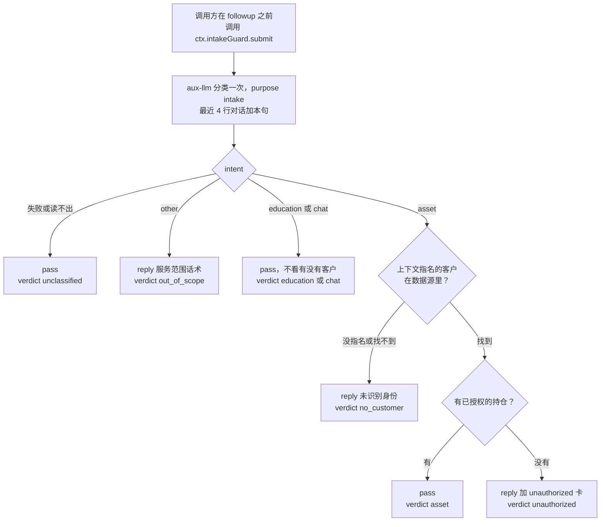
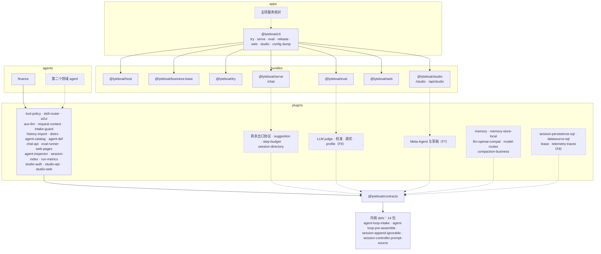
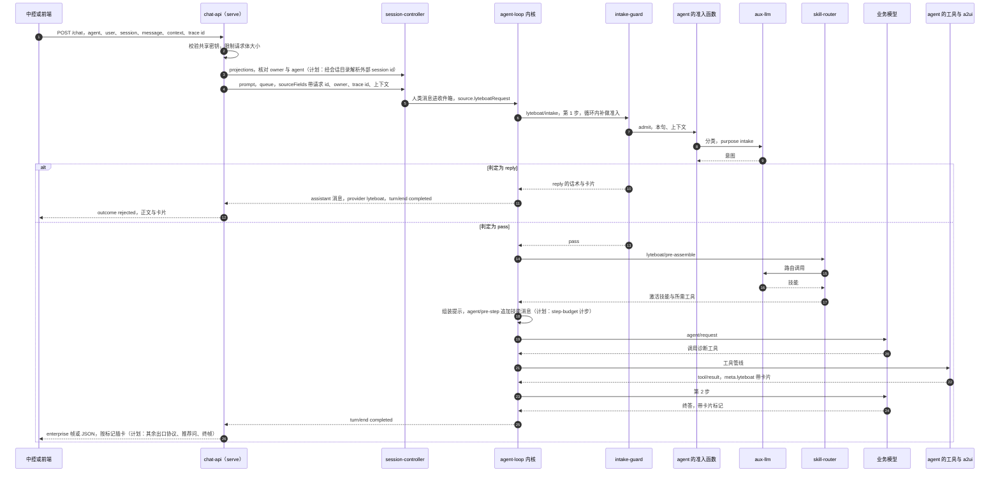

# lyteboat 与参考实现对齐：能力对照、设计规则与引入计划

> 本文把参考实现的能力逐项对到 lyteboat 的代码上：lyteboat 有没有这项能力、在哪个包哪个文件；只有一部分的，缺什么。然后写下决定能力怎样落进 lyteboat 的设计规则，以及接下来引入能力的顺序。
>
> **基线**
> - lyteboat：本仓库的代码。内核是 dsh 0.1.7-rc.2（tag `dsh-v0.1.7-rc.2`，`dsh.upstream.json`）的 14 个包，带四项登记过的扩展。
> - 参考实现：它的 master 分支。
>
> **路径约定**
> - 不带前缀的路径从 lyteboat 仓库根算起，例如 `lyteboat/plugins/tool-policy/src/state.ts`；内核包引用 lyteboat 里的源码路径，例如 `dsh/core/agent-loop/src/agent.ts`。
> - `ref:` 指参考实现的 Python 包根目录，例如 `ref:core/runtime/base_agent.py`；`ref 仓库:` 指参考实现的仓库根。参考实现只按文件路径引用。
> - `dsh:` 指 dsh 0.1.7-rc.2 上游 monorepo 的根，例如 `dsh:packages/preset/agent-preset-registry/README.md`。
> - `CLAUDE.md` 按节标题和规则名引用，例如 `CLAUDE.md`「Architecture boundaries」的 "Outside the kernel first"。
>
> **数据说明**
> - 不带前缀的路径和 `dsh:` 路径上的行号都对照所在的树核对过；容易随代码移动的地方按符号名引用。
> - 标「推断」的结论来自读代码，没有测试证实。
> - 标「实跑」的输出来自构建好的 CLI（`node lyteboat/apps/cli/lib/bin.js`，下文记作 `lyteboat`），模型是 `@lyteboat/testing/scripted-model` 的脚本化模型，`DSH_TELEMETRY_DISABLED=1`，`LYTEBOAT_HOME` 和工作目录都在 `<临时目录>` 下。命令写成从仓库根目录跑（`--agents ./examples/agents`）；会话 id、surfaceId 这类随机值写成 `…`。

---

## 0. 摘要

- **怎样落地。** lyteboat 把参考实现的运行时事实重新表达为 dsh 接缝上的 Cordis 插件：七个能力插件（tool-policy、skill-router、a2ui、aux-llm、request-context、intake-guard、history-import）和发行版标记 distro，由 `@lyteboat/host` 挂到每个 profile 上；三种业务模式（try、serve、eval）另带业务底座 `@lyteboat/business-base`，agent 只拿到它自己声明的能力；Studio 工作台（studio）也带它，看到的 agent 和业务模式里的一样。内核只带四项登记过的扩展，14 个内核包里 11 个的上游文件没有改动。
- **能力对照（第 3 节）。**
  - **有**：工具可见性；业务 agent 只拿到自己声明的工具与能力；请求记下类型化的发起者；技能加载与模型路由，路由过的会话能重开、能续聊；A2UI 模板卡片，工具直接出卡、一个结果多张卡、按标记和出卡模式排进一轮，也能边跑边排；终态卡结束本轮；进循环前的准入，判定、回复和卡片记在请求上；请求上下文；旁路模型调用留痕；外部历史作为新会话的种子；数据层单例；目录形态的业务 agent；`/chat` 的同步与 SSE（enterprise 帧、帧装饰器、断连取消），一个进程服务多个 agent；评测（YAML 用例、逐轮的确定性检查、真实模型录制与免 key 回放、两次运行比较）；浏览器里的调试台 `lyteboat web`（agent 列表与重载、评测报告、带请求上下文发消息并实时看会话的 lyteboat 状态）；Studio 工作台 `lyteboat studio`（自己的账户与 admin、editor、viewer 三种角色，agent 雷达与工作台，只读的会话列表、查找与时间线，按原 Studio 的算法并对照金样校验的看板，评测窗口里的用例、运行、对比，editor 及以上起停评测运行，admin 热修已有技能的 SKILL.md）；每轮一行的运行指标（serve 写，看板读）。
  - **部分**：LLM 准入分类（没有 friction 计数和授权回流后的刷新）；会话状态（深合并，整份给模型看，没有可见键）；trace id（记在请求上，Studio 能在一个 agent 最近的会话里按它查找；外部历史不按它去重）；结束原因（`/chat` 的 `outcome`、评测读出的结局、Studio 的会话页从日志折出的结局；出口层没有从日志折叠的一份）；幂等与并发（重复的 `message_id` 拒绝，同一会话排队）；业务 agent 的模型可见面（还剩三处宿主痕迹，见 3.4）；按角色选模型（只有旁路调用能选路由）。
  - **无**：对外服务的其余部分（其他出口协议、会话目录、推荐问、步数上限）；记忆；外部历史并入已有会话；OpenAI 兼容的业务模型适配器；多实例存储；评测的 LLM judge、校准、调优、profile 与出口帧断言；Studio 的 Meta-Agent、用例的编辑与从会话导入；子任务与委派；工作流状态机；引用与终答前纠错；主动服务。
  - **不移植**：回调容器；Bootstrap、AppContext 与 `ENABLE_*` 开关；checkout/flush 与乐观锁；三档压缩视图；把兜底话术写进会话；单轮工具调用数截断；Studio 整体回写与会话编辑；Studio 的 MCP、沙箱、warm pool 与人工审批页面；技能资格过滤；read_reference；工具级沙箱；调用前的人工确认；portal 反馈墙。
- **设计规则（第 2 节）。** 能力先落在 lyteboat 插件上，内核只在接缝确实不够时扩展；lyteboat 的事实放在 dsh 已有的日志信封里，唯一的自有记录是可忽略的旁路调用审计；框架包不含业务词汇；示例 agent 只用公开知识、保持最小。
- **后续计划（第 6 节）。** F3 骨架已完成：agent 目录、session-controller 纳入内核、`/chat`、eval、`lyteboat web`。F4 收紧了业务运行时、给请求加上身份：业务底座、类型化的请求发起者、agent 的工作目录。F5 让 agent 成为一等对象、有了发布物：一次性模式改名 `lyteboat try`，清单 `agent.yml`（版本、模型），agent 的身份（目录摘要）记在每个请求和评测运行上，发布闸门 `lyteboat release` 与发布锁，`lyteboat serve --release`。F6 做了 Studio 工作台 `lyteboat studio`：它和 serve 共用 `$LYTEBOAT_HOME`、各是一个进程，只读 agent 的组成、会话、运行指标和评测运行，自己的写只有账户与角色、admin 的技能热修和 `lyteboat eval` 子进程跑的评测（6 节开头的 F6）。F7 是 Meta-Agent 与草稿，F8 是多实例与租户，F9 是评测的 judge、校准、调优与 profile。其余按顺序：
  1. 继续验证金融智能体：friction 计数、授权回流后的刷新、用 `lyteboat eval` 扩充用例。
  2. 对外服务的其余部分：其他出口协议、会话目录、推荐问、步数上限、重试返回原答案。
  3. 记忆与外部历史：记忆 seam 与本地 provider、外部历史增量并入已有会话、OpenAI 兼容的模型适配器。
  4. 第二个领域 agent，并据此决定要不要 agent kit。
  5. 多实例部署。
  6. 评测的 LLM judge 与上游化。

---

## 1. 基线

### 1.1 lyteboat 的构成

**工作区包（31 个）。** 每层一个目录，层就是目录（`CLAUDE.md`「Repository layout」）：

| 层 | 包 | 在本文里的角色 |
|---|---|---|
| apps | `@lyteboat/cli` | `lyteboat` 启动器：profile 模板 `try`、`web`、`serve`、`eval`、`studio`（`lyteboat/apps/cli/src/templates.ts`），patch 叠加，启动 |
| bundles | `@lyteboat/host`、`@lyteboat/business-base`、`@lyteboat/try`、`@lyteboat/serve`、`@lyteboat/eval`、`@lyteboat/web`、`@lyteboat/studio`、`@lyteboat/inspect` | 每个 profile 都带的宿主行；业务模式和 Studio 共用的业务底座；`lyteboat try` 的一次性模式；`lyteboat serve` 的服务模式（`/chat`）；`lyteboat eval` 的评测模式；`lyteboat web` 的浏览器界面（dsh web 加 lyteboat 的页面）；`lyteboat studio` 的 Studio 工作台（只查看 agent，不跑会话）；`lyteboat inspect` 打印一个 agent 由什么组成 |
| plugins | `@lyteboat/distro`、`@lyteboat/agent-catalog`、`@lyteboat/agent-def`、`@lyteboat/eval-runner`、`@lyteboat/web-pages`、`@lyteboat/chat-api`、`@lyteboat/tool-policy`、`@lyteboat/aux-llm`、`@lyteboat/request-context`、`@lyteboat/intake-guard`、`@lyteboat/skill-router`、`@lyteboat/a2ui`、`@lyteboat/history-import`、`@lyteboat/agent-inspector`、`@lyteboat/session-index`、`@lyteboat/run-metrics`、`@lyteboat/studio-auth`、`@lyteboat/studio-api`、`@lyteboat/studio-web` | 承接参考实现运行时能力的插件；agent-catalog 把 agent 目录声明成 preset，agent-def 是业务 agent 的一份声明 `lyteboatAgentDef({…})`（一个库，它返回的类就是 agent 目录的一行），eval-runner 跑 agent 的评测用例（它的 `./records` 给 Studio 读运行和用例文件），web-pages 是 lyteboat 在 dsh web 里的页面和回答它们的 Host 面，chat-api 提供 `/chat`；Studio 的六个：agent-inspector 从 agent 的常驻作用域读它的组成，session-index 只读地列出、查找、折叠会话，run-metrics 的记录器（serve 挂）每轮写一行指标、读取器（Studio 挂）读它们，studio-auth 管账户、角色与登录，studio-api 是 `/api/studio`，studio-web 是 `/studio` 下的页面 |
| core | `@lyteboat/contracts` | 共享声明：工具与技能元数据、内核的 `lyteboat/*` 事件（再导出）、日志节点、投影键、所声明 JSON 信封的 zod schema、提示词顺序 `LYTEBOAT_STATE_CONTEXT_ORDER`（130）与 `LYTEBOAT_SKILLS_SECTION_ORDER`（450）；`./studio` 是 Studio API 的请求与回答类型 |
| tooling | `@lyteboat/testing` | 单元宿主、把 agent 目录的行挂进常驻作用域（`mountAgentStandingScope`）、进程内组合启动、脚本化模型、会话日志读取与重开检查、`/chat` 测试客户端 |
| agents | `@lyteboat/agent-finance` | 金融智能体，唯一的示例 agent |

**内核。** `dsh/kernel.json` 列出 14 个 dsh 包：llm、session、system-prompt、tools、skill、agent、agent-loop；session-projection、session-persistence、session-persistence-jsonl；compaction、compaction-basic；agent-loop-testkit；api-session-controller。其余 dsh 包从 npm 安装，版本按 `dsh.upstream.json` 精确钉住。

**内核扩展（`dsh-compat/contract/extensions.yml`）。**

| id | 包 | 加了什么 | 退出条件 |
|---|---|---|---|
| `agent-loop-intake` | `@deepseek-ai/dsh-agent-loop` | `lyteboat/intake` waterfall：在收件箱认领之后、组装提示之前派发；`reply` 不发模型请求，在一步里用一条 assistant 消息（source 的 provider 为 `lyteboat`）作答。reply 往会话里写什么在 `dsh/core/agent-loop/src/lyteboat/intake-reply.ts` | 上游在组装前派发一个能不发请求就作答的 waterfall |
| `agent-loop-pre-assemble` | `@deepseek-ai/dsh-agent-loop` | `lyteboat/pre-assemble` waterfall：`lyteboat/intake` 放行之后、组装系统提示之前派发，所以技能路由和工具激活作用于同一步的请求 | 上游在 `systemPrompt.assemble` 之前派发一个还能改本步提示和工具集的事件 |
| `session-append-ignorable` | `@deepseek-ai/dsh-session` | `Session.append(type, data, { ignorable: true })`：给本构建不认识的非 surface 事件打上可忽略标记；认识的类型带这个标记直接抛错 | 上游给 `Session.append`（或别的写入口）一个设置 `SessionEvent.ignorable` 的办法 |
| `session-controller-prompt-source` | `@deepseek-ai/dsh-api-session-controller` | `SessionPromptRequest.sourceFields`：`prompt` 把调用方的字段并进用户消息的 source；`kind`、`rpcId`、`clientTimeZone` 不能覆盖 | 上游让 prompt 能把调用方的字段带到用户消息的 source 上 |

`pnpm run dist:delta`（实跑）：上游文件里 agent-loop 两个文件多 49 行，session 一个文件多 9 行、删 2 行，session-controller 五个文件多 66 行、删 46 行（其中两个是重新生成的 Typert 文件）；其余 11 个包的上游文件没有改动。lyteboat 自己的逻辑和测试放在各包的 `src/lyteboat/`、`tests/lyteboat/` 下。`pnpm run contract:check`（实跑）：`G1 contract vs dsh 0.1.7-rc.2: 21 registered difference(s), 0 failure(s)`。

**宿主 bundle（`lyteboat/bundles/host/cordis.patch.yml`）。** 关掉 dsh-base 的两行：`session-log-deepseek`（模型服务只收到请求本身，不附会话日志）和 `session-telemetry-otel`（用户反馈时不上传会话前缀）；插入 distro、tool-policy、aux-llm、request-context、intake-guard、skill-router、a2ui、history-import 八行，都是宿主服务，agent 行 inject 它们。

**业务底座（`lyteboat/bundles/business-base/cordis.patch.yml`）。** try、serve、eval 三个 profile 和 studio profile 在 `@lyteboat/host` 之后、模式 bundle 之前列它（Studio 列它，是为了 agent 的工具和技能按 serve 的样子挂上），`lyteboat web` 不列。它只有一层 patch：关掉 dsh-base 的编码工具和只为它们服务的行（bash、pwsh、jobs、文件工具、todo、goal、plan mode、子 agent、PTC 与 workflow、web 工具、MCP 资源）；关掉沙箱各行、shell 环境、subprocess、审批和权限，`fs` 改由 `dsh-fs-local` 提供；关掉 spill（大的工具结果只裁剪，不落盘）；关掉工作目录的 AGENTS.md、本机插件包清单、插件管理、配置编辑、settings 和会话标题的旁路请求；skill-filesystem 不读宿主的默认目录；系统提示不加宿主 persona，也不加 harness 身份段。web 的服务行留在宿主上，模型看不到；要用 web 搜索的 agent 在自己的组合里列 `@deepseek-ai/dsh-tool-web` 一行。

**示例 agent。** `examples/agents/finance`（金融智能体）只用公开理财常识，刻意做到最小：三个路由技能（asset-overview、allocation-diagnosis、investor-education），三个工具（`asset_overview`、`allocation_diagnosis`、`lookup_knowledge`），四张卡（asset_overview、allocation_diagnosis、allocation_plan、unauthorized），进循环前的准入，temperature 0。客户由请求上下文的 `customer` 指明，数据来自 `assets/sample-data/customers/` 的四个夹具。`evals/` 里有 6 个评测用例和一次真实模型运行录下的基线（6 个用例、30 项检查全部通过），组合测试不带 key 回放它。第 5 节拿它对照参考实现的资产诊断 agent。

### 1.2 术语对照（给熟悉参考实现、刚接触 dsh 的读者）

| 参考实现的说法 | dsh / lyteboat 的对应 | 要点 |
|---|---|---|
| 一次 run：一次用户请求走完 `agent.run()` | 一个 turn：从 `turn/start` 到 `turn/end` | 参考实现的 RunOutcome 对应 `turn/end` 的 reason（`TurnEndReasonMap`，`dsh/core/session/src/types.ts:201`） |
| run 里的一轮模型调用：`ls.turns`，受 `max_turns = 10` 限制（`ref:core/runtime/base_agent.py`） | 一个 step：从 `step/start` 到 `step/end` | 最容易混淆：参考实现的 turn 是 dsh 的 step，参考实现的 max_turns 实际上是步数上限 |
| SessionEntry：messages、可变的 state、meta | session：只追加的事件日志，加上从日志折叠出来的投影 | dsh 没有可变的 meta |
| session.state 与 state_delta | 投影（`ctx.sessionProjections`）；lyteboat 这边是 `lyteboatState` | 投影是日志的纯函数 |
| 消息的 metadata | user/message 上的 `source` | `MessageSourceMap`（`dsh/llm/llm/src/message.ts:110`）的键只是声明合并用的名字，运行时靠 `kind` 区分来源 |
| 压缩视图 | surface 加 replace | 日志里的原文一直保留，surface 是模型当前看到的那一面 |
| 8 个 hook | 类型化事件，派发模式分 waterfall、serial、emit | 派发模式属于公开契约：`agent/pre-step` 是 waterfall，`agent/turn-stopping` 是 serial（`dsh/core/agent/src/runtime-types.ts:320,381`）；hook 与事件的对应见 4.1 |
| BaseAgent 的子类 | 一个 `lyteboatAgentDef({…})`（`@lyteboat/agent-def`），编译成 agent 目录的一行；dsh 那边是一行 dsh-agent-preset 声明，加上它的子行 | 注册表不扫描目录；lyteboat 的 agent 目录由 `@lyteboat/agent-catalog`（在 try、serve、eval、web、studio 和 inspect 组合里）声明成 preset |
| Plugin、Lifecycle | Cordis 插件；组合里的一行 | 依赖用 `inject` 声明，不靠列表顺序 |
| Protocol 加工厂插槽 | capability seam，由 Definition、Provider、Consumer 三个角色组成 | 缺任何一个角色都不算完整的 seam（`dsh:AGENTS.md:138`） |
| `app.py` 组合根 | profile 加 bundle patch | 组合就是数据 |

### 1.3 兼容承诺（`dsh-compat/README.md`）

| 闸门 | 证明什么 |
|---|---|
| G1 契约 | 内核构建出的契约与 `dsh-compat/contract/dsh-0.1.7-rc.2/` 快照一致，所有差异都在 `extensions.yml` 登记 |
| G2 上游测试 | 上游为内核包写的测试原样在 lyteboat 源码上通过 |
| G3 跨包测试 | 依赖内核的官方包，在 lyteboat 内核上仍通过自己的测试 |
| persistence / typert | 持久化 schema 和发布的 Typert 文件，与上游生成器从 lyteboat 源码生成的相同 |
| G4 日志等价 | 同一个脚本化运行，官方版和 lyteboat 写出的会话日志逐事件相同；包括工具集在会话中途变化的两个场景，一个在 `addition-only` 路由上，一个在不带工具更新的路由上（`dsh-compat/tests/scenarios/scenarios.ts`） |
| G5 社区金丝雀 | 钉版的社区插件在两边行为相同，并且绑定到 lyteboat 内核 |
| G6 会话往返 | 任一方写的会话，另一方都能按写入方的语义续写 |

契约只能以登记的方式增长（`CLAUDE.md`「Architecture boundaries」的 "The contract only grows, by registration"）。G6 跑的是两棵树上的官方 headless 组合，不带 lyteboat 插件；带 lyteboat 记录的会话能不能被 dsh 的持久层重开，由各组合测试用 `@lyteboat/testing/session-reopen` 的 `reopenRefusal`（它调用内核的 `validateStoredEvents`）逐份检查。

---

## 2. 设计规则

这一节的规则决定第 3 节「落点」一列怎么填，也是第 6 节每一步的约束。

### 2.1 能力落在哪里

1. **插件在 dsh 接缝上，不重写接缝**（`CLAUDE.md`「Architecture boundaries」的 "Plugins sit on dsh seams; they do not re-implement them"）。lyteboat 用到的接缝：
   - 工具：`ctx.tools`，tool-policy 用 `restrict` 隐藏工具；
   - 技能：`ctx.skills`，skill-router 读目录与正文，写 dsh 自己的 skill-invocation 消息；
   - 模型：`ctx.llm`，aux-llm 发旁路调用；
   - 状态：`ctx.sessionProjections`，四个投影 `lyteboatState`、`lyteboatActiveSkill`、`lyteboatCards`、`lyteboatRequest`；
   - 提示：`ctx.systemPrompt`，运行时上下文 `lyteboat:state`（130）、系统提示段 `lyteboat:skills`（450）。

   lyteboat 不用 dsh 的 approval 接缝：业务底座把审批和沙箱一起关掉，lyteboat 不带沙箱和人工审批，以后也不加回来。
2. **落点有先后**（`CLAUDE.md`「Architecture boundaries」的 "Outside the kernel first"）：先用 dsh 原样的包，只做配置；不够再写 lyteboat 插件；再不够，建 lyteboat 自有的 seam；最后才是内核扩展。lyteboat 的自有 seam 用登记表的写法：宿主服务持有登记表，agent 行在自己的常驻作用域里 `register` 一个实现并拿回 disposer，取用时沿 agent 的作用域链找最近的一个；实现的接口是类型，消费方 `import type`。`ctx.intakeGuard.register(admission)`（`lyteboat/plugins/intake-guard/src/index.ts:83`）就是这样。
3. **内核只在插件做不到时扩展。** 四项扩展各有一个插件绕不过去的原因：
   - `agent/pre-step` 在系统提示组装之后才派发（`dsh/core/agent-loop/src/agent.ts:290-300`），插件在那里既不能不发模型请求就作答，也改不了同一步的提示和工具集：所以有 `agent-loop-intake` 和 `agent-loop-pre-assemble`。
   - 事件信封由 `Session.append` 在内部拼装，插件碰不到 `ignorable` 标记：所以有 `session-append-ignorable`。
   - session-controller 的 `prompt` 在自己的校验、附件准入和去重之后才构造用户消息，source 由它自己写；另开一条写入路径就丢了这三样：所以有 `session-controller-prompt-source`。

   上游文件里的钩子保持几行，逻辑放在 `src/lyteboat/`（`CLAUDE.md`「Architecture boundaries」的 "The kernel changes only by classified commits"）；每项扩展登记退出条件，上游提供替代能力后在下一次同步里退役。这样做是因为内核的每一行差量都要长期携带：dsh 不接受外部 PR（`dsh:CONTRIBUTING.md:9`），而扩展所在的文件是上游改得最勤的：在 dsh-0.1.7-rc.2 的 checkout 上执行 `git log --since=2026-08-01`，`packages/core/agent-loop/src/agent.ts` 有 82 个提交（不算合并提交 58 个），`packages/core/session/src/index.ts` 有 69 个（不算合并提交 56 个）。

   其余内核包不改，理由如下：

   | 包 | 为什么不用改 |
   |---|---|
   | dsh-system-prompt | 提示预算在各内容生产方执行（2.4 第 12 条），不需要组装器帮忙 |
   | dsh-compaction-basic | `summarize()` 是可覆盖的子类钩子，业务摘要模板写子类就够；pruner 按服务名取用，组合里可以替换 |
   | dsh-tools | PTC 子调度不计算 presentationMeta（`dsh/core/tools/src/index.ts:1845`），卡片和状态增量会丢；业务底座关掉了 PTC（`ptc-runtime`） |
   | dsh-llm | 采样参数与旁路调用的差异用具名路由表达，不放宽闭合联合 `purpose`（`dsh/llm/llm/src/types.ts:552`） |
   | dsh-session-persistence | seam 是抽象类 `SessionPersistence`（`dsh/session/session-persistence/src/index.ts:135`），第二个 provider 在内核外继承它 |

   候选的内核改动都不带，理由写在 7.2：放宽 `LyteboatIntakeReply`，让它能替换被认领的消息（lyteboat web 路径上的拒识轮就能记下判定和卡片）；放宽 `purpose`、新增 `toolChoice`；发行版必需词表（2.2）。
4. **共享只经 contracts**（`CLAUDE.md`「Architecture boundaries」的 "contracts is the only shared declaration home"）。插件之间只 `import type`（`scripts/check-layers.ts` 的 `checkPluginImports`）；一个插件要读另一个插件的数据，走投影或服务 inject。没有插件之间共享的运行时层。agent 可以按值依赖插件：金融智能体从 `@lyteboat/a2ui` 取 `cardMarker` 和 `cardsPresentationMeta`（`examples/agents/finance/src/tools/finance-tool-support.ts:10`）。一个 seam 要是需要按值共享的定义（例如抽象基类），先用第 2 条的登记表写法绕开；绕不开时再定它放在哪一层，这是跨层的决定。
5. **框架包不含业务词汇**（`CLAUDE.md`「Architecture boundaries」的 "Framework packages stay domain-neutral"）。a2ui 的默认组件目录只有版式、文本、按钮、图片和基本形状（`DEFAULT_A2UI_COMPONENT_CATALOG`，`lyteboat/plugins/a2ui/src/contract.ts:38`），参考客户端的完整目录只作为测试夹具（`lyteboat/plugins/a2ui/tests/fixtures/reference-component-catalog.ts`）；为了与金样逐字一致而照搬的参考实现字符串（a2ui 的错误信息与 digest 格式，skill-router 的路由提示词 `SKILL_ROUTER_SYSTEM_PROMPT`）在注释里注明来历。人设、客户数据、准入话术都在 `examples/agents/finance` 下。
6. **组合就是数据**（`CLAUDE.md`「Architecture boundaries」的 "Composition is data"）。宿主行发布服务；agent 的行在 agent 的常驻作用域里声明策略：它的 `lyteboatAgentDef`（`./lib/agent.js`，没有 `agent.cordis.yml` 时是唯一的一行）把 `toolPolicy`、`skillRouting`、`a2uiRenderTool` 等字段交给宿主服务，`agent.cordis.yml` 可以在它后面再列 dsh 的行；它们从不向根 realm 发布服务。
7. **配置错误大声失败**（`CLAUDE.md`「Coding conventions」的 "Misconfiguration fails loud"）。这样做的例子：策略里写了没人注册的工具名、auto 工具注册在 agent 自己的层（`restrict` 藏不住它）、技能要求一个策略没声明的工具、`lyteboatAgentDef` 里的未知键（给它的行配置也拒绝）、卡片 manifest 里未知的 `emission_mode`、只有默认导出的 `compute.js`、profile 缺了模板列出的 bundle，都在加载、启动或第一次解析到这个引用时抛错；日志里的 lyteboat 信封不合 schema，读它的投影直接抛错。

### 2.2 事实放在 dsh 的信封上

**规则。** 进入模型请求的一切都能从会话日志重建（`dsh:AGENTS.md:136`，`CLAUDE.md`「Architecture boundaries」的 "Model-visible ⟺ logged"）。dsh 的持久层读日志时，遇到既不在编译进来的目录里、又没标可忽略的事件类型，整份会话拒读（`dsh/session/session-persistence/src/storage-contract.ts:75`）。所以 lyteboat 记录的事实放在 dsh 已有的信封里，唯一的自有记录标成可忽略，任何 dsh 读者都能打开 lyteboat 写的会话：

| 事实 | 信封 | 谁写 | 谁读回 |
|---|---|---|---|
| 请求 id、请求上下文、准入判定（含回复的卡片） | 人类消息的 `source.lyteboatRequest`，形状 `{ kind: 'user'; lyteboatRequest: LyteboatRequest }` | `ctx.intakeGuard.submit` 经 `ctx.requestContext.message` | `lyteboatRequest` 投影；a2ui 的 `lyteboatCards`；intake-guard 在循环内读判定 |
| 准入回复 | assistant 消息，source `{ kind: 'model', provider: 'lyteboat', model: <准入函数名> }` | 内核的 intake reply（`dsh/core/agent-loop/src/lyteboat/intake-reply.ts`） | 任何 dsh 读者 |
| 路由到的技能 | dsh 自己的 skill-invocation 消息，source `{ kind: 'skill-invocation', name, form: 'instructions' }` | skill-router 在 `agent/pre-step` 上把它接在本步消息后面 | `lyteboatActiveSkill` 投影 |
| 工具的卡片与状态增量 | `tool/result.meta.lyteboat.{cards,stateDelta}` | 工具的 presentationMeta（a2ui 的 `cardsPresentationMeta`，tool-policy 对 `stateDelta` 的包装） | `lyteboatCards`、`lyteboatState` 投影 |
| 导入的历史 | 一串已关闭的普通 turn：user 消息的 source kind 是 `plugin:lyteboat-history-import`，assistant 消息的 provider 是 `lyteboat`、model 是 `history-import` | history-import 的种子 | 任何 dsh 读者 |
| 工具集在两次请求之间的变化 | dsh 自己的 `developer/message`，source `tool-registry`（见 2.3） | 内核 | 内核 |
| 旁路模型调用的审计 | `lyteboat/aux-llm-call`，信封上 `ignorable: true` | aux-llm（`lyteboat/plugins/aux-llm/src/index.ts:133`） | 只供审计；不认识它的读者跳过 |

**会话词表分三档：**
1. **已有信封**（默认档）：上表除最后一行以外的全部。
2. **可忽略记录**：只给纯信息记录，读者跳过它必须能重建出同一个会话（`CLAUDE.md`「Architecture boundaries」的 "A new session event type is proven reopenable before it ships"）。只有 `lyteboat/aux-llm-call` 一种，一次调用一条。读者需要的事实从不放在可忽略记录上。
3. **发行版必需词表**：空。加一个词意味着官方 dsh 拒读含它的会话；新词要先证明持久化后能重开。

**投影的规则**（`CLAUDE.md`「Architecture boundaries」的 "Projections return the same reference when nothing changed" 和 "Projections fold appended nodes only"）：只折叠 `surfaceOp === 'append'` 的节点，压缩或替换带着原来的 meta，再折一次会把旧的增量或旧卡片重放一遍；不相干的事件返回同一个引用；lyteboat 信封不合 contracts 的 schema 时抛错并指出 seq（`lyteboat/plugins/tool-policy/src/state.ts:79-94`、`lyteboat/plugins/a2ui/src/cards-projection.ts:57-65`、`lyteboat/plugins/request-context/src/request-projection.ts:29-46`）。四个投影的 `stateVersion` 都是 1。

**`lyteboat-request` 这个来源的设计：**
- **kind 是 `'user'`。** `MessageSourceMap` 的键 `'lyteboat-request'` 只是声明合并时的名字，运行时靠 kind 区分来源。dsh 代表人类输入的来源都用 kind `'user'`：tool-skill 只把 `source.kind === 'user'` 的消息当人类输入扫描（`dsh:packages/skill/tool-skill/src/index.ts:171`），goal 的授权判断也一样（`dsh:packages/goal/tool-goal/src/authority.ts:83`）。lyteboat 的字段都收在 `lyteboatRequest` 下面，不用 `rpcId` 这个名字，否则 session-controller 的 `hasPromptRequest`（`'rpcId' in source`，`dsh:packages/api/session-controller/src/commands.ts:602-614`）会把它当成 user-rpc。
- **当数据读，用 schema 校验。** `lyteboatRequestOf(source)`（`lyteboat/plugins/request-context/src/request-projection.ts:22-27`）先看 kind 是不是 `'user'`，再把 `lyteboatRequest` 字段取出来用 `lyteboatRequestSchema` 校验，不合 schema 就抛错；不用 `'lyteboatRequest' in source` 这类能力探测（`CLAUDE.md`「Coding conventions」的 "No capability probing"）。插件之间只能 `import type`，a2ui 用同样的读法取判定里的卡片（`cardsOfRequest`，`lyteboat/plugins/a2ui/src/cards-projection.ts:45-50`）。
- **上下文只落日志，不给模型看。** 调用方给的上下文原样记在 `context` 上，工具经 `ctx.requestContext.contextOf(agent)` 读取；凭证不放进上下文（`lyteboat/plugins/request-context/src/index.ts` 的模块注释）。实跑：金融智能体几次运行的所有请求体（准入分类、路由、主循环、标题）里都没有 `lyteboatRequest` 字段，也没有上下文里的客户名。

### 2.3 工具集变化按 dsh 0.1.7-rc.2 的工具更新走

- tool-policy 在每次 `lyteboat/pre-assemble` 之后重算 agent 的 `restrict`，被拒的名单变了才重发（`reconcile`，`lyteboat/plugins/tool-policy/src/index.ts:257`）。技能切换就是一次工具集变化。
- 内核把两次请求之间的工具集变化记成一条 `developer/message`：source 是 `tool-registry`，内容是 `tool-addition`、`tool-removal`，`headerSeq` 指向变化后的那条 `request/header`。
- 路由声明了 `toolUpdate` 时，工具变化不开新的请求序列：新出现的工具带 `defer_loading` 声明，由新 user 轮之后的一个 `tool_addition` 块启用。dsh 默认的 `deepseek-flash` 是 `addition-only`（`dsh:packages/llm/llm-deepseek/src/models.ts:13`）。路由没声明 `toolUpdate`（例如同一目录里的 `deepseek-v4-pro`）时，工具变化开一个新序列：`request/header` 带 `startsSeries`，系统提示替换（`dsh/core/agent-loop/src/agent.ts:440-443`）。请求带 `toolHistory`（同文件 710 行）。
- 所以动态路由在 `addition-only` 路由上切换技能不打断前缀。两种路由都在 G4 里；lyteboat 这边由 `lyteboat/plugins/tool-policy/tests/tool-policy.spec.ts` 和 `examples/agents/finance/tests/finance.composite.ts` 覆盖，实跑见 5.4。

### 2.4 沿用 dsh 的做法

1. **模型可见 ⟺ 可从日志重建**（`dsh:AGENTS.md:136`）。见 2.2。
2. **读取时 fail-closed。** 未登记又没标可忽略的事件类型，整份会话拒读（`dsh/session/session-persistence/src/storage-contract.ts:75`）。可忽略只用于纯信息记录（`SessionEvent.ignorable`，`dsh/core/session/src/types.ts:511`）。上游的决策笔记保留了这个字段，否决了「外部事件一律可忽略」和「按挂载的组合登记事件名」两种做法，并写明只有替代机制完成切换之后才能删它（`dsh:.agents/notes/implemented/architecture/2026-08-30-retain-ignorable-external-session-events.md`「Decision」）。
3. **加插件，不改循环**（`dsh:AGENTS.md:137`）。见 2.1 第 3 条。
4. **能力 seam 的三个角色要齐全**（`dsh:AGENTS.md:138`）。
5. **登记本身就是 effect**，`register()` 返回 disposer（`dsh:AGENTS.md:131`，`CLAUDE.md`「Architecture boundaries」的 "Registrations are effects"）。per-agent 状态放在 `WeakMap<Agent, …>` 里。
6. **组合就是数据。** agent 是一行 preset 声明，注册表不扫描目录（`dsh:.agents/notes/implemented/architecture/2026-09-18-declarative-agent-presets.md`）。
7. **waterfall 的监听者必须调用 `next()`**（`dsh:AGENTS.md:135`）。在 `next()` 前做还是后做要想清楚：skill-router 在 `lyteboat/pre-assemble` 上先路由再 `next()`，tool-policy 在 `next()` 之后重算限制；intake-guard 在 `lyteboat/intake` 上 `next()` 之后才判定，所以后登记的门先做决定。
8. **`agent/turn-stopping` 按 serial 派发。** 监听者用 steer 放进收件箱的输入决定本轮是否继续（`dsh/core/agent/src/runtime-types.ts:381`）。
9. **显式优于隐式**（`dsh:AGENTS.md:140`）；**插件里不硬编码可调参数**（141）；**配置错误大声失败**（142）。
10. **尽量用有人维护的依赖**（`dsh:AGENTS.md:139`）。OpenAI 兼容适配器建在 pi-ai 库上，而不是手写协议（6.3）。
11. **失败按错误码路由，不解析错误文本。** 适配器一次调用只试一次，重试在 step 边界由 llm-retry 做，并写进日志。
12. **在做决定的操作处执行约束**，监听顺序、提示过滤都不算执行（`dsh:packages/AGENTS.md:14`）；**状态只在提交点发布**（15）；**上限作用在完整结果上**（16）。提示预算因此由各内容生产方执行，不靠一个排在最后的全局截断。
13. **旁路模型调用也留痕。** dsh 的先例是 `session/title-llm-request`，请求发出前就写日志。lyteboat 的 aux-llm 在调用结束后追加一条可忽略的 `lyteboat/aux-llm-call`，带回答或失败原因和耗时；调用方自己中止时什么也不记。
14. **上游测试从不修改**，lyteboat 自己的内核测试放在 `tests/lyteboat/` 下（`CLAUDE.md`「Architecture boundaries」的 "Upstream's tests are never edited"）。

### 2.5 不移植的参考实现机制

| 机制 | 参考实现位置 | 为什么不移植 |
|---|---|---|
| RunnerCallbacks 这个统一的回调容器与 CallbackResult | `ref:core/runtime/callbacks.py` | dsh 每个扩展点都是独立的类型化事件，派发模式本身就是语义；hook 与事件的对应见 4.1 |
| Bootstrap、AppContext、`ENABLE_*` 开关 | `ref:core/protocol/bootstrap.py` | Cordis 的 Service、inject、effect 与 bundle patch 覆盖了它们 |
| checkout/flush、shield、version 乐观锁，「先写 meta 再写消息」 | `ref:core/session/manager.py`、`ref:core/storage/database/sql/session.py` | dsh 的日志只追加、写句柄独占，连续的 seq 本身就是版本 |
| CompactionSegment 的三档视图 | `ref:core/session/compaction.py` | dsh 用 `compaction/*` 事件加 surface replace，原文留在日志里 |
| 把兜底话术写进会话 | `ref:core/runtime/base_agent.py` 的模型错误处理 | 话术放在出口层按 `LlmFailure.code` 映射，模型看不到（6.2） |
| 单轮最多 5 个工具调用的截断 | `ref:core/tools/executor.py` | dsh 用 `maxParallelToolCalls` 限并发（`dsh/core/agent-loop/src/index.ts:338`），不丢调用 |
| 异常时整轮丢弃、Studio 整体回写原始会话 | `ref:plugins/studio/api/sessions.py` | 日志只追加 |
| 技能资格过滤（required_os、binaries、env_vars） | `ref:core/skills/base.py` | 业务技能都没用这些字段 |
| read_reference | `ref:core/tools/read_reference.py` | 参考实现的 agents 下没有任何 references/ 目录；需要时用 tool-skill 的资源指引 |
| 工具级沙箱 | `ref:plugins/sandbox` | 业务底座关掉了编码工具，也关掉了 dsh 的沙箱；lyteboat 不带沙箱，以后也不加 |
| 工具调用前的人工确认 | `ref:core/tools/base.py` | 业务底座关掉了 dsh 的审批，lyteboat 不带人工审批，以后也不加；工具只在 agent 声明过的范围里运行，要不要先问用户由技能和工具自己决定 |
| Studio 的 MCP、沙箱、warm pool 与人工审批（HITL）页面 | `ref:plugins/studio` | 有意去掉，以后也不移植：lyteboat 不带沙箱和人工审批（2.1 第 1 条和上面两行），业务底座把 dsh 的沙箱、审批和 MCP 资源行一起关掉；agent 要用 MCP，在自己的组合里列 dsh 的 mcp 行（3.4） |
| 内部知识库检索工具 | `ref:core/tools/` 下的检索工具（只在 `ref:core/tools/__init__.py` 导出，没有 agent 注册它） | 带领域词汇，也没有使用方；需要时放 agent 层 |
| portal 反馈墙 | `ref:portal/feedback/routes.py`、`ref:portal/feedback/rate_limit.py` | 参考实现框架内部的站点，不在它的发布物里 |

### 2.6 启动必备的五项能力

业务 agent 缺下面任何一项都起不来：

| 能力 | 内核包 / seam | 由谁初始化 | lyteboat |
|---|---|---|---|
| llm | `dsh/llm/llm` | dsh-base 的 `llm`、`llm-deepseek`、`llm-pi-ai` 行 | 有，用 dsh；默认模型是 dsh-base `agent-default-model` 行的 `deepseek-official` / `deepseek-flash` |
| tool | `dsh/core/tools` | dsh-base 的 `tools` 行 | 有，用 dsh |
| skill | `dsh/skill/skill` | dsh-base 的 `skill`、`skill-filesystem`、`tool-skill` 行；agent 的 `lyteboatAgentDef` 挂自己的技能目录（`skillDirs`，缺省是 `assets/skills`） | 有，用 dsh |
| session | `dsh/core/session` 与持久化 seam | dsh-base 的 `session-persistence-jsonl` 行 | 有，只有 JSONL |
| memory | dsh 0.1.7-rc.2 的 `packages/` 下没有记忆分组 | lyteboat 自有 seam | 无（6.3） |

规则：
- **seam 一直在，策略可以关。** 参考实现的记忆由 `ENABLE_MEMORY` 控制，默认关（`ref 仓库:.env-sample`）；lyteboat 让记忆 seam 在每个 profile 里都挂着，由 agent 决定开不开记忆策略，这样各 profile 的启动行为一致。
- **启动时核对。** dsh app-boot 的必需行是写死的全局常量（`requiredStartupEntryIds`，`dsh:packages/boot/app-boot/src/index.ts:746-754`），profile 扩展不了，所以由 lyteboat 自己核对。启动器拒绝缺了模板所列 bundle 的 profile（`checkSkippedProfileBundles`，`lyteboat/apps/cli/src/profile-boot.ts:146`）；五项服务的核对随记忆 seam 一起做（6.3）。

### 2.7 示例 agent 的范围

- 公开仓库只放一个通用的金融智能体，只用公开理财知识；参考实现的业务 agent 带内部数据接入与业务规则，不迁进来。
- 示例 agent 刻意最小，只用来验证端到端流程，业务深度不是目标。它的规则（「100 减年龄」，上下各 10 个百分点，`examples/agents/finance/src/capabilities/allocation-diagnosis.ts:37-48`）和话术都在 agent 层。
- 投资者教育在准入阶段不拒识：分类为教育或闲聊的请求一律放行，不看有没有客户（`examples/agents/finance/src/intake/finance-admission.ts:113`）。
- 金融智能体不用 `lyteboatState`，没有会话状态：工具每次按请求上下文里的客户重新取数，事实只写在给模型的 digest 里。tool-policy 的状态按真实需求再设计（6.1）。

---

## 3. 能力对照

**字段说明**
- **lyteboat**：**有**，写明包与文件；**部分**，写明缺什么；**无**；**用 dsh**，dsh 原样的包就够，lyteboat 不另做；**不移植**，理由见 2.5。
- **落点与计划**：能力计划落在哪里，括号里是第 6 节的步骤；「按需」表示没有排进第 6 节，等某个领域 agent 需要时再做（6.4、6.7）。

### 3.1 运行时循环、回调、护栏、子任务与多 agent

| 参考实现能力 | 参考实现位置 | dsh 对应 | lyteboat | 落点与计划 |
|---|---|---|---|---|
| 8 个 hook 与 CallbackResult | `ref:core/runtime/callbacks.py` | 各扩展点都是独立的类型化事件 | **不移植**：用 dsh 事件，加内核的 `lyteboat/intake`、`lyteboat/pre-assemble`（`dsh/core/agent-loop/src/lyteboat/step-hooks.ts`） | 对应表见 4.1 |
| before_agent 返回 ABORT 拒识，回调事件写进 `hook_effects` 并落盘 | `ref:core/runtime/base_agent.py`、`ref:core/runtime/_runner_helpers.py`、`ref:core/session/format.py` | 无；`lyteboat/intake` 是内核扩展 | **有**：`@lyteboat/intake-guard`。调用方用 `ctx.intakeGuard.submit(agent, { text, context?, requestId?, owner?, agent? }, signal)` 在请求进循环前准入（`lyteboat/plugins/intake-guard/src/index.ts:110`），判定（`by`、`decision`、`verdict`、`text`、`cards`）记在人类消息的 `source.lyteboatRequest.intake`；reply 不发模型请求，会话能重开。缺：判定里没有出口帧；不经 `submit` 的消息（`lyteboat web`、`/chat`）在循环内补做准入，回复一样，判定和卡片不落日志 | 帧由出口层从判定推导（6.2） |
| LLM 准入分类（看最近 10 条、正则预判、降级方向因 agent 而异） | 理财 agent 与资产诊断 agent 的准入分类器 | 无 | **部分**：骨架是 intake-guard 加 aux-llm。金融智能体一次旁路调用分四类，看最近 4 行对话、每行最多 200 字（`examples/agents/finance/src/intake/finance-admission.ts:67-73`），没有正则预判，分类失败就放行；没有 friction 计数 | agent 层（6.1） |
| 证券 agent 的 `_auth_check`（未登录时 ABORT 出登录卡）和 `_enrich_context` | 证券 agent 的定义文件与工具参数映射 | 无 | **部分**：准入函数按请求上下文直接回复：问自己资产时，上下文没指名客户或客户不存在回复「未识别身份」，没有已授权持仓回复 unauthorized 卡（同文件 114-118 行）；没有 enrich，上下文原样使用 | agent 层，经 intake-guard |
| 交易 agent 的 `_enrich_context` | 交易 agent 的定义文件 | 无 | **无** | agent 层，按需 |
| context_updates 与画像预取 | 理财 agent 的回调模块；`ref:core/runtime/base_agent.py` | 带来源的 user/message | **部分**：请求上下文记在 `source.lyteboatRequest.context`，`lyteboatRequest` 投影沿用到下一个带上下文的请求，工具经 `contextOf` 读取，模型看不到；`lyteboat try --context` 传入。缺：画像预取；按白名单把部分字段渲染给模型 | request-context 加准入阶段（6.2） |
| before_loop_end 的 RETRY（grounding 校验） | `ref:core/runtime/validation.py` | `agent/turn-stopping` 加 steer | **无** | `@lyteboat/turn-review`，按需（6.4） |
| 工具返回 STOP，以 tool_stopped 结束 | `ref:core/runtime/base_agent.py` | `exec.concludeTurn()`（`dsh/core/tools/src/index.ts:434`） | **有**：a2ui 的 `terminalCards`（`lyteboat/plugins/a2ui/src/index.ts:241`）；金融智能体的 unauthorized 结果（`examples/agents/finance/src/tools/finance-tool-support.ts:66`）。语义差异见 5.5 | — |
| 路由 agent 多路 consult 时推迟 STOP | 路由 agent 的定义文件 | 同一步里任一成功结果结束本轮，本轮就结束（`dsh/core/agent-loop/src/tool-calls.ts:37,158`） | **无** | consult 工具自己判断是否结束本轮，按需（6.4） |
| max_turns 与 stopped_by_limit | `ref:core/runtime/base_agent.py` | 没有步数上限；有 `cancel(cause, { keepInbox })`（`dsh/core/agent/src/runtime-types.ts:183`） | **无** | `@lyteboat/step-budget`（6.2） |
| 单轮最多 5 个调用、每个 30s 超时 | `ref:core/tools/executor.py` | agent-loop 的 `maxParallelToolCalls`；`dsh:packages/guard/timeout-policy` | **用 dsh**：并发按 dsh 默认；没有配超时默认值 | 截断不移植；超时默认值写进业务组合（6.2） |
| RunOutcome 作为唯一的结束原因来源 | `ref:core/types.py` | `TurnEndReason` | **部分**：`/chat` 的回答带 `outcome`（contracts 的 `LyteboatTurnOutcome`），由本轮 `turn/end` 的 reason 推出，循环内准入作答的轮记为 `rejected`（`lyteboat/plugins/chat-api/src/chat-turn.ts:62-77`）；`lyteboat eval` 按同样的规则推出每轮的结局（`lyteboat/plugins/eval-runner/src/eval-turn.ts:31-39`）；两者都在本轮结束时推出，不从日志折叠，`lyteboat try` 只按 `turn/end` 的 reason 定退出码。reason 到结局的映射在 contracts 的 `LYTEBOAT_TURN_OUTCOME_OF_REASON`，eval-runner、运行指标的记录器和 session-index 共用它；session-index 从存下的日志折出每轮的结局，给 Studio 的会话页 | 出口层用的、从日志折叠的纯函数（6.2） |
| on_model_error：友好话术写进会话 | `ref:core/runtime/base_agent.py` | `agent/request-error` 加 llm-retry | **不移植**写日志的部分 | 话术放出口层（6.2） |
| AgentsLifecycle、Registry、invoker | `ref:core/runtime/agents_lifecycle.py`、`ref:core/runtime/invoker.py` | agent-preset-registry：多个 preset，按会话选择 | **有**：`@lyteboat/agent-catalog` 把 agent 目录声明成 preset（`lyteboat/plugins/agent-catalog/src/index.ts:248-289`），`reload()` 按目录现在的内容重新声明（`:162-171`）。`lyteboat try` 只让它声明所选的那一个，`--session-id` 按日志里记下的 preset 续写，请求经 `intakeGuard.submit` 提交；`lyteboat serve` 声明 `--agents` 下的全部 agent（或只声明 `--release` 发布锁里的 agent，按锁钉住），`/chat` 按请求的 `agent_id` 选 agent、续聊时核对会话记下的 preset（`lyteboat/plugins/chat-api/src/index.ts:186-207`），消息经 session-controller 的 `prompt` 进会话；`lyteboat web` 也声明全部 agent，根目录一变就重新声明，新会话默认用 `--agent`，dsh web 里可以另挑（`lyteboat/bundles/web/cordis.patch.yml:102-117`）；`lyteboat studio` 也声明全部 agent（不严格，根目录一变就重新声明），只从常驻作用域读它们的组成，不建 agent 实例（`lyteboat/bundles/studio/cordis.patch.yml:25-37`） | — |
| SpawnSubtasksTool 并行子任务 | `ref:core/subtask/tool.py` | tool-subagent 声明可并发（`dsh:packages/subagent/tool-subagent/src/index.ts:470`），子 agent 经 `applyChildComposition` 继承父 preset 的组合 | **无** | 按需（6.4） |
| consult_sub_agent | 路由 agent 的 consult 工具 | SubagentProvider seam | **无** | `@lyteboat/consult`，按需（6.4） |
| 编排 agent 使用 `tool_choice=required` | 编排 agent 的定义文件 | `LlmCallConfig` 没有这个字段（`dsh/llm/llm/src/call-config.ts:23-30`） | **无** | 路由预设加 turn-stopping 纠偏，按需（6.4）；内核候选见 7.2 |
| app_type 运行期覆盖 | 业务 agent 共用的覆盖表；`ref:plugins/api/chat.py` | 无 | **无** | chat wire 的部署配置（6.2） |

### 3.2 会话、存储与持久化

| 参考实现能力 | 参考实现位置 | dsh 对应 | lyteboat | 落点与计划 |
|---|---|---|---|---|
| checkout/flush、shield、version 乐观锁 | `ref:core/session/manager.py` | 只追加日志，加 `session/flush` 和 checkpoint-policy | **不移植** | — |
| 跨 POD 运行锁，冲突时返回 409 / session_busy | `ref:core/storage/database/sql/session.py`、`ref:plugins/api/errors.py` | `open('write')` 独占写；`SessionOwnershipLostError` 已声明，内置后端从不抛它（`dsh/session/session-persistence/src/errors.ts:59`） | **部分**：JSONL 后端的文件锁，只在单机上可靠 | SQL provider 与租约（6.5） |
| seq 原子分配、预计算计数 | `ref:core/storage/database/sql/session.py` | append 要求 seq 连续 | **无** | SQL provider 加会话目录读模型（6.5） |
| 存储 Protocol：文件和 SQL 两种后端，按 agent 隔离 | `ref:core/storage/protocols/session.py` | `SessionPersistence` 抽象类（`dsh/session/session-persistence/src/index.ts:135`） | **部分**：只有 dsh-base 的 JSONL，按工作目录分目录；`/chat`、评测和 `lyteboat try --agent` 的会话都在 agent 自己的工作目录 `$LYTEBOAT_HOME/agent-workdirs/<id>` 下，所以按 agent 分开 | 第二个 provider（6.5） |
| Datasource、方言、alembic、DDL 导出、托管密码 | `ref:core/storage/datasource.py`、`ref:core/storage/dialect.py`、`ref:core/storage/database/migrate.py` | credentials seam | **无** | `@lyteboat/datasource-sql`（6.5） |
| (agent_id, session_id) 复合唯一，session_id 由调用方指定 | `ref:core/storage/database/models.py`、`ref:core/runtime/base_agent.py` | SessionId 全局唯一 | **部分**：`lyteboat try --session-id` 只续写已存在的会话，并核对它记下的 agent 和工作目录（`assertContinuable`，`lyteboat/bundles/try/src/index.ts:195`）；新会话的 id 由 lyteboat 生成 | 会话目录（6.2） |
| 会话列表、搜索、摘要 | `ref:core/storage/protocols/session.py` | session-query 不做调用方授权（`dsh:packages/session-query/session-query/README.md:150`） | **部分**：面向操作者的有：`@lyteboat/session-index` 用 `sessionPersistence` 的读句柄读一个 agent 工作目录下的会话（不拿写所有权，和写它们的 serve 进程并行），按时间窗与发起者列出、在时间窗内最新的 500 个里按会话 id、用户消息、trace id 查找、折成时间线（`lyteboat/plugins/session-index/src/index.ts`），Studio 的会话页和看板读它，登录的任何角色都看得到全部会话，不按终端用户过滤。面向终端用户、按归属过滤的会话目录还没有 | 会话目录的读模型（6.2） |
| state 命名空间 `user:`、`temp:`、`meta:` | `ref:plugins/api/chat.py`、`ref:core/types.py` | user/message 的 source 可以扩展 | **部分**：请求上下文单独记在 `source.lyteboatRequest`，不进提示；`lyteboatState` 只折叠工具的增量，按点路径深合并，整份渲染进 `lyteboat:state`（`lyteboat/plugins/tool-policy/src/index.ts:109-117`）；没有命名空间和按键的可见性 | 状态按真实需求再设计（6.1） |
| 外部对话历史合并，按 trace_id 去重 | `ref:core/session/history_strategy.py`；理财 agent 的外部历史合并器 | 日志只追加 | **部分**：`@lyteboat/history-import` 按参考实现的轮次规则解析（`round-history.ts`），给新会话做种子（`seed.ts`）；种子不记 trace id；`--history` 不能和 `--session-id` 一起用（`lyteboat/bundles/try/src/startup.ts:125`） | 增量并入已有会话（6.3） |
| tool_exchange | `ref:core/session/tool_exchange.py` | 无 | **无** | `@lyteboat/tool-exchange`，按需（6.4） |
| 会话删除与保留期（含子任务的临时会话） | `ref:core/subtask/tool.py`、`ref:plugins/evals/replay_runner.py` | 没有删除 API | **无** | 会话目录的 purge（6.5） |
| 异常时整轮丢弃、原始会话整体回写 | `ref:plugins/studio/api/sessions.py` | 只追加 | **不移植**：Studio 的原始记录只读，可以复制和下载（`lyteboat/plugins/studio-web/src/client/studio-session-raw.tsx`） | — |

### 3.3 记忆、上下文压缩与提示词

| 参考实现能力 | 参考实现位置 | dsh 对应 | lyteboat | 落点与计划 |
|---|---|---|---|---|
| MemoryProvider（11 个成员）与工厂插槽 | `ref:core/protocol/memory_provider.py`、`ref:core/protocol/_active_memory_factory.py` | 没有记忆分组；社区插件各自定义服务（4.4） | **无** | 记忆 seam，接口不超过 7 个方法；host 常驻挂本地 provider（6.3） |
| 冻结快照，注入 `<memory_context>` | `ref:plugins/memory/manager.py`、`ref:plugins/memory/prompts.py` | agent-instructions 的「被遮蔽就重新注入」模式 | **无** | `@lyteboat/memory`（6.3） |
| 每轮 flush 抽取、dream 整理 | `ref:plugins/memory/extractor.py`、`ref:plugins/memory/dream.py` | 无 | **无** | 同一个按用户串行的队列（6.3） |
| 代码独占的记忆小节（资产诊断 agent 的外部资产） | 资产诊断 agent 的外部资产记忆模块 | 无 | **无** | 受保护标题（6.3） |
| memory_write 工具 | `ref:core/tools/memory.py` | 无 | **无** | 默认关（6.3） |
| SystemPromptBuilder 分段 | `ref:core/prompt/builder.py`、`ref:core/runtime/base_agent.py` | system-prompt 的 section 与 context、dsh-persona | **用 dsh**：金融智能体 `lyteboatAgentDef` 的 `persona`（它的行挂上 dsh-persona）；lyteboat 的 `lyteboat:skills`（450）与 `lyteboat:state`（130） | 不移植 builder |
| 内容生产方各自控制预算 | `ref:core/skills/base.py`、`ref:plugins/memory/user_profile.py` | 组装阶段没有预算 | **部分**：技能正文只在激活、切换或不在模型视野里时注入（`bodyOnSurface`，`lyteboat/plugins/skill-router/src/index.ts:168`）；每次旁路调用带自己的 `maxTokens`；`lyteboat:state` 没有预算 | 各生产方执行；全局只计量（6.3） |
| 非破坏式的三档视图 | `ref:core/session/compaction.py` | `compaction/*` 事件加 surface replace | **不移植** | — |
| 中文四节摘要模板 | `ref:core/session/compaction.py` | `summarize()` 是可覆盖的子类钩子；默认指令 `COMPACTION_INSTRUCTION` 是英文、面向编码助手的（`dsh/compaction/compaction-basic/src/summarizer.ts`） | **无** | `@lyteboat/compaction-business`（6.3） |
| 上下文窗口与压缩阈值（业务 agent 默认 128k） | `ref:core/runtime/base_agent.py`、`ref:core/session/compaction.py` | 默认 headroom 65536（`dsh/compaction/compaction-basic/src/config.ts:75`）；窗口放不下时抛 `TargetPressureConfigError`，每个 target 只告警一次，之后照常运行 | **用 dsh**，默认配置 | 按模型写窗口配置（6.3） |
| 时态边界 llm_digest_past | `ref:core/runtime/_runner_helpers.py` | pruner 只在压力下截断 | **无**：更早轮次的工具结果原样留在模型视野里（实跑，见 5.4） | 看 eval 数据决定（6.1） |
| 身份与时间段 | `ref:core/prompt/builder.py` | persona、time-context、`includeHarnessIdentity` | **部分**：业务模式里系统提示只有 agent 自己的 persona，业务底座不加宿主 persona，也不加 harness 身份段（`lyteboat/bundles/business-base/cordis.patch.yml` 的 `system-prompt` 行）；金融智能体的 `persona` 另设 `complete: true`（`examples/agents/finance/src/agent.ts:39`）；没有 time-context | time-context 写进业务组合（6.2） |
| （dsh 自带）agent-instructions | — | dsh-base 的 `agent-instructions` 行，把用户级与项目级 AGENTS.md 类文件注入会话 | 业务底座关掉了它：启动目录里放一个 AGENTS.md，它不进金融智能体的主循环请求（实跑）；`lyteboat web` 也关掉了它（`lyteboat/bundles/web/cordis.patch.yml:96-97`） | — |
| 引用标注与 grounding | `ref:core/citation/hook.py`、`ref:core/runtime/validation.py` | 无 | **无** | `@lyteboat/citation`、`@lyteboat/turn-review`，按需（6.4） |

### 3.4 工具、技能、工作流、MCP 与沙箱

| 参考实现能力 | 参考实现位置 | dsh 对应 | lyteboat | 落点与计划 |
|---|---|---|---|---|
| AgentTool 声明与 `parameters_schema_extra` | `ref:core/tools/base.py` | `defineTool` DSL，只支持 schema 子集 | **有**：`ctx.toolPolicy.register(definition, meta)`（`lyteboat/plugins/tool-policy/src/index.ts:134`），元数据 `LyteboatToolMeta`：`visibility`、`stateDelta` | — |
| 可见性 always/auto（默认 auto） | `ref:core/tools/base.py` | `restrict` 的 allow/deny 掩码，在执行器里生效 | **有**：tool-policy 的 `auto` 可见性、`activate`/`clear`；`lyteboatAgentDef` 的 `toolPolicy.inherited: visible \| hidden` 决定没有声明点名的继承工具（`declareInherited`，同文件 174 行），金融智能体用 `hidden`。默认 `visible`，与参考实现不同 | — |
| state_delta 按顶层浅覆盖，只有 `user:*` 进提示 | `ref:core/runtime/_runner_helpers.py` | 无 | **部分**：`stateDelta` 放在 `meta.lyteboat.stateDelta`，`lyteboatState` 按点路径深合并（`mergeStateDelta`，`lyteboat/plugins/tool-policy/src/state.ts:53`），整份给模型看；没有可见键和预算 | 按真实需求再设计（6.1） |
| 执行器：并行、超时、降级 | `ref:core/tools/executor.py` | 默认 exclusive（`dsh/core/tools/src/index.ts:1305`），`isConcurrencySafe` 声明可并行；timeout-policy | **用 dsh**：金融智能体的工具都没声明 `isConcurrencySafe` | 查询类工具声明并发；超时默认值写进业务组合（6.2） |
| 入参二次编码纠正 | `ref:core/tools/argument_coercion.py` | 无 | **无** | 看 eval 数据决定（6.1） |
| thinking_hint、data_source、output_state_keys | `ref:core/tools/base.py` | presentCall 的 title | **无** | 出口层需要时（6.2） |
| SKILL.md，full/dynamic 两种模式 | `ref:core/skills/loader.py`、`ref:core/skills/base.py` | skill-filesystem：名字不合 kebab 规则只记一条 warn 然后跳过（`dsh:packages/skill/skill-filesystem/src/index.ts:821`） | **有**：`@lyteboat/skill-router` 的 `off`、`full`、`dynamic`；`metadata.lyteboat.requiredTools` 按 `lyteboatSkillMetaSchema` 严格校验。缺：参考实现技能的转换脚本、加载时核对技能数量 | 转换脚本随迁移（6.4） |
| 技能资格过滤 | `ref:core/skills/base.py` | 无 | **不移植** | — |
| read_reference（按需读 references/） | `ref:core/tools/read_reference.py` | tool-skill 的资源指引 | **不移植** | — |
| read_skill 与 `<active_skill>`（新激活的替换旧的） | `ref:core/tools/read_skill.py` | tool-skill 的持久消息 | **有**（重新设计）：路由到的技能正文作为 dsh 的 skill-invocation 消息进入本步，切换时先写一句取代了哪个技能（`invocationMessage`，`lyteboat/plugins/skill-router/src/index.ts:175`），被压缩遮蔽后重新注入；`lyteboatActiveSkill` 从这类消息和成功的 `skill` 工具调用折叠出来 | — |
| LLMSkillRouter | `ref:core/skills/router.py` | 无 | **有**：参考实现的路由提示词与规则（`lyteboat/plugins/skill-router/src/router.ts`），经 `ctx.auxLlm` 发出；`historyWindow`、`timeoutMs`、`maxTokens`（默认 200）、路由可配；调用失败或答非所选时保持当前技能。缺：`router:false` | 按需 |
| Workflow 有限状态机 | `ref:core/workflow/engine.py` | dsh 的 workflow 是脚本编排 | **无** | `@lyteboat/flow-fsm`，按需（6.4） |
| 内部知识库检索工具 | `ref:core/tools/` | 无 | **不移植** | — |
| MCP | `ref:plugins/mcp` | dsh 的 mcp 分组 | **用 dsh**，没有配置 | agent 组合里配 mcp 行，按需 |
| 工具级沙箱 | `ref:plugins/sandbox` | 进程级沙箱 | **不移植** | — |
| 业务 agent 的工具面只含业务工具 | — | dsh-base 在全局挂 bash、fs、web、PTC、workflow、goal 等编码工具（`dsh:packages/bundle/base/cordis.patch.yml` 的 `tool-bash` 到 `tool-web` 各行） | **部分**：业务底座关掉了这些行，业务模式里 agent 从 dsh-base 只继承 `skill`；要用的 dsh 工具在 agent 自己的组合里列一行（例如 `@deepseek-ai/dsh-tool-todo`）。金融智能体再用 `inherited: hidden` 把没声明的继承工具都藏起来，只留 `skill`（`examples/agents/finance/src/agent.ts:41`）。模型只看到路由技能要的工具和 `skill`；请求里没有沙箱与审批的运行时上下文，没有工作目录的 AGENTS.md，没有 `dsh_plugin_packages`（实跑）。还剩三处宿主痕迹：dsh 的技能调用消息写着技能目录的绝对路径；compaction-basic 的摘要指令按编码助手写；persona 的 `{{cwd}}` 渲染成服务器上的路径，业务 persona 不能用它 | 三处痕迹之后清掉（6.2） |

### 3.5 模型层、可观测性与评测

| 参考实现能力 | 参考实现位置 | dsh 对应 | lyteboat | 落点与计划 |
|---|---|---|---|---|
| Provider 注册表与三个企业模型网关 | `ref:core/llm/providers/__init__.py` 与同目录下三个网关的 provider | `registerAdapter`；dsh-base 挂 llm-deepseek 与 llm-pi-ai。pi-ai 适配器只透传 temperature 和 maxTokens，header 只有静态的 profile headers（`dsh:packages/llm/llm-pi-ai/src/adapter.ts:381-388`） | **用 dsh**：DeepSeek 官方路由 | `@lyteboat/llm-openai-compat`；网关专有逻辑放部署私有包（6.3） |
| 流式解析 reasoning 与 `<think>`、回填 tool_call | `ref:core/llm/caller.py` | 适配器的职责；pi-ai 有 thinkingFormat | 同上 | 同上，并在 finish 之前发出 usage（6.3） |
| 按角色的 LLMRegistry 与 `LLM_ROLE` | `ref:core/llm/registry.py`、`ref:core/runtime/base_agent.py` | 各消费方在自己的 Config 里写路由 | **部分**：skill-router 的 `provider`/`model`；aux-llm 的调用可以带路由，不带就用 agent 自己的模型；业务模型没有按 agent 的路由 | `@lyteboat/model-routes`（6.3） |
| SamplingConfig 与 extra_body | `ref:core/llm/sampling.py` | `LlmCallConfig` 只有 6 个字段（`dsh/llm/llm/src/call-config.ts:23-30`） | **部分**：金融智能体的 `modelRequest: { temperature: 0 }`（`examples/agents/finance/src/agent.ts:42`），由 `lyteboatAgentDef` 叠在 `agent/request` 上（`modelRequest` 管 temperature、maxTokens、stop，provider、model 和推理强度留给模型选择） | 适配器的路由预设（6.3） |
| 错误分类与两层重试 | `ref:core/llm/errors.py`、`ref:core/llm/retry.py` | `LlmFailure.code` 加 llm-retry | **用 dsh**（dsh-base 的 `llm-retry` 行） | — |
| OTel 追踪（OpenInference） | `ref:core/observability` | session-telemetry 导出 OTel 日志，dsh 不产生 span | **部分**：`@lyteboat/host` 关掉 `session-telemetry-otel` 的上传；没有 span | `@lyteboat/telemetry-traces`（6.5） |
| @timed 耗时埋点 | `ref:core/observability/timing.py` | session-stats | **用 dsh**，没挂 | — |
| trace_id 贯穿 | `ref:core/observability/request_trace.py` | 无 | **部分**：`source.lyteboatRequest` 上有可选的 `requestId`、`traceId`；`/chat` 把请求的 `message_id`、`trace_id` 记在上面（`lyteboat/plugins/chat-api/src/index.ts:268-274`），`lyteboat try` 不传；Studio 的会话查找在一个 agent 时间窗内最新的 500 个会话里按 trace id 找，会话头给出 trace 的链接（`--trace-link`）；还没有按 trace id 检索的会话目录 | 按 trace id 搜会话目录、外部历史去重（6.2、6.3） |
| 每个 run 一行运行指标 | `ref:core/storage/entries.py` | session-stats 只看单个会话 | **部分**：`@lyteboat/run-metrics` 的记录器由 serve 挂，每轮结束后往 `$LYTEBOAT_HOME/run-metrics/<UTC 日期>.jsonl` 追加一行 `LyteboatRunMetric`（用时、首字时间、步数、模型请求与旁路调用数、工具与技能、结局、发起者），按进程写一个运行中轮次的心跳文件；写盘走异步队列，不进模型请求也不进会话日志；Studio 挂读取器 `@lyteboat/run-metrics/reader`（`lyteboat/plugins/run-metrics/src/index.ts`、`reader.ts`）。文件在本机，try 和 eval 不写 | 多实例的汇总随多实例部署（F8，6.5） |
| 辅助模型调用（guard、推荐问、路由） | 资产诊断 agent 的定义文件 | 先例是 `session/title-llm-request` | **有**：`@lyteboat/aux-llm`。`ctx.auxLlm.generate` 带自己的 deadline，调用结束后追加一条可忽略的 `lyteboat/aux-llm-call`（purpose、route、system、prompt、maxTokens、temperature、reasoningEffort、回答或失败原因、耗时）；在 `maxTokens` 处截断算失败（`lyteboat/plugins/aux-llm/src/index.ts:125`）；宿主行的 `reasoningEffort` 配置旁路调用的推理强度。路由和金融智能体的准入分类都走它。缺：重试；JSON 容错解析留给调用方 | 推荐问也走它（6.2） |
| Evals 回放、白盒 grader、种子 | `ref:plugins/evals/replay_runner.py`、`ref:plugins/evals/grader_service.py`、`ref:plugins/evals/seed.py` | llm-replay、session-snapshot、invariants | **有**：`@lyteboat/eval-runner` 加 `@lyteboat/eval`（`lyteboat eval`）。用例是 agent 目录 `evals/` 下的 YAML，严格校验；每个用例一个新会话，每轮经 session-controller 提交，从会话读出技能（`lyteboatActiveSkill`）、调用的工具、`turnParts` 排出的卡片与正文、结局和循环的模型调用次数，做确定性检查（`lyteboat/plugins/eval-runner/src/eval-check.ts`）；real 录下会话，replay 用 `llm/stream` 监听按会话 id 从录音作答，循环调用取 dsh-llm-replay 推出的脚本，旁路调用取 `lyteboat/aux-llm-call` 记录（`eval-replay.ts`）；`lyteboat eval compare` 列出两次运行间变了的检查。金融智能体的用例和真实模型基线在 `examples/agents/finance/evals/`，组合测试在 CI 里不带 key 回放它（`tests/finance-eval.composite.ts`）。`run.json` 记下 agent 的身份和录下的循环请求用的模型。`--case <id>` 只跑这些用例，`--run-id <id>` 指定运行目录名；Studio 的评测窗口读这些运行，editor 及以上从页面起运行（3.6） | — |
| （lyteboat 自身）agent 的版本、身份与发布锁 | — | preset 定义没有版本和模型字段 | **有**（F5）：清单 `agent.yml` 声明 `version` 和 `model`；agent 的身份（id、版本、目录摘要）记在 try、`/chat`、eval 的每条人类消息上；serve 和 eval 拒绝声明了别的模型的 agent；`lyteboat release` 检查基线的身份与模型、在当前构建上回放，通过就写发布锁 `agent.release.json`；`lyteboat serve --release` 按锁只服务这个 agent，内容、版本、模型或内核的 dsh 版本不对就不起（`lyteboat/plugins/eval-runner/src/eval-release.ts`，`lyteboat/plugins/agent-catalog/src/index.ts:209-234`）。锁不覆盖框架代码，要用发布它的同一个构建去 serve（[02-distribution.md](02-distribution.md) §9.3）。Studio 的雷达读 agent 旁边的锁，目录摘要和锁不同时标为偏离发布（`lyteboat/plugins/studio-api/src/studio-agents.ts`） | — |
| callback_event 断言（对比客户端收到的帧） | `ref:plugins/evals/callback_event_grader.py`、`ref:plugins/evals/replay_event_collector.py` | 无 | **无** | grader 读出口层推导出的帧（6.6） |
| LLM judge、judge 校准、prompt 调优、变体、从会话导入用例 | `ref:plugins/evals/judge_service.py`、`judge_calibration_store.py`、`tune_service.py`、`variant_builder.py`、`session_case_importer.py` | 无 | **无**；Studio 的评测窗口也没有 judge、校准、调优、profile 和从会话导入 | judge、校准、调优与 profile 在 F9；从会话导入用例要 F7 的草稿（6.6） |

### 3.6 对外接口、流式协议与界面能力

| 参考实现能力 | 参考实现位置 | dsh 对应 | lyteboat | 落点与计划 |
|---|---|---|---|---|
| `/chat` 同步与 SSE，客户端断连即取消 | `ref:plugins/api/chat.py`、`ref:plugins/api/sse_runner.py` | host-webserver 不带 TLS、鉴权和 origin 策略（`dsh:packages/host/webserver/README.md:113`）；session-controller 只面向单一操作者（`dsh:packages/client/connection/src/operator-peer.ts`） | **有**：`lyteboat serve`（`@lyteboat/serve` 加 `@lyteboat/chat-api`）。`POST /chat` 回一个 JSON 或 enterprise 事件流；消息经 session-controller 进会话；共享密钥鉴权，不鉴权只允许 `127.0.0.1`；流式的调用方断开就取消它正在跑的一轮，排在后面的消息照样作答（`lyteboat/plugins/chat-api/src/index.ts:240-311`） | — |
| AG-UI 事件与四种出口协议 | `ref:core/stream/events.py`、`ref:core/stream/output_formatter.py` | `agent/assistant-stream` 加 `session/event` | **部分**：`/chat` 的流只有 enterprise 一种：AGUI 信封，`run_started`、`reasoning_*`、`text_message_*`、`run_finished` 或 `run_error`（`lyteboat/plugins/chat-api/src/enterprise-frames.ts`）；没有其余出口协议 | `@lyteboat/chat-wire`（6.2） |
| 企业帧装饰器链 | `ref:core/stream/enterprise_frame_decorators.py` | 无 | **有**：agent 行用 `ctx.chatApi.registerFrameDecorator` 在自己的作用域里登记装饰器，只能往帧的 `data` 加字段，改协议自己的字段这一帧就失败（`lyteboat/plugins/chat-api/src/index.ts:126-139`、`enterprise-frames.ts:58-77`） | — |
| 终帧里的 card_description、original_context | `ref:plugins/api/chat.py` | 无 | **无** | chat wire（6.2） |
| A2UI 的 blocks、template、preset 三种模式 | `ref:core/tools/render_a2ui.py` | presentationMeta | **部分**：`@lyteboat/a2ui` 移植了 template 模式：引擎、`render_a2ui` 工具（`registerRenderTool`，`lyteboat/plugins/a2ui/src/index.ts:176`）、契约校验（`warn`/`enforce`）、可替换的组件目录。缺 blocks；preset 留在 agent 层 | blocks 按需（6.4） |
| 工具直接出卡（a2ui_result） | `ref:core/types.py` | 无 | **有**：`ctx.a2ui.renderCard(templates, area, raw, { agent })` 渲染一张卡（`lyteboat/plugins/a2ui/src/index.ts:132`），`cardsPresentationMeta(cards)` 把卡放到结果的 `meta.lyteboat.cards`（`lyteboat/plugins/a2ui/src/cards-projection.ts:35`），`cardMarker(area)` 给 digest 写标记（`lyteboat/plugins/a2ui/src/turn-parts.ts:30`）；金融智能体的工具和准入函数都这样出卡，诊断工具一次结果出两张 | — |
| 说卡交错（延迟出卡与卡片标记） | `ref:core/stream/output_composer.py`、`ref:core/stream/card_marker_scanner.py` | 无 | **有**：manifest 的 `emission_mode` 取 `immediate`、`deferred`、`deferred_discard`；`ctx.a2ui.turnParts(session, fromSeq)` 按 `[[card:<area>]]` 标记把卡排进一轮，`ctx.a2ui.liveTurn()` 边跑边排，同一段日志两者排出的结果相同（`LyteboatTurnComposer`，`lyteboat/plugins/a2ui/src/turn-parts.ts:67`；`LyteboatLiveTurn`，`live-turn.ts:18`）；`lyteboat try` 把每张卡打成一行 `[card <area>]`，`/chat` 的流把卡插在正文标记处 | — |
| 业务事件（CustomToolEvent、RunErrorToolEvent） | `ref:core/tools/executor.py` | 无 | **无** | `tool/result.meta.lyteboat` 上的新字段，先进 contracts（6.2） |
| 推荐问 | `ref:core/suggestion` | 无 | **无** | `@lyteboat/suggestion`（6.2） |
| 子 agent 的流转发 | `ref:core/stream/relay.py` | 子代理的子会话可以直接寻址 | **无** | serve 的事件桥，按需（6.4） |
| idempotency_key 与 session_busy | `ref:plugins/api/models.py`、`ref:plugins/api/errors.py` | requestId 去重只在 session-controller 的命令层（`hasPromptRequest`，`dsh:packages/api/session-controller/src/commands.ts:602-614`） | **部分**：`/chat` 的 `message_id` 记成请求的 `requestId`，同一会话里重复就回 409，不返回原来的答案；同一会话的消息排队依次作答，没有 session_busy | serve（6.2） |
| （lyteboat 自身）在 dsh web 里调试 agent | — | dsh web 客户端（ui-session、ui-trajectory 等）；页面、侧栏入口和右侧栏页签经 dsh 的 slots 与页签注册表挂上 | **有**：`lyteboat web`（`@lyteboat/web` 加 `@lyteboat/web-pages`），它不是原 Studio 的移植。dsh web 里多出 Agents 页（catalog 的 agent、挂不上的原因、重载，根目录一变也自动重载）、Evals 页（`$LYTEBOAT_HOME/evals` 下的运行和报告），以及会话右侧栏的 lyteboat 页签：带请求上下文发下一条消息（经 session-controller，owner `operator:web`），实时显示激活技能、请求、卡片、状态（`lyteboat/plugins/web-pages/src/index.ts`、`src/client/`）。卡片以 JSON 显示，不排版；dsh 自己的输入框发的消息不带请求上下文；准入在循环内补做，不记判定。`lyteboat web` 不带业务底座，保留 dsh web 自己的能力，会话不按 `/chat` 的方式跑；要按 `/chat` 的样子跑会话，用 `lyteboat eval` 或 `lyteboat try --agent`（Studio 不跑会话） | — |
| Studio 的登录、账户与角色（RBAC） | `ref:plugins/studio` | dsh 的信任模型只有单一操作者；dsh web 用启动时打出的 token 换登录 cookie | **有**：`lyteboat studio`（`@lyteboat/studio` 加 `@lyteboat/studio-auth`）。账户模式：运维用 `lyteboat studio account add \| set-password \| remove \| list` 管账户（口令从标准输入读，scrypt，存在 `$LYTEBOAT_HOME/studio/accounts.json`），登录换一个 HMAC 签名的令牌（默认 12 小时）；未知用户名和错误口令回同一句话，同一用户名与来源连续 5 次失败锁 30 秒。网关模式：授权网关在每个请求上带共享密钥和用户 id，第一次出现的身份是 viewer，`--admin` 在启动时给 admin。角色 admin、editor、viewer 记在 `grants.json`，每个请求都重读，撤销立即生效；经 Studio 改不了自己的角色，最后一个 admin 降不了级；Users 页只给 admin（`lyteboat/plugins/studio-auth/src/index.ts`）。`@lyteboat/studio-api` 给每条路由标出最低角色，Host 允许名单挡 DNS 重绑定，失败的登录和经 API 的每次改动写进 `$LYTEBOAT_HOME/studio/audit.jsonl`（`lyteboat/plugins/studio-api/src/index.ts`、`studio-audit.ts`） | — |
| Studio 的 agent 雷达与 agent 工作台 | `ref:plugins/studio`、`ref:plugins/studio/frontend/src/index.css` | preset 注册表的常驻作用域 | **有**：页面是 `@lyteboat/studio-web` 按原 Studio 移植的 React 单页应用，界面与样式照原样，数据改从 `@lyteboat/studio-api` 的 `/api/studio` 取。雷达列出 catalog 服务的 agent：版本、目录摘要、旁边的发布锁、是否偏离发布，以及挂不上的 agent 和原因（`lyteboat/plugins/studio-api/src/studio-agents.ts`）。agent 工作台有概览、技能（列表、SKILL.md 正文与文件、确定性诊断：lyteboat 元数据能解析、要求的工具已注册并已声明、要求的工具是 `auto`、路由的 agent 能选到它；不调模型）、工具（声明、怎样到达模型、参数、哪些技能要求它），由 `@lyteboat/agent-inspector` 从 agent 的常驻作用域读出，不建 agent 实例、不写盘（`lyteboat/plugins/agent-inspector/src/index.ts`）。工作台顶上的 Configure、Export、Test agent 按钮是灰的，标着即将推出 | — |
| Studio 的技能热修 | `ref:plugins/studio` | 无 | **有**：admin 在技能页编辑整份 SKILL.md，经 `PUT agents/<id>/skills/<name>` 保存：`If-Match` 必须是读到的 sha256（否则 412）；新文本要保留 YAML frontmatter、名字、描述、能解析的 lyteboat 元数据、agent 声明了的所需工具（否则 400，说出违反的规则）；文件经 rename 整份替换，写进审计日志，agent 随即重载，技能加载器不认就还原（`lyteboat/plugins/studio-api/src/studio-skill-hotfix.ts`、`studio-workspace-routes.ts`）。有发布锁的 agent 保存前先警告，保存后雷达标为偏离发布，`serve --release` 再启动时拒绝这个目录，要升版本、重录基线再发布。只改已有技能的 SKILL.md，不新建、不删除技能，不改 agent 目录里别的文件 | — |
| Studio 的会话查看 | `ref:plugins/studio/api/sessions.py` | `sessionPersistence` 的读句柄 | **有**：会话页经 `@lyteboat/session-index` 读（3.2）：列表（默认最近两小时，或全量；仅看异常、仅看拦截、按用户分组；按会话 id、问题、trace id 查找）、会话头（发起者、计数、trace 链接）、按轮的时间线（请求的上下文与准入、旁路调用、技能、模型回答的用时与 token、工具调用和它出的卡片区域与状态增量、压缩、结局；导入的历史单独标出）、只读的原始记录。列的是 agent 工作目录里的会话，即 `/chat` 和 `lyteboat try --agent` 的，评测的不列。Studio 不挂 session-controller，不建、不续、不改会话；它关掉了投影缓存，读会话时什么也不写回（`lyteboat/bundles/studio/cordis.patch.yml:83-86`）。会话的编辑不移植（2.5）；原 Studio 的 LLM 诊断和 Flow 面板没有移植 | — |
| Studio 的看板 | `ref:plugins/studio/api/dashboard.py` | session-stats 只看单个会话 | **有**：性能视图按 agent（默认全部）和时间段（最近 12、24、48 小时，或按本地日期挑的整天），可以比对另一段整天；三条泳道共用一条时间轴（请求量与并发用户峰值，首字与总用时 P95，工具调用与失败），前六的工具与技能，有请求的桶的表。数据是 serve 的 `@lyteboat/run-metrics` 写的每轮一行（3.5），`@lyteboat/studio-api` 按原 Studio 的算法算（最近秩百分位、按桶、扫描线求并发用户峰值、Python 的四舍六入五成双），逐字段对照原 Studio 自己的函数生成的金样，有意的差异（准入作答的轮算受控退出、技能加载工具是 dsh 的 `skill`、用户是发起者 `kind:id`）各有一个具名测试（`lyteboat/plugins/studio-api/src/studio-dashboard-health.ts`、`tests/studio-dashboard-health.spec.ts`）。静态视图：总量、五张指标卡与六个月的趋势、技能与会话的覆盖、serve 正在跑的消息（读 30 秒内的心跳文件）、最新动态（会话、技能、评测运行）。原 Studio 的记忆指标、技能分组与标签、工具趋势没有：lyteboat 没有这些数据 | — |
| Studio 的 System 页 | `ref:plugins/studio/api/system.py` | 无 | **有**：机器、运行时（Node.js）、lyteboat 构建和它的数据目录、进程属性、环境变量；环境变量按参考实现 `_mask_env_value` 的规则打码，对照它生成的金样测试（`lyteboat/plugins/studio-api/src/studio-env-masking.ts`）；网关模式下共享密钥所在的变量不论名字都打码 | — |
| Studio 的评测界面 | `ref:plugins/evals`、`ref:plugins/evals/ui/evals.css` | 无 | **有**：独立窗口 `/studio/evals`，由 `@lyteboat/eval-runner/records` 读 `$LYTEBOAT_HOME/evals` 下的运行和 agent 的用例文件，不需要 session-controller：用例（只读，逐个文件，读不进来的说明原因）、运行列表（状态、模式、通过率、agent 版本、模型、谁起的；按状态与文字筛选；批量删除；选两次对比）、运行详情（逐用例逐轮的检查；停止、重跑、导出 JSON、删除）、两次运行对比（改善、回退、不变、只在一边、第一次分歧的轮、失败的检查）。editor 及以上起运行（real，或回放这个 agent 的一次 real 运行；也可以对单个用例试跑）、停止、删除：每个运行是启动器 bin 的一个 `lyteboat eval --run-id` 子进程，在自己的进程组里，环境沿用 Studio 的（网关模式下去掉共享密钥所在的变量）；同一 agent 同时一个、全局两个；起、停、删写进审计日志（`lyteboat/plugins/studio-api/src/studio-eval-jobs.ts`）。没有数据集和运行名：用例就是 agent 目录里的文件 | judge、校准、调优与 profile 在 F9；编辑用例和从会话导入用例要 F7 的草稿 |
| Studio 的 Meta-Agent | `ref:plugins/studio` | Creator 模式 | **无**：它的 dock 样式也没有移植（`lyteboat/plugins/studio-web/src/client/studio.css` 的文件头） | F7 |
| Studio 的记忆页与记忆指标 | `ref:plugins/studio` | 没有记忆分组 | **无**：lyteboat 没有记忆（3.3），看板少一张记忆卡 | 记忆本身见 6.3 |
| Studio 的 MCP、沙箱、warm pool 与人工审批（HITL） | `ref:plugins/studio` | dsh 的 mcp 分组、进程级沙箱、user-approval | **不移植**：有意去掉（2.5） | — |
| Studio 跨实例、分租户地看 | `ref:plugins/studio` | 无 | **无**：一个 Studio 读一个 `$LYTEBOAT_HOME`（会话、运行指标、评测运行、账户都是本机文件），角色不分租户 | F8 |
| portal 反馈墙 | `ref:portal/feedback/routes.py`、`ref:portal/feedback/rate_limit.py` | 没有对应物；dsh 的 message-feedback 是按消息的评分，只写进日志 | **不移植** | — |
| （dsh 自带）按消息评分与 `/feedback` 命令 | — | web-app 挂 `message-feedback`；dsh-base 挂 `command-feedback` | 保留：评分只写进日志，`@lyteboat/host` 关掉了上传 | — |

### 3.7 后台任务、定时、通知与主动服务

| 参考实现能力 | 参考实现位置 | dsh 对应 | lyteboat | 落点与计划 |
|---|---|---|---|---|
| @proactive 声明式主动服务 | `ref:plugins/proactive_service/decorator.py` | 无 | **无** | `@lyteboat/proactive`（6.7） |
| Cron 触发与多 POD 选主 | `ref:plugins/proactive_service/triggers/cron.py`、`ref:plugins/proactive_service/storage/leader.py` | schedule 支持一次性、固定间隔、每日、每周和 cron 提醒，但只作为原会话里的跟进消息投递（`dsh:packages/schedule/schedule/README.md`「Summary」），调度器在进程内 | **无** | proactive 加租约（6.7，租约在 6.5） |
| PerUser 扫描与频控 | `ref:plugins/proactive_service/scopes/per_user.py` | 没法枚举用户 | **无** | proactive 加用户目录（6.7） |
| 站内信与 SSE 推送 | `ref:plugins/notifications` | 无 | **无** | 通知存储加 serve 路由（6.7） |
| Webhook 触发 | `ref:plugins/proactive_service/triggers/webhook.py` | `dsh-webhook` 按受信规则把外部事件变成一个新的根会话（`dsh:packages/webhook/webhook/README.md`「Summary」）；dsh-base 和 web-app 都不挂 | **无** | proactive 的一种触发器（6.7） |
| （dsh 自带）goal 自动续轮、jobs | — | dsh-base 默认挂载 | 业务底座关掉了；`lyteboat web` 里开着 | — |

### 3.8 框架组合、生命周期与开发体验

| 参考实现能力 | 参考实现位置 | dsh 对应 | lyteboat | 落点与计划 |
|---|---|---|---|---|
| Lifecycle、Bootstrap、AppContext、`ENABLE_*` | `ref:core/protocol/bootstrap.py` | Cordis 的 Service、inject、effect、bundle patch | **不移植**：宿主 bundle 与 profile 模板 | — |
| 启动必备能力 | `ref:app.py` 组合根 | app-boot 的必需行是全局常量 | **部分**：四项有；缺了模板所列 bundle 的 profile 启动失败；没有记忆，也没有五项服务的核对 | 6.3 |
| BaseAgent 的声明式配置 | `ref:core/runtime/base_agent.py` | preset 声明行 | **有**（形态不同）：一个 `lyteboatAgentDef({…})`（`lyteboat/plugins/agent-def/src/index.ts`）声明 `agentId`、`agentName`、`persona`、`skillDirs`、`skillRouting`、`toolPolicy`、`modelRequest`、`tools(host)`、`admission(host)`、`a2uiRenderTool`、`eventListeners(host)`，行挂载时检查，未知键报错；它编译成 agent 目录的 `lib/agent.js`，加上清单 `agent.yml`（显示字段、版本、模型），由 `@lyteboat/agent-catalog` 读（`lyteboat/plugins/agent-catalog/src/agent-directory.ts`）并声明成 preset，preset 的名字取 `agentName`；定义管不到的能力在 `agent.cordis.yml` 里另加一行 | agent 包形态（6.4） |
| 工具与回调共享的数据层单例 | 资产诊断 agent、理财 agent 的定义文件 | preset 行在每个修订里只挂载一次 | **有**：`lyteboatAgentDef` 的行在每个修订里只挂载一次，`tools(host)`、`admission(host)` 在挂载时各调一次，它们建的对象活到这个修订结束。金融智能体在这两个钩子里各建一个 `FixtureCustomerSource`（读同一批夹具，`financeCustomersOf`，`examples/agents/finance/src/agent.ts:22,44,50`），工具和准入函数没有共用一个实例 | — |
| 常驻子进程（数据接入用的加密 JVM，按探针判断就绪，崩溃后重启） | `ref:core/utils/resident_process.py`、`ref:core/utils/executable_runner.py` | `ctx.subprocess` 负责拉起和终止，服务被 dispose 时终止所有受管进程；就绪判断和重启归消费方（`dsh:packages/subprocess/subprocess/README.md`） | **无**：公开仓库里没有客户数据接入；业务底座关掉了 `subprocess` 行，业务模式里没有 `ctx.subprocess` | agent 层 provider，怎样拉起进程等第一个需要它的 agent 再定，按需（6.4） |
| 每个 agent 自己的模型与采样 | 资产诊断 agent 的定义文件 | `agent/request` | **部分**：金融智能体用 `modelRequest` 固定 temperature 0（`lyteboatAgentDef` 叠在 `agent/request` 上）；模型用宿主默认 | agent 行在 `agent/request` 上选路由（6.3） |
| CLI 的 init、add-agent、list、enable | `ref:cli/main.py` | dsh CLI 的 plugin 子命令 | **部分**：`lyteboat try`（带 `--agents`、`--agent`、`--history`、`--session-id`、`--context`）、`lyteboat serve`（带 `--agents` 或 `--release`、`--host`、`--port`、`--auth`、`--secret-env`）、`lyteboat eval`（带 `--agents`、`--agent`、`--cases`、`--case`、`--run-id`、`--model`、`--from`；`lyteboat eval compare`、`lyteboat eval release`）、`lyteboat release`、`lyteboat web`（带 `--agents`、`--agent`，以及 dsh web 的 `--host`、`--port`、`--no-open`、`--trusted-host`）、`lyteboat studio`（带 `--agents`、`--host`、`--port`、`--trusted-host`、`--gateway-secret-env`、`--admin`、`--anonymous-viewer`、`--trace-link`；`lyteboat studio account add \| set-password \| remove \| list`）、`lyteboat config dump` | 随 agent kit 决定（6.4） |
| meta_builder：用对话建 agent | meta_builder 的 agent 目录（按 `ref 仓库:pyproject.toml` 的配置不在发布物里） | Creator 模式 | **无** | Studio 的 Meta-Agent 在 F7；6.7 |
| 按约定放置的旁路文件 | `ref:plugins/proactive_service/discovery.py`、`ref:plugins/evals/seed.py` | 注册表不扫描目录 | **部分**：`lyteboatAgentDef` 没写 `skillDirs` 时挂 agent 目录的 `assets/skills`（目录存在时）；卡片模板和样例数据由 agent 自己经 `host.agentPath` 找到（金融智能体是 `assets/a2ui/`、`assets/sample-data/`）；`lyteboat eval` 默认读 agent 目录的 `evals/` | — |
| （lyteboat 自身）profile 的 bundle 列表 | — | dsh 允许往 profile 里装 bundle 包 | 已存在的 profile 目录，bundle 列表必须与模板逐项相同，否则启动报错（`ensureProfileInitialized`，`lyteboat/apps/cli/src/profile-boot.ts:129`） | agent 以 bundle 包分发时放宽为以模板为前缀（6.4） |

### 3.9 每个 lyteboat 包接手哪些参考实现能力

| lyteboat 包 | 接手的参考实现能力 |
|---|---|
| 内核的 `lyteboat/intake` 加 `@lyteboat/intake-guard` | before_agent 的 ABORT；准入分类器的骨架；auth_check 与门槛卡的位置 |
| `@lyteboat/request-context` | context_updates；state 的 `user:` 命名空间里属于请求的部分；requestId；请求的发起者 |
| `@lyteboat/tool-policy` | AgentTool 的 visibility；state_delta（深合并）；agent 对继承工具的收窄 |
| 内核的 `lyteboat/pre-assemble` 加 `@lyteboat/skill-router` | SKILL.md 的 full/dynamic；LLMSkillRouter；read_skill 与 `<active_skill>` |
| `@lyteboat/a2ui` | render_a2ui 的 template 模式；a2ui_result；延迟出卡与说卡交错的排版，整轮的和边跑边出的；终态卡 |
| `@lyteboat/aux-llm` | 辅助模型调用与它的留痕 |
| `@lyteboat/history-import` | 外部对话历史的轮次规则；作为新会话的种子 |
| `@lyteboat/host` | 组合根里对 dsh 默认行的收紧（会话日志附带、遥测上传） |
| `@lyteboat/business-base` | 组合根里业务模式的收口：业务 agent 只拿到它自己声明的能力 |
| `@lyteboat/try` | invoker 的一次性形态；按 agent 续写已存会话 |
| `@lyteboat/serve` 加 `@lyteboat/agent-catalog` | invoker 的服务形态：一个进程服务多个 agent，按请求选 agent |
| `@lyteboat/agent-def` | BaseAgent 的声明式配置：一个业务 agent 一份声明 `lyteboatAgentDef({…})` |
| `@lyteboat/chat-api` | `/chat` 的同步与 SSE、断连取消；enterprise 帧与帧装饰器链；会话归属与重复消息的检查 |
| `@lyteboat/eval-runner` 加 `@lyteboat/eval` | evals 的回放 runner 与白盒 grader；按约定放在 agent 目录里的用例 |
| `@lyteboat/web` 加 `@lyteboat/web-pages` | 不接手原 Studio：dsh web 里的调试台，agent 列表与重载、评测报告、会话的 lyteboat 状态、带请求上下文发消息 |
| `@lyteboat/studio` 加 `@lyteboat/studio-auth`、`@lyteboat/studio-api`、`@lyteboat/studio-web` | 原 Studio：登录、账户与角色，agent 雷达与工作台，技能热修，会话查看，看板，System 页，评测界面；审计日志 |
| `@lyteboat/agent-inspector` | 原 Studio 里读 agent 由什么组成（工具、技能、路由）的部分 |
| `@lyteboat/session-index` | 会话的列表、搜索与摘要（面向操作者）；原 Studio 的会话时间线 |
| `@lyteboat/run-metrics` | 每个 run 一行运行指标（记录器在 serve，读取器在 Studio） |
| `@lyteboat/eval-runner/records` | 原 Studio 的评测界面读的运行与用例 |
| agent 层（`examples/agents/finance`） | 数据层单例；准入分类的规则与话术；卡片模板；digest 格式；评测用例 |
| dsh 原样 | Bootstrap、AppContext；checkout/flush；三档视图；两层重试；@timed |

计划中的包各自接手哪些能力，见第 6 节各步。

---

## 4. 分领域说明

每一小节说明参考实现怎么做、dsh 提供什么、lyteboat 怎么做，以及缺口；缺口的做法在第 6 节。

### 4.1 运行时循环、回调与护栏

**参考实现。** 以 BaseAgent 的运行循环为核心，外面挂 8 个 hook。回调只返回 PASS、ABORT、OVERRIDE、RETRY 四种声明，具体怎么处理由 runner 按 hook 语义决定。ABORT 路径把入口的 user 消息连同完整的 input_context 写进会话，把回调事件的类型和数据写进 assistant 消息的 `hook_effects`，一起落盘（`ref:core/runtime/base_agent.py`、`ref:core/runtime/_runner_helpers.py`、`ref:core/session/format.py`）；会话列表里的 `aborted_count` 就读这份数据（`ref:plugins/studio/api/sessions.py`）。PASS 附带的事件（例如 citation_batch）只推流，不落盘。

**hook 在 dsh / lyteboat 里的对应：**

| 参考实现 hook | dsh / lyteboat |
|---|---|
| before_agent | 进循环前：`ctx.intakeGuard` 登记的准入函数，由 `submit` 调用；每一步组装前：内核的 `lyteboat/intake`、`lyteboat/pre-assemble` |
| after_agent | `session/event` 上的 `turn/end`，或 `agent/status` 转为 idle |
| before_model | `agent/pre-step`（waterfall，可以拒绝本步，也可以替换进入本步的消息）；`agent/request`（改本次请求的采样参数） |
| after_model | `agent/assistant-stream`（emit）；assistant 消息落日志后的 `session/event` |
| on_model_error | `agent/request-error`；重试由 llm-retry 在 step 边界做 |
| before_tool | `tools/pre-execute`（waterfall，答 allow、ask 或 deny） |
| after_tool | `tools/post-execute`（waterfall）、`tools/result` |
| before_loop_end | `agent/turn-stopping`（serial，监听者 steer 让本轮继续） |

**lyteboat 的准入。**
- **登记。** agent 的行在自己的常驻作用域里调用 `ctx.intakeGuard.register(admission)`，拿回 disposer（`lyteboatAgentDef` 替 agent 登记它的 `admission(host)`）；取用时沿 agent 的作用域链找最近的一个（`admissionFor`，`lyteboat/plugins/intake-guard/src/index.ts:92`），不以 preset id 为键。准入函数拿到 `{ agent, text, context, signal }`，返回 `decision`（`pass` 或 `reply`）、`verdict` 标签、回复文字和卡片；判定的 `by` 由服务填成准入函数的名字。
- **提交。** 调用方（`lyteboat try`，`lyteboat/bundles/try/src/index.ts:294`）用 `ctx.intakeGuard.submit` 提交请求：准入先跑，再 `agent.followup` 一条人类消息，source 上记着请求 id、发起者（`lyteboat try` 记 `operator:cli`）、agent 的身份、上下文和判定。空的上下文和没给一样，会话沿用之前的上下文，准入看到的也是它。调用方的 signal 在准入期间中止，就什么也不提交。
- **循环内。** intake-guard 在 `lyteboat/intake` 上、`next()` 之后判断，只管第 1 步：本步最后一条 kind 为 `'user'` 的消息记着 reply，就用它的文字作答，不发模型请求；记着 pass 就放行；没有判定（不经 `submit` 的客户端，例如 `lyteboat web` 和 `/chat` 经 session-controller 进来的消息），就当场补做准入，回复一样，但判定和卡片不落日志（同文件 69-75 行）。
- **卡片。** reply 带的卡片由 a2ui 从人类消息的 source 读出来，和工具结果的卡片一起进 `lyteboatCards` 投影与 `turnParts`。

**缺口。**
1. 没有步数上限。
2. 结束原因只有 `/chat` 的回答（`outcome`）和 `lyteboat eval` 的结果里有，它由调用方在本轮结束时推出，不是从日志折叠的纯函数；Studio 的 session-index 倒是从存下的日志折出每轮的结局，但那是给操作者看的读模型，出口层不用它。两边都有 aborted，但含义相反：参考实现的 aborted 是 before_agent 拒识，dsh 的 `aborted` 是取消；lyteboat 的准入回复在日志里以 `completed` 结束，`/chat` 和 `lyteboat eval` 按回复的 provider 是 `lyteboat` 把它记成 `rejected`，其余场合拒识要从 `lyteboatRequest.intake.decision` 推出来。
3. 判定里没有出口帧。
4. 没有终答前的纠错（grounding 重试）。dsh 的 hooks-claude-code 在 `agent/turn-stopping` 上用 steer 实现 Stop 钩子，并注明监听者要自己限制重试次数（`dsh:packages/hooks/hooks-claude-code/src/index.ts:273-282`）。lyteboat 照这个做法时，每轮的重试预算记在 `WeakMap<Agent>` 里，lyteboat 自己的回复和已经结束的 turn 不校验；体验上的差异是 steer 发生在第一版回答提交之后，用户会先后看到两版回答。

### 4.2 子任务与多 agent

**参考实现。** SpawnSubtasksTool 一次调用并行跑多个子任务：子任务继承父会话的 `user:*` 状态，结束后把 state_delta 合并回父会话，会话 id 里带 `:sub:` 标记，用来禁止嵌套（`ref:core/subtask/tool.py`）。路由 agent 通过 consult 工具委派给业务 agent，并挂两个钩子：before_tool 统计本批 consult 的调用数，after_tool 在多路调用时把 STOP 改回 CONTINUE；效果是单路直接结束，多路交给模型汇总。

**dsh。** 子代理 seam 的默认深度是 1（`dsh:packages/subagent/subagent/README.md:47`）；tool-subagent 声明 `isConcurrencySafe: () => true`，同一步里的多个子代理调用本来就并行；进程内的子 agent 通过 `applyChildComposition` 加入父 preset 的组合（`dsh:packages/subagent/subagent/src/child-agent.ts:200`）；同一步里只要有一个成功结果标了 `concludesTurn`，本轮就结束。

**lyteboat。** 没有。

**缺口。** 子任务缺的只是 `user:*` 的传入和 state_delta 的回传；consult 缺一个只挂目标 preset 的 SubagentProvider，以及「单路结束、多路汇总」的判断；子 agent 的卡片留在子会话里，出口层要能找到它们。做法见 6.4。

### 4.3 会话、存储与多实例

**参考实现。** 持久层是唯一的真相源，每个 turn 做一次 checkout/flush（`ref:core/session/manager.py`）；跨 POD 互斥有两层，DB 运行锁加 version 乐观锁（`ref:core/storage/database/sql/session.py`）；会话在 (agent_id, session_id) 内唯一（`ref:core/storage/database/models.py`）；请求的 context 一律加 `user:` 前缀并入 state（`ref:plugins/api/chat.py`）。`temp:trace_id` 名义上是本轮临时值，但 input_context 整体作为 user 消息的 metadata 落盘，所以按 trace_id 搜会话（`ref:core/session/format.py`）、外部历史去重（`ref:core/session/history_insert.py`）都能用它。

**dsh。** 会话是只追加的事件日志，写句柄由 agent-loop 独占；`SessionPersistence` 只定义契约，JSONL 后端靠文件锁互斥，在 NFS 上不可靠；SessionHeader 里没有用户字段；session-query 不做调用方授权（`dsh:packages/session-query/session-query/README.md:150`）。

**lyteboat。** 用 dsh-base 的 JSONL，会话按工作目录分目录存在 `$LYTEBOAT_HOME/sessions/` 下；`/chat`、评测和 `lyteboat try --agent` 的会话都用 agent 自己的工作目录 `$LYTEBOAT_HOME/agent-workdirs/<id>`（`AgentCatalogEntry.workdir`），所以一个 agent 的会话在一处，与进程从哪个目录启动无关。`lyteboat try --session-id` 续写已存的会话，核对它记下的 agent preset、工作目录，并拒绝子代理或 fork 出来的会话（`assertContinuable`，`lyteboat/bundles/try/src/index.ts:195-204`）；带 `--agent` 时工作目录就是 agent 的，所以在哪个目录都能续；id 不存在时报错，不当成新会话。请求 id、发起者、traceId 和上下文记在 `source.lyteboatRequest` 上，没有 messageId 字段；发起者是类型化的 `{ kind: 'user' | 'operator' | 'system', id }`（`LyteboatRequestOwner`）。Studio 是另一个进程，经 `@lyteboat/session-index` 用读句柄读同一个 `$LYTEBOAT_HOME` 下的这些会话，不拿写所有权，也不写回投影缓存（3.2、3.6）。

**缺口。** 没有多 POD 存储；用户维度只有 `/chat` 的归属检查（会话属于第一次创建它的 `user_id`；别的用户的会话、操作者或评测建的会话都按不存在处理，`lyteboat/plugins/chat-api/src/chat-session-owner.ts`）；命令行的操作者能用 `lyteboat try --agent <id> --session-id` 续写同一个 home 里这个 agent 的任何会话，包括 `/chat` 用户的，这是有意的（本机操作者）；没有「外部 session_id 映射到 dsh SessionId」这一层：中控用同一个 session_id 分别调用两个 agent，在 dsh 里会冲突；session-query 直接暴露出去，任何调用方都能列出所有会话。做法见 6.2（会话目录）和 6.5（SQL provider）。

### 4.4 记忆

**参考实现。** 每个 (agent, user) 有一份按标题组织的 MEMORY.md（`ref:plugins/memory/manager.py`）。会话开始时冻结一份截断后的快照，注入 `<memory_context>`，并声明它不是当前用户输入（`ref:plugins/memory/prompts.py`）。每轮结束后用一次模型调用抽取要写回的内容，另外定期做 dream 整理。资产诊断 agent 的「外部资产」小节由诊断工具在代码里独占读写；它的模块注释写明，会话末的抽取轮虽然被告知不要动这个标题，模型仍会去「整理」它（加空格、改单位、换全角括号），读取时只好放宽正则。

**dsh。** dsh 0.1.7-rc.2 的 `packages/` 下没有记忆分组。最接近的是 agent-instructions：它把用户级和项目级的 AGENTS.md 类文件作为带来源的 user/message 注入，被压缩遮蔽后重新注入（`dsh:packages/context/agent-instructions/README.md`「Summary」）；这是人写的静态说明，不会自己学习。session-query 能检索历史会话，dsh-base 默认不打开它的全文检索。

**社区插件。** npm 上有多个 dsh 记忆插件。G5 金丝雀之一 `@zzerx/dsh-plugin-memory` 0.3.1（`dsh-compat/tests/canaries/canaries.yml:28`）在 lyteboat 内核上原样可用，但它按「全局」和「项目（以工作区目录为键）」两个作用域存记忆（它的 README「能做什么」），面向编码助手，不按业务用户分区，也没有多实例存储；它发布自己的服务，没有可以挂 provider 的公共 seam。

**lyteboat。** 没有记忆。做法见 6.3；合适的社区插件可以包成 lyteboat 记忆 seam 的一个 provider。

### 4.5 上下文压缩与提示词

**参考实现。** 系统提示分段拼接（`ref:core/prompt/builder.py`）；所有 `user:*` 状态都注入提示；压缩不改原文，每轮实时重算三档视图（`ref:core/session/compaction.py`），默认窗口 128k。

**dsh。** 系统提示头保持稳定，动态内容作为运行时上下文快照追加在历史尾部；压缩结果写成 `compaction/*` 事件加 surface replace，原文仍在日志里；默认的摘要指令是英文的编码助手模板。

**lyteboat。**
- **技能正文。** 路由到的技能正文作为 skill-invocation 消息，只在激活、切换或正文不在模型视野里时追加，不进运行时上下文。
- **`lyteboat:state`。** 整份 `lyteboatState` 渲染成一段运行时上下文（`lyteboat/plugins/tool-policy/src/index.ts:109-117`）。运行时上下文是一整块快照：渲染出的文字和上次不同，就追加一份新的完整快照（`RuntimeContext.project`，`dsh/core/agent-loop/src/runtime-context.ts:152-163`），业务模式里 `lyteboat:state` 是唯一的一段运行时上下文，状态每变一次，重发的只有它；`lyteboat web` 里 `sandbox:policy`、`approval:policy` 两段也跟着再发一遍（推断）。金融智能体不写状态，没有这个开销。
- **请求上下文。** 不渲染给模型。

**缺口。**
1. **预算。** 在做决定的操作里执行（`dsh:packages/AGENTS.md:14`）：skill-router 管技能正文，记忆管快照，tool-policy 管 `lyteboat:state`，request-context 管要渲染的上下文字段。全局只计量、只告警，不截断：要看到最终结果，就得排在 `system-prompt/assemble` waterfall 的最外层或在 `await next()` 之后，这依赖监听顺序，而监听顺序不能用来执行约束。
2. **中文摘要模板。** 写 `BasicCompactionEngine` 的子类，只覆盖 `summarize()`（6.3）。
3. **窗口配置。** compaction-basic 的默认 headroom 是 65536；部署模型的窗口扣掉输出预留后放不下它，就抛 `TargetPressureConfigError`，每个 target 只告警一次，之后照常运行，主动压缩就静默失效了（`dsh/compaction/compaction-basic/src/index.ts` 的 `agent/pre-step` 监听）。业务组合要按模型写窗口配置（6.3）。
4. **`lyteboat:state` 的形状。** 只渲染声明为模型可见的键，并加字节预算（6.1）。

### 4.6 工具、技能与工作流

**参考实现。** dynamic 模式下，模型只能看到 always 工具加当前技能 `required_tools` 里的工具，隐藏靠在 schema 里省略。Workflow 是一个确定性的有限状态机（`ref:core/workflow/engine.py`）。

**dsh。** `restrict` 掩码在执行器里生效：被隐藏的工具模型看不到，调用也会被拒，比参考实现严格。dsh 的 workflow 是脚本编排，不是状态机。

**lyteboat。**
- **工具面。** tool-policy 的 `auto` 可见性加 skill-router 的 `requiredTools` 复现参考实现的规则：可见的是 always 工具加当前技能要的工具，切换时替换（`activateTools`，`lyteboat/plugins/skill-router/src/index.ts`）。技能要求一个策略没声明的工具，直接抛错（同文件 416 行）；没有声明点名的继承工具由 agent 的 `toolPolicy.inherited`（`lyteboatAgentDef`）决定，`hidden` 时它们永远藏着，PTC 的传输工具 `run_code` 不算在内（`lyteboat/plugins/tool-policy/src/index.ts:279-283`）。
- **金融智能体的实跑。** 路由到 asset-overview 时，主循环请求的工具是 `asset_overview`、`skill`；路由到 allocation-diagnosis、investor-education 时分别是 `allocation_diagnosis`、`lookup_knowledge` 加 `skill`。系统提示就是 persona 的 381 个字符；第一步没有运行时上下文；启动目录里放一个 AGENTS.md，它不出现在请求里；请求体里没有 `dsh_plugin_packages`。
- **技能。** 金融智能体的三个技能按 kebab 名新写，路由说明写在 `description` 里。

**缺口。**
1. **SKILL.md 转换。** 参考实现的业务技能大多用下划线名或中文名，dsh 要求 kebab-case（`SKILL_NAME`，`dsh/skill/skill/src/index.ts:21`），不合规的只记 warn 然后跳过。转换规则：kebab 名从目录名推导（参考实现的技能 id 本来就取自目录名，`ref:core/skills/loader.py`）；`when_to_use` 拼进 description（参考实现就这么做）。dsh 的技能定义有 `whenToUse` 字段，但 tool-skill 的目录不渲染它，只映射到 `whenToUse` 的话，full 模式和目录里模型都看不到这段说明。加载时核对技能数量，防止被静默跳过。
2. **资源指引。** 业务底座关掉了 fs 工具，tool-skill 给出的目录型资源指引读不到了（`dsh:packages/skill/tool-skill/README.md`「Directory resource guidance」），技能调用消息却仍写着技能目录的绝对路径。以后技能要带资源，需要一个受限的读取工具；这段路径也要从消息里去掉（6.2）。
3. **工作流。** 状态机移植为 `@lyteboat/flow-fsm`，名字避开 dsh 的 workflow。

### 4.7 模型层、可观测性与评测

**参考实现。** 按角色组织的 LLMRegistry；采样预设带 penalty 和 top_k（资产诊断 agent 在模型配置处注明，temperature 0 在实测中提升 2 到 3 个百分点，复读由 presence_penalty 和 repetition_penalty 兜底）；三个企业模型网关，网关 A 按请求做 RSA+HMAC 签名并带 scene_id，网关 B 和网关 C 在 transport 层给每个请求注入固定的 trace header，transport 自带 `retries=3`。

**dsh。** `LlmRuntime` 与 provider 无关；采样参数刻意收窄，`LlmCallConfig` 只有 provider、model、reasoningEffort、temperature、maxTokens、stop；`GenerateOptions.purpose` 是闭合联合 `'compaction' | 'session-title'`；`llm/stream` waterfall 的 `next()` 不带参数，循环构造的请求是深冻结的（`dsh/llm/llm/src/index.ts:63-75`），不能替代「把采样参数交给适配器」。dsh-base 挂着 llm-pi-ai，它能接 OpenAI 兼容网关和自托管服务（`dsh:packages/llm/llm-pi-ai/README.md`「Summary」），但只透传 temperature 和 maxTokens，header 只有静态的 profile headers（`dsh:packages/llm/llm-pi-ai/src/adapter.ts:381-388`）。

**lyteboat。** aux-llm 统一旁路调用：自带 deadline、留痕、截断算失败、可配推理强度；不传路由就用 agent 自己的模型；记录里的 `purpose` 只是一个字符串，请求不设 dsh-llm 的 `purpose`。没有重试，JSON 容错解析留给调用方：路由器容忍 json 代码围栏，金融智能体取回答里第一个 `{` 到最后一个 `}` 之间的一段。评测在 `@lyteboat/eval-runner` 与 `@lyteboat/eval`：用例的每一轮经 session-controller 提交，按会话日志、`lyteboatActiveSkill` 投影和 `turnParts` 做确定性检查；真实模型的一次运行录下会话，回放时 `llm/stream` 监听按会话从录音作答，不接 provider、不要 key。Studio 的评测界面读这些运行；editor 及以上从页面起的运行也是 `lyteboat eval` 进程，Studio 自己不跑会话。serve 挂的 `@lyteboat/run-metrics` 每轮写一行运行指标，Studio 的看板读它。

**缺口。** 按请求签名、penalty/top_k/seed/extra_body/tool_choice、流式 usage，都要一个自己的适配器；业务模型没有按 agent 的路由；没有 span；评测只有确定性检查，没有 LLM judge、校准和调优（F9），也不对出口层的帧断言。做法见 6.3、6.5、6.6。

### 4.8 对外接口与界面

**参考实现。** `/chat` 支持同步和 SSE，客户端断连就取消（`ref:plugins/api/sse_runner.py`）；四种出口协议（`ref:core/stream/output_formatter.py`）；企业帧装饰器链；说卡交错。

**dsh。** host-webserver 不带 TLS、鉴权和 origin 策略，路由的所有者自己执行请求策略（`dsh:packages/host/webserver/README.md:113`）；session-controller 只信任单一操作者。

**lyteboat。** `lyteboat serve`（`@lyteboat/serve`）在 dsh 的 host-webserver 上挂 `@lyteboat/chat-api`：`POST /chat` 的消息经 session-controller 进会话，请求记在人类消息上；回答是一个 JSON 或 enterprise 事件流（AGUI 信封），流式的调用方断开就取消正在跑的一轮；鉴权是共享密钥，不鉴权只允许 `127.0.0.1`；别的用户的会话按不存在处理（`lyteboat/plugins/chat-api/src/index.ts`）。一轮的排版在 `@lyteboat/a2ui` 里：每一步的正文按写出的顺序保留，`immediate` 的卡放在它的结果到达处，正文里每个 `[[card:<area>]]` 换成这个区域还没出过的延迟卡；本轮以 `completed` 结束时，正文没放下的 `deferred` 卡跟在正文后面，`deferred_discard` 的卡丢掉；卡片后面遗留的标点和空白去掉（`LyteboatTurnComposer`，`lyteboat/plugins/a2ui/src/turn-parts.ts:67`）。`turnParts` 从日志排一整轮，只读日志，不写新东西，`lyteboat try` 用它打印结果（实跑，见 5.4）；`liveTurn()` 边跑边排，`/chat` 用它出回答。浏览器里的调试台是 `lyteboat web`（`@lyteboat/web`）：dsh web 加上 `@lyteboat/web-pages` 的 Agents 页、Evals 页和会话的 lyteboat 页签；页面经 dsh 自己的浏览器传输调 `/api/lyteboat/<端点>`，和别的 dsh web 请求同一套信任围栏与登录，页签发的消息走 `/chat` 那条 session-controller 的路，发起者记成 `operator:web`。`lyteboat web` 不带业务底座，保留 dsh web 自己的能力（编码工具、沙箱、审批），所以它的会话不按 `/chat` 的方式跑；要按 `/chat` 的样子调试 agent，用 `lyteboat eval` 或 `lyteboat try --agent`。原 Studio 的移植是 Studio 工作台 `lyteboat studio`（`@lyteboat/studio`）：它带业务底座，agent 的工具和技能按 serve 的样子挂上，但不挂 session-controller，不建也不续会话；它在自己的 web server 上提供 `/studio` 下的页面（`@lyteboat/studio-web`）和 `/api/studio`（`@lyteboat/studio-api`），用自己的账户与角色或授权网关登录（`@lyteboat/studio-auth`），读 serve 写下的会话和运行指标、`lyteboat eval` 写下的运行（3.6）。

**缺口。** 没有 chat wire 的其余出口协议、终帧的 card_description 与 original_context、会话目录、推荐问。做法见 6.2。`lyteboat web` 不排版卡片（页签里是 JSON）；Studio 的时间线只列卡片区域，也不排版。Studio 还没有 Meta-Agent（F7）、用例的编辑与从会话导入（要 F7 的草稿），跨实例和分租户（F8）。

### 4.9 后台任务与主动服务

**参考实现。** 一个 async 函数加一个 `@proactive` 装饰器，就同时声明了触发、扇出和投递（`ref:plugins/proactive_service/decorator.py`）。频控有一个缺陷（推断）：last_run 记的是用户处理完成的时间（`ref:plugins/proactive_service/scopes/per_user.py`），频控窗口正好等于 cron 周期时，下一轮可能把这个用户判在窗口内而跳过；应该记本次 tick 的 fired_at。参考实现的两个主动服务都注明是 demo、用 mock 数据。

**dsh。** schedule 支持 cron，但提醒只作为原会话里的跟进消息投递，调度在进程内；没有按用户扇出，也没有站外通知。

**lyteboat。** 没有。计划见 6.7。

### 4.10 框架组合与开发体验

**参考实现。** 插件之间用 `getattr` 取对方的产物（`ref:plugins/proactive_service/plugin.py`）；业务 agent 继承 BaseAgent 就被注册。

**dsh。** `inject` 声明依赖，服务可用时才激活；新增 agent 就是插入一行 dsh-agent-preset。

**lyteboat。**
- **agent 形态。** 一个 agent 是一个目录：一份 `lyteboatAgentDef({…})`（`src/agent.ts` 编译成 `lib/agent.js`，没有 `agent.cordis.yml` 时这一行就是 preset 的 plugins；要在它后面再加 dsh 的行，就写 `agent.cordis.yml`，原样作为 plugins）加可选的清单 `agent.yml`（显示字段、版本、模型；给了 `name` 就必须等于定义的 `agentName`）。`lyteboat try --agents <dir> --agent <id>` 把目录声明成 preset，目录作为 base URL，`./lib/agent.js` 这类行名和定义里的相对路径（`skillDirs`、`a2uiRenderTool.templatesDir`、`host.agentPath(...)`）都相对它解析；定义的 `agentId` 必须就是目录名。
- **数据层单例。** 放在 `lyteboatAgentDef` 的钩子（`tools(host)`、`admission(host)`）里：行在每个 preset 修订里只挂载一次，钩子在挂载时各调一次，它们建的对象生命周期与 preset 修订相同；金融智能体在两个钩子里各建一个客户数据源（读同一批夹具）。数据接入要常驻进程时也放在这里，每换一个 preset 修订就起一个新进程，热更新等于重启。业务底座关掉了 `subprocess` 行，业务模式里没有 `ctx.subprocess`；进程怎样拉起，等第一个需要它的 agent 再定（6.4）。
- **profile 检查。** 已存在的 profile 目录，bundle 列表必须与 lyteboat 的模板逐项相同。

**缺口。** agent 没有 npm 包形态；只有一个 agent，谈不上提炼 agent kit。做法见 6.4。

---

## 5. 贯穿例子：参考实现的资产诊断 agent 与金融智能体

参考实现的资产诊断 agent 几乎用到了参考实现的所有特殊机制：dynamic 技能；LLM 准入加六选一门控；template 卡片加 DEFERRED_DISCARD；外部对话历史合并；记忆；双轨推荐问；企业帧装饰器；app_type 覆盖；数据接入用的常驻加密进程。公开仓库里对应的可运行示例是金融智能体：它按公开理财知识新写，不是从参考实现迁来的，只保留验证端到端流程要用的部分。本节逐项对照两者，说明金融智能体用 lyteboat 的哪些能力做到了哪些，其余的落在第 6 节哪一步。

### 5.1 资产诊断 agent 在参考实现里的构成

- **身份与声明**（定义文件）：`custom_instructions`；`skill_load_mode = dynamic`；描述上限 600；`business_profile`；`runtime_overrides = APP_TYPE_RUNTIME_OVERRIDES`。
- **模型**：`temperature=0.0`，外加 `suppress_tool_turn_content=True`。
- **单例**：`_provider_registry()` 惰性创建一个 ProviderRegistry，工具和 before_agent 回调共用，其中包括资产数据网关的取数缓存。
- **客户数据接入**：资产数据网关的客户端、签名和 token；标签数据网关的加密由常驻 JVM 提供 `/encrypt`，以长生命周期单例注入，通信失败时重启一次（`ref:core/utils/resident_process.py`）。
- **工具**：取数、诊断、组合入口、知识查询，以及 template 模式的 `render_a2ui`。出卡方式是 `DEFERRED_DISCARD`，`unauthorized` 是终态卡。
- **回调**：`before_agent = [make_a2ui_refresh, make_intake_gate]`。
  - `make_intake_gate`：guard 分类一次，然后在六个分支里选一个。friction 每轮都计入会话状态，轮号等于历史里的 USER 条数加 1。
  - `make_a2ui_refresh`：授权回流时重新取数，原地刷新卡片，然后 ABORT。
- **记忆**：`memory_extraction_rules`；外部资产小节由代码独占读写。
- **历史**：外部历史合并器，外部对话历史按 trace_id 在轮一级去重。
- **推荐问（双轨）**：诊断轮按确定性规则出 0 到 2 条，由诊断状态决定；其余轮次从 `suggestions.yaml` 的候选池兜底，用 CALLBACK 角色生成。
- **帧装饰器**：`MultiTurnInfoDecorator(ended_when=intake_rejected)`；AIGC 渠道加盖 `response_type=llm`。

### 5.2 逐项对照

| 参考实现机制 | 金融智能体 | 计划 |
|---|---|---|
| agent_id、custom_instructions | agent 目录（`lyteboatAgentDef` 加 `agent.yml`：定义的 `agentId` 是 `finance`、`agentName` 是显示名「金融智能体」，`agent.yml` 写版本 `1.0.0`、模型 `deepseek-official/deepseek-flash`）；`persona` 设 `complete: true`，系统提示只有它自己的身份 | 包形态（6.4） |
| dynamic 技能、600 字描述上限 | 定义的 `skillRouting: { mode: 'dynamic', historyWindow: 6, timeoutMs: 10_000 }`；三个 kebab 名的技能在缺省的 `assets/skills` 下，没有描述上限 | — |
| temperature 0 和 penalty | 定义的 `modelRequest: { temperature: 0 }`，由 `lyteboatAgentDef` 在 `agent/request` 上叠加；没有 penalty | 路由预设，penalty 写在适配器的路由配置里，日志只留路由名（6.3） |
| suppress_tool_turn_content | 人设要求「调用工具的那一轮不要输出正文」 | 出口层缓冲带工具调用那一步的正文（6.2） |
| ProviderRegistry 单例 | 定义的 `tools(host)` 和 `admission(host)` 各建一个 `FixtureCustomerSource`（读同一批夹具），每个 preset 修订各一个，工具和准入函数不共用同一个实例 | — |
| 常驻加密 JVM、资产数据网关 token | 没有：客户数据来自 `assets/sample-data/customers/`；数据源接口 `FinanceCustomerSource`（`examples/agents/finance/src/data/finance-customer.ts`）由部署替换 | agent 层 provider（6.4） |
| 取数与诊断工具 | 三个工具由定义的 `tools(host)` 按 `auto` 交出（`examples/agents/finance/src/tools/finance-tools.ts:19-22`），`lyteboatAgentDef` 经 `ctx.toolPolicy.register` 登记，每次按请求上下文的客户取数；给模型的 digest 分【事实】【回答要点】【可引导】【不可答】四段；没有会话状态；没有声明 `isConcurrencySafe` | 查询类工具声明并发（6.2） |
| render_a2ui、DEFERRED_DISCARD、unauthorized 终态卡 | 工具自己用 `renderCard` 出卡；asset_overview、allocation_diagnosis、allocation_plan 是 `deferred`，靠正文里的标记放置；unauthorized 是 `immediate`，出它的工具调用 `concludeTurn` | — |
| make_intake_gate、准入分类器 | 准入函数 `financeAdmission` 由定义的 `admission(host)` 给出（`examples/agents/finance/src/agent.ts:43-48`），`lyteboatAgentDef` 把它登记到 `ctx.intakeGuard`，分类走 `ctx.auxLlm`，purpose `intake`；分支见 5.3 | friction（6.1） |
| make_a2ui_refresh | 没有 | 授权回流后的刷新（6.1） |
| 外部历史合并器 | 没有；`lyteboat try --history` 只能给新会话做种子，分类器把导入的人类消息也算进对话 | 增量并入（6.3） |
| memory_extraction_rules、外部资产小节 | 没有 | 记忆策略与受保护标题（6.3） |
| 双轨推荐问 | digest 的【可引导】给出候选，人设要求收尾选一条写成一句话 | `@lyteboat/suggestion`（6.2） |
| MultiTurnInfoDecorator、StaticEnvelopeFields | 没有 | chat wire 的 agent 级装饰器，`ended_when` 取「结束原因是拒识」（6.2） |
| APP_TYPE_RUNTIME_OVERRIDES | 没有 | chat wire 的部署配置（6.2） |
| eval_seed_cases.py | `evals/cases.yml` 的 6 个用例（先看资产再问诊断、诊断、有客户和没有客户的投教、超出服务范围、没有授权账户），`evals/baseline/` 是它们在真实模型上的一次运行，组合测试 `tests/finance-eval.composite.ts` 不带 key 回放它，`results.jsonl` 必须与基线相同 | — |

诊断规则：风险资产占比对照「100 减年龄」，上下各 10 个百分点，低于区间偏保守，高于区间偏激进，落在区间里（含两端）比较合适。四个客户夹具各对一种情形：`young-idle-cash` 偏保守，`midlife-moderate` 正好落在区间下沿、比较合适，`pre-retiree-risky` 偏激进，`none-authorized` 没有授权任何账户。

实跑（45 岁、风险资产正好占 45% 的客户；脚本化模型照 digest 的结论和两个标记写终答）：

```
$ lyteboat try --agents ./examples/agents --agent finance --context '{"customer":"midlife-moderate"}' "我的配置合理吗"
您的配置比较合适。
[card allocation_diagnosis]
具体的调整方向见下面这张卡。
[card allocation_plan]
想了解什么是再平衡吗？
```

stderr 另外打一行 `lyteboat: session session-…`。一个 `tool/result` 的 `meta.lyteboat.cards` 带两张 `deferred` 卡，`turnParts` 按标记把它们分别放进正文。

### 5.3 准入

金融智能体的准入函数（`examples/agents/finance/src/intake/finance-admission.ts`）先分类，只有问到自己资产的请求才去看客户：



分类失败或读不出意图时放行，由人设的边界和工具自己的 unauthorized 兜底。

与参考实现资产诊断 agent 的六个分支对照：

| 参考实现的分支 | 金融智能体 | 计划 |
|---|---|---|
| 授权回流（`ui_event=a2ui_refresh`）：不分类，重新取数，原地刷新卡片 | 没有 | 6.1 |
| friction 累计到阈值：转人工话术 | 没有 | 6.1 |
| 不受理：拒识话术 | `other` → 服务范围话术 | — |
| 非 AIGC 渠道且意图是 other：跳端话术 | 没有渠道之分 | 渠道进请求上下文，按需 |
| 取数失败：AIGC 放行，非 AIGC 只回文字 | 没有取数失败的分支：客户没指名或找不到都回「未识别身份」；只有夹具文件格式不对才抛错 | 部署的数据源接入时补 |
| 已授权钱包数：0 个出 unauthorized 卡，1 个说明为什么还不能诊断，足够就放行 | 没有已授权持仓出 unauthorized 卡，有就放行 | — |

参考实现的分类看最近 10 条、有正则预判；金融智能体看最近 4 行、每行最多 200 字，没有正则预判。判定里只有 `by`、`decision`、`verdict`、`text`、`cards`，没有帧。

实跑（没有已授权账户的客户问自己的资产）：

```
$ lyteboat try --agents ./examples/agents --agent finance --context '{"customer":"none-authorized"}' "看看我的资产"
[card unauthorized]
您还没有授权任何账户，授权后我就能帮您看资产了。
```

脚本化模型只收到一次请求，就是准入分类；没有路由调用，也没有主循环请求。会话日志里：
- `lyteboat/aux-llm-call` 带 `ignorable: true`，`purpose` 为 `intake`，`route` 为 `{"provider":"deepseek-official","model":"deepseek-flash"}`，`maxTokens` 为 200。它落在本轮的 `turn/start` 之前，因为准入在 followup 之前就跑完了。
- 人类消息的 source 是 `{"kind":"user","lyteboatRequest":{"context":{"customer":"none-authorized"},"intake":{"decision":"reply","verdict":"unauthorized","text":"您还没有授权任何账户，授权后我就能帮您看资产了。","cards":[{"surfaceId":"unauthorized-…","area":"unauthorized","emission":"immediate","payload":{…}}],"by":"finance-admission"}}}`。
- 回复是一条 assistant 消息，source 为 `{"kind":"model","provider":"lyteboat","model":"finance-admission"}`，本轮以 `completed` 结束。
- `reopenRefusal` 对这份日志返回 undefined：dsh 的持久层能重开它。

同样用脚本化模型跑的另外几种，退出码都是 0：
- 不带 `--context` 问「什么是再平衡」：准入判为 `education` 放行，路由到 investor-education，模型调 `lookup_knowledge` 后作答；脚本化模型依次收到分类、路由、主循环、主循环四个请求（业务底座关掉了会话标题的旁路请求）。
- 不带 `--context` 问「看看我的资产」：得到「暂时没能识别您的身份，请从已登录的入口进来后再试。」，判定是 `no_customer`，只有一次分类请求。
- 带客户说「帮我写一首诗」：得到「这个问题不在我的服务范围内。我可以帮您看看资产、诊断配置，或者讲讲理财常识。」，判定是 `out_of_scope`，也只有一次分类请求。

### 5.4 一次会话的两轮日志

第一轮，客户 `young-idle-cash` 问「看看我的资产」（实跑）：

```
$ lyteboat try --agents ./examples/agents --agent finance --context '{"customer":"young-idle-cash"}' "看看我的资产"
您的资产分布如下：
[card asset_overview]
想看看配置诊断吗？
```

会话日志的主要节点依次是（略去 `agent/inbox/spliced`、`session/title` 这类节点）：
1. `lyteboat/aux-llm-call`，`purpose` 为 `intake`，带 `ignorable: true`：准入在 followup 之前跑完。
2. `turn/start`，然后第二条 `lyteboat/aux-llm-call`，`purpose` 为 `skill-router`：`lyteboat/pre-assemble` 上的路由调用。
3. `step/start`、system 消息，然后是人类消息，source 带 `lyteboatRequest`（发起者 `operator:cli`、`context` 和判定为 pass、`asset` 的 `intake`）。
4. `asset-overview` 的 skill-invocation 消息，它由 skill-router 在 `agent/pre-step` 上接在本步消息后面；再后面是技能目录消息；然后是 `request/header`（`initial`）。这一步没有运行时上下文快照：业务底座关掉了沙箱和审批两段，状态也是空的。
5. 模型调用 `asset_overview`，`tool/result` 的 `meta.lyteboat.cards` 带一张 `emission` 为 `deferred` 的卡。
6. 第 2 步的终答，`turn/end`（`completed`）；进程最后用 `ctx.a2ui.turnParts` 排版打印。

第二轮，用 `--session-id` 在同一会话里接着问「诊断一下我的配置」，不带 `--context`（实跑）：

```
$ lyteboat try --agents ./examples/agents --agent finance --session-id session-… "诊断一下我的配置"
您的配置偏保守。
[card allocation_diagnosis]
具体的调整方向见下面这张卡。
[card allocation_plan]
想了解什么是再平衡吗？
```

- 第二轮也是先记一条准入分类，再记一条路由调用。新的人类消息只带 `intake`（判定为 pass、`asset`），没有带上下文；准入判出 `asset` 而不是「未识别身份」，诊断工具也读到了客户（模型拿到的结果头是 `[tool:allocation_diagnosis status=ok verdict=cautious areas=allocation_diagnosis,allocation_plan]`，【事实】里有「风险资产占 32.0%；按「100 减年龄」，28 岁的建议区间是 62%–82%」），说明 `lyteboatRequest` 投影沿用了第一轮的上下文。
- 路由从 asset-overview 切到 allocation-diagnosis：新的 skill-invocation 消息先写一句 `Skill "asset-overview" is no longer active; follow the skill below instead.`。
- 进程换了一个，所以 `request/header` 的 reason 是 `resume`；紧接着一条 `developer/message`，source `tool-registry`，内容是 `tool-addition allocation_diagnosis`、`tool-removal asset_overview`，`headerSeq` 指向这条 header。默认路由是 `addition-only`：请求的工具是 `skill` 和带 `defer_loading` 的 `allocation_diagnosis`，最后一条消息是 system 角色的 `tool_addition` 块（2.3）。
- 第一轮的工具结果没有被替换：日志里没有 surface replace 的 `tool/result`，第二轮的请求里第一轮 `asset_overview` 的 digest 是完整的。

### 5.5 与参考实现的行为差异

1. **拒识帧由出口层推导。** 回复写在 assistant 消息里，判定和卡片写在人类消息的 source 里，两者不在同一步内原子提交；帧由出口层从判定推导（6.2）。
2. **兜底话术模型看不到。** 按 `LlmFailure.code` 在出口层映射，不写进会话；参考实现会写进会话。
3. **终态卡结束本轮后不合成 assistant 消息。** 出错的结果不结束本轮（`concludesTurn` 只挂在成功结果上，`dsh/core/tools/src/index.ts:581`）；同一步里工具追加的上下文（`additionalContexts`）进了下一步的收件箱，本轮就继续（`dsh/core/agent-loop/src/agent.ts:384-388`）。
4. **技能切换只追加。** 旧技能的正文留在历史里，直到被压缩；新的 skill-invocation 消息先声明它取代了哪个技能（`invocationMessage`，`lyteboat/plugins/skill-router/src/index.ts:175-182`）。参考实现是新正文替换旧正文。
5. **采样参数在日志里只留下路由名**（6.3 之后）。
6. **请求上下文不进提示。** 参考实现把所有 `user:*` 注入提示，其中包括 `user:validatedata`、`user:signature` 这类凭证，input_context 也整体随 user 消息落盘。lyteboat 把上下文原样记在 `source.lyteboatRequest.context` 上，一个字段也不渲染给模型，工具经 `contextOf` 读取；凭证不放进上下文，它的去处待定（7.2）。
7. **状态合并语义不同。** `lyteboatState` 按点路径深合并，参考实现按顶层浅覆盖；金融智能体不用它（2.7）。
8. **旁路调用的审计是可忽略记录。** 路由和准入分类的每次调用写成一条 `lyteboat/aux-llm-call`：不认识它的读者直接跳过，重建会话不需要它。
9. **lyteboat web、`/chat` 和 `lyteboat eval` 路径下，拒识轮的判定和卡片不落日志。** 不经 `submit` 的消息在循环内补做准入，回复的文字一样。
10. **更早轮次的工具结果不老化。** 参考实现在新一轮把过去的工具结果换成与时态无关的 digest；lyteboat 原样保留（5.4）。

这些差异的影响要用 6.1 的 eval 语料在真实模型上确认。

---

## 6. 后续计划

顺序的理由：先把示例 agent 在真实模型上验证扎实，服务化和记忆才有可信的行为基线；对外服务 bundle 定下用户身份、请求 id 与会话目录，记忆的用户键和外部历史的去重键都依赖它们；多实例和评测建在这些之上。每一步都遵守第 2 节的规则：先插件，内核扩展只在插件做不到时加，事实放在已有信封上。

**F3 骨架（已完成）。** 下面 6.1、6.2、6.6、6.7 里原本计划的一部分，在 F3 里按四步做完，每步都在构建产物上验收：
- **agent 目录与 session-controller 纳入内核。** `@lyteboat/agent-catalog` 扫描 agent 根目录，把每个 agent 声明成 dsh preset，报告挂载失败的 agent，能重载、能监视目录；dsh 的 session-controller 成为内核第 14 个包，登记扩展 `session-controller-prompt-source`（`prompt` 的 `sourceFields`），调用方经 dsh 自己的会话入口送消息时带上请求上下文；`lyteboat run` 改名 `lyteboat headless`（F5 又改名为 `lyteboat try`）。
- **`/chat`。** `lyteboat serve`（`@lyteboat/serve`、`@lyteboat/chat-api`）：同步 JSON 与 enterprise 事件流，见 6.2。
- **eval。** `lyteboat eval`（`@lyteboat/eval`、`@lyteboat/eval-runner`）：用例放在 agent 目录，逐轮做确定性检查，真模型运行录下会话，CI 免 key 回放，见 6.6。
- **浏览器界面。** `lyteboat web`（`@lyteboat/web`、`@lyteboat/web-pages`）：dsh web 加 Agents、Evals 页面和会话右侧栏的 lyteboat 页签。F3 里它叫 `lyteboat studio`；这个名字后来给了 F6 的 Studio 工作台，`lyteboat web` 不读已有的 `$LYTEBOAT_HOME/profiles/studio`。

**F4 业务运行时收口与身份（已完成）。** 6.2「业务组合的其余部分」的大半，加上请求的身份：
- **业务底座。** `@lyteboat/business-base`（1.1）列在 try、serve、eval 三个 profile 里：业务 agent 只拿到自己组合里声明的能力，模型请求里只有它的 persona、它声明的工具加 `skill`，没有沙箱与审批的文字、工作目录的 AGENTS.md、本机插件包清单，也没有会话标题的旁路请求。沙箱和人工审批从 lyteboat 自己的能力和业务模式里整个去掉，以后也不加回来（`lyteboat web` 是 dsh web，仍保留 dsh 自带的沙箱与审批）；tool-policy 不再有确认，只在可见性和状态两处起作用。`lyteboat web` 不带业务底座。
- **继承工具的可见性。** agent 行的 `undeclared: always | auto` 换成 `inherited: visible | hidden`，`ctx.toolPolicy.declareInherited` 换掉 `declareUndeclared`；agent 行和工具策略里不认识的键在加载时报错。那时的 agent 行 `@lyteboat/tool-policy/agent` 后来并进了 `lyteboatAgentDef`：`inherited` 现在是定义的 `toolPolicy.inherited`，不认识的键在行挂载时报错。
- **请求的发起者。** `LyteboatRequest.owner` 从字符串改成 `{ kind: 'user' | 'operator' | 'system', id }`：`/chat` 记 `user:<user_id>`，`lyteboat web` 的页面记 `operator:web`，`lyteboat try` 记 `operator:cli`，评测记 `system:eval`。`/chat` 只续同一个用户（kind 为 `user`）的会话，别的一律 404。
- **agent 的工作目录。** `AgentCatalogEntry.workdir` 是 `<workdirsDir>/<id>`（默认 `$LYTEBOAT_HOME/agent-workdirs`）；`/chat`、评测和 `lyteboat try --agent` 的会话用它作 `cwd`。`lyteboat serve` 和 `lyteboat eval` 去掉了 `--workspace`，chat-api 去掉了 `workspace` 配置。

**F5 agent 成为一等对象与发布物（已完成）。**
- **一次性模式改名。** `lyteboat headless` 改名 `lyteboat try`（包 `@lyteboat/try`、profile `try`、行 `lyteboat-try-startup` 和 `lyteboat-try`、服务 `lyteboatTryStartup`），没有别名，改名前的 `profiles/headless` 不再读取。dsh 自己的 `dsh-headless` 不改名。
- **agent 清单。** agent 目录的 `preset.yml` 换成清单 `agent.yml`（`LyteboatAgentManifest`：`name`、`description`、`order`、`version`、`model`），按严格 schema 读；目录里还留着 `preset.yml` 就报错并提示改名。
- **agent 的身份。** agent-catalog 算出每个 agent 目录的摘要，`{ id, version?, digest }` 记在 try、`/chat`、eval 的每条人类消息的 `source.lyteboatRequest.agent` 上（`lyteboat web` 不记：它的目录会重新声明）；`/agents` 列出版本；`run.json` 是 contracts 的 `LyteboatEvalRunRecord`，记下身份和录下的循环请求用的模型。serve 和 eval 打开 `enforceDeclaredModel`：agent 声明的模型不是进程的默认模型，就在它的代码运行之前拒绝。
- **发布闸门与锁。** `lyteboat release`（即 `lyteboat eval release`）检查清单、基线、基线里的身份和模型，在当前构建上回放基线，再确认没有同版本不同内容的锁，通过就写 `<agent>/agent.release.json`（`LyteboatAgentRelease`）。`lyteboat serve --release <锁>` 只服务锁里的 agent，内容、版本、模型、内核的 dsh 版本对不上就不起。锁管住 agent 目录、版本、模型、dsh 版本和基线证据，不管 lyteboat 框架代码（[02-distribution.md](02-distribution.md) §9.3）。

**F6 Studio 工作台（已完成）。** 原 Studio 移植成 `lyteboat studio`，它只查看 agent，不跑会话（3.6 的 Studio 各行）：
- **组合。** `@lyteboat/studio` 是 profile `studio` 的最后一层（dsh-base、`@lyteboat/host`、`@lyteboat/business-base`、`@lyteboat/studio`）：带业务底座，agent 的工具和技能按 serve 的样子挂上；插入 agent-catalog（不严格，根目录一变就重载）、`@lyteboat/agent-inspector`、`@lyteboat/session-index`、`@lyteboat/run-metrics/reader`、`@lyteboat/eval-runner/records`、host-webserver、`@lyteboat/studio-auth`、`@lyteboat/studio-api`、`@lyteboat/studio-web`；不挂 session-controller 和 client connection，关掉投影缓存和 `hmr`（`lyteboat/bundles/studio/cordis.patch.yml`）。默认监听 `127.0.0.1:8090`，`--host 0.0.0.0` 必须配 `--trusted-host`。
- **和 serve 共用 home，不共用进程。** Studio 和 serve 各是一个进程，读写同一个 `$LYTEBOAT_HOME`：serve 写会话（`sessions/`）和运行指标（`run-metrics/<UTC 日期>.jsonl`、`run-metrics/running/<主机>-<pid>.json`），`lyteboat eval` 写运行（`evals/<运行 id>/`）；Studio 用读句柄读会话，读指标和运行，自己的文件在 `studio/`：`accounts.json`、`grants.json`、`token-secret`、`audit.jsonl`、`eval-jobs/<运行 id>.json` 与 `.log`，权限 0600。
- **登录与角色。** 账户由运维用 `lyteboat studio account add | set-password | remove | list` 管，口令从标准输入读；没有账户时 Studio 不启动，并给出建第一个账户的命令。也可以挂在授权网关后面（`--gateway-secret-env`、`--admin`）。角色 admin、editor、viewer，每条路由标出最低角色。
- **Studio 的写只有三种。** 账户与角色；admin 热修已有技能的 SKILL.md（写进审计日志，有发布锁的 agent 随后在雷达上偏离发布）；editor 及以上起、停、删评测运行，运行是 `lyteboat eval --run-id` 子进程。重载 agent 目录也要 admin，它不写盘。
- **看板的数据。** `@lyteboat/run-metrics` 新增，serve 挂它的记录器，Studio 挂读取器；看板的数字按原 Studio 的算法算，对照原 Studio 自己的函数生成的金样校验。
- **`lyteboat eval` 的两个参数。** `--case <id>`（可重复）只跑这些用例，没有这个 id 就跑不起来；`--run-id <id>` 指定运行目录名，已存在就是用法错误。Studio 靠它们起一个能跟踪的运行、对单个用例试跑。

和原计划不同的地方：
- 原计划把「按 `/chat` 的方式跑会话」放在 Studio 工作台这一步。Studio 不挂 session-controller，不建、不续、不改会话；评测运行是单独的 `lyteboat eval` 进程。按 `/chat` 的样子调试 agent，仍然用 `lyteboat eval` 或 `lyteboat try --agent`。
- 6.2 计划会话列表与搜索都经过会话目录、按归属过滤。Studio 面向操作者，session-index 直接按 agent 的工作目录读，登录的任何角色都看得到全部会话；面向终端用户的会话目录还没做。
- 6.5 计划的运行摘要表是每轮一行的表；F6 的运行指标是本机的 JSONL 日文件，只有 serve 写，保留 90 天。
- 写功能收窄：6.7 原来列的写功能里，编辑 agent、技能与用例，F6 只做了已有技能 SKILL.md 的热修；排好的卡片预览没有做，时间线只列卡片区域。原 Studio 的会话编辑、LLM 诊断和 Flow 面板，记忆指标、技能分组与标签、工具趋势，评测的数据集与运行名都没有移植。
- `lyteboat web` 不再算原 Studio 的移植：它是 dsh web 里的调试台，保留 dsh web 自己的能力。

还没做的：
- Meta-Agent 与草稿在 F7；编辑用例、从会话导入用例要 F7 的草稿。
- 多实例与租户在 F8：一个 Studio 只读一个 `$LYTEBOAT_HOME`，角色不分租户。
- 评测的 judge、校准、调优与 profile 在 F9。
- 记忆：lyteboat 没有记忆（6.3），Studio 也就没有记忆页。
- MCP、沙箱、warm pool 与人工审批的页面有意去掉，不移植（2.5）。

下面各小节只写还没做的部分，以及 F3 到 F6 的做法和原计划不同的地方。

计划完成后的组合（实线框是已有的包，虚线框是计划中的）：



### 6.1 继续验证金融智能体

**friction 计数。**
- 规则照参考实现：受不受理都计一次（参考实现资产诊断 agent 的准入回调先计 friction 再分支），累计到阈值时回复转人工话术。
- 计数在准入里做，所以拒识轮也算：拒识走 reply，根本到不了 `agent/pre-step`，在循环里计数会漏掉它们。
- 数据来源都在日志里：轮号是 `lyteboatRequest` 投影的 `requests` 加 1，上一轮的 friction 状态取最近一次判定（`intake`）。`LyteboatIntakeVerdict` 在 contracts 里加一个 friction 字段，schema 同步；模型看不到它。
- 验收：连续三轮负面输入（其中有一轮被拒识），第三轮触发转人工；模型请求里看不到计数；会话重开后计数不变。

**授权回流后的刷新。**
- 请求上下文带一个界面事件（例如 `ui_event: a2ui_refresh`），准入函数认出它就不分类，重新取数，以 reply 加卡片作答。
- 卡片原地刷新：`renderCard` 要能接受已有的 surfaceId，渲染成 `surfaceUpdate`，`lyteboatCards` 投影据此替换同一 surface 的卡（`appendCard`，`lyteboat/plugins/a2ui/src/cards-projection.ts`）。模板引擎支持指定 surfaceId，`render_a2ui` 的 `surface_id` 参数就用它。
- 验收：刷新轮不发模型请求；`lyteboatCards` 里那张卡被替换而不是追加。

**扩充 eval 用例。**
- `lyteboat eval` 在 F3 里做完了：金融智能体的 6 个用例（`examples/agents/finance/evals/cases.yml`）有一份真模型基线，组合测试免 key 回放它（6.6）。
- 接下来把用例扩充到准入分类（四类意图、追问归类）、路由、工具选择、卡片标记的写法、边界话术、续聊时上下文的沿用；每扩一批就真跑一次、审报告、重录基线。
- 这份数据是之后改提示的依据（`CLAUDE.md`「Agent design」：提示改动要有 eval 数据，否则只是工作假设），也用来回答几个悬而未决的问题：更早轮次的工具结果要不要老化成只留事实的形式；入参二次编码要不要纠正；5.5 那些行为差异的实际影响；`lyteboatState` 的可见键和预算怎样设计才有用。

### 6.2 对外服务的其余部分

**F3 做了什么。** `lyteboat serve`（`@lyteboat/serve`）加 `@lyteboat/chat-api`：
- `POST /chat` 同步返回一个 JSON，或返回 enterprise 事件流（SSE），卡片放在正文标记处（`a2ui.turnParts`，流式时 `liveTurn`）；另有 `GET /agents`、`GET /health`。
- 只在本机回环上可以不鉴权，其余监听要共享密钥（bearer，按请求经 credentialRef 解析）。
- 不带 `session_id` 就在请求的 agent 下新建会话；续聊时别人的会话按不存在处理（owner 取自会话的 `lyteboatRequest`），agent 不符拒绝，同一会话里重复的 `message_id` 拒绝；调用方断开就取消本轮。
- agent 行可以登记帧装饰器给帧加字段；金融智能体的四个场景做成帧金样。

**和原计划不同的地方。**
- 消息经 dsh 的 session-controller 进会话，请求上下文走 `prompt` 的 `sourceFields`（扩展 `session-controller-prompt-source`），不调 `intakeGuard.submit`。准入在循环第 1 步的 `lyteboat/intake` 补做，`reply` 照样作答，判定不记在消息上。
- 只有 enterprise 一种出口，帧格式写在 chat-api 里，没有单独的 chat wire 包；帧金样是 lyteboat 自己录的，不是参考实现生成的。
- 结束原因（`outcome`）在 chat-api 里从日志推出，取值 completed、tool_stopped、rejected、stopped_by_limit、aborted、errored。
- `LyteboatRequest` 加了 `owner` 和 `traceId`；`/chat` 的消息 id 就是请求 id，没有单独的 `messageId`。
- F3 的业务组合只关掉了本机包清单和工作区 AGENTS.md，工具面由 agent 自己收窄；其余在 F4 由业务底座做完（见本节开头）。原计划要保留的 `approval:policy`（确认接缝）和 `subprocess` 行也一起关掉了：lyteboat 不带人工审批，确认这个能力整个去掉。

**还没做的。**
- **其余出口协议。** 参考实现的另外三种出口协议、终帧的 card_description 与 original_context、app_type 覆盖。做的时候把帧格式从 chat-api 里拆成按 agent 作用域登记的格式器（原计划的 chat wire），内部把拒识和取消分开，只在 wire 层把 rejected 映射回参考实现的 aborted。兜底话术按 `LlmFailure.code` 映射，不写日志；业务事件（参考实现的 CustomToolEvent）放在 `tool/result.meta.lyteboat` 的新字段上，先在 contracts 里声明 schema。
- **重试返回原答案。** 现在同一会话里重复的 `message_id` 直接拒绝；参考实现的语义是返回原来的答案。
- **会话目录。** `@lyteboat/session-directory` 维护 `(agentId, userKey, externalSessionId) → SessionId`，resume 之前校验归属；现在 `/chat` 直接用 dsh 的会话 id，归属靠请求上的 owner。会话列表与搜索一律经过会话目录，按归属过滤；session-query 只在进程内做单会话精读，不对外暴露。删除与保留期的 purge 在 6.5 随 SQL 版一起做。
- **按 trace id 检索。** trace id 已经记在请求上；按它搜会话、外部历史去重（6.3）都还没做。
- **推荐问。** `@lyteboat/suggestion` 支持两种来源：agent 提供的规则生成器，加上候选池兜底；池兜底经 `ctx.auxLlm` 用自己的路由。只在出口协议需要时触发，并按结束原因门控。
- **步数上限。** `@lyteboat/step-budget` 在 `agent/pre-step` 上计步，超限时调用 `agent.cancel({ kind: 'hook', reason: 'step-budget' }, { keepInbox: true })`：hook 类型的原因原样写进 `turn/end`，追发的消息留在收件箱里。
- **业务组合的其余部分。** 编码工具、PTC、workflow、goal、jobs、沙箱、审批、subprocess 这些行在 F4 已由业务底座关掉。剩下的：加上 `time-context`；写工具超时的默认值；清掉模型请求里剩下的三处宿主痕迹：dsh 的技能调用消息写着技能目录的绝对路径，compaction-basic 的摘要指令按编码助手写，persona 的 `{{cwd}}` 渲染成服务器上的路径（在清掉之前，业务 persona 不用 `{{cwd}}`）。启动器还读它启动目录里的 `.env`，这一条保留，那个目录就是运维放部署配置的地方。关掉的服务，依赖它们的社区插件在业务模式里一直等待而不报错（7.1）。

**现在的时序，加上还没做的部分**（AIGC 渠道、已有会话、用户说「帮我诊断一下资产配置」；标「计划」的还没做）：



**验收（还没做的部分）。**
- 其余出口协议与参考实现生成的 SSE 金样逐帧一致，金融智能体至少 3 个场景。
- 同一个请求 id 重试返回原来的答案。
- 步数超限时 `turn/end` 为 `aborted`，原因 `{ kind: 'hook', reason: 'step-budget' }`，追发的消息仍在收件箱里。
- 业务 profile 下，主循环请求的工具集合与 agent 声明的完全相等（F4 之后还多一个 dsh-base 的 `skill`）；请求里没有宿主的路径（F4 之后只剩技能调用消息里的技能目录）。
- 别的用户拿同一个外部 session id 续聊被拒绝（F3 对 dsh 的会话 id 已经如此）。

### 6.3 记忆与外部历史

**记忆 seam 与本地 provider。**
- seam 用登记表写法（2.1 第 2 条）：宿主服务 `ctx.lyteboatMemory` 持有 provider 登记表；provider 接口是类型，方法不超过 7 个，从参考实现 MemoryProvider 的 11 个成员里拆出来（读、写、按会话读快照、列用户、整理这几类），提示相关的成员（写入协议、上下文标题、截断）归注入的插件。
- `@lyteboat/memory-store-local` 建在 dsh 的 storage-domain 上，由 `@lyteboat/host` 常驻挂载（2.6）。合适的社区记忆插件可以包成另一个 provider。
- `@lyteboat/memory` 负责策略：快照作为 source kind `plugin:lyteboat-memory` 的 recall 消息注入，保留参考实现那句「不是当前用户输入」的声明；被压缩遮蔽后，用日志里的原文重新注入（agent-instructions 的做法）；flush 和 dream 放进同一个按用户串行的队列，dispose 时等队列排空；「受保护标题」不出现在 flush 和 dream 的输入里，写回时原样保留；memory_write 工具默认关。策略由 agent 行按需打开。
- 启动器在 `boot()` 之后核对 `llm`、`tools`、`skills`、`sessions`（连同持久化 provider）、`lyteboatMemory` 五项服务，缺一项就以非零码退出，并写明缺的是哪个。

**外部历史增量并入已有会话。**
- 日志只追加，agent loop 按自己的阶段数 turn，导入的轮次不能插到历史中间，也不能作为已关闭的 turn 追加到活着的会话里（`lyteboat/plugins/history-import/src/index.ts` 的模块注释）。所以增量模式按 trace id 找出会话里缺的轮次，在下一个请求前以一条 recall 消息追加到末尾。
- trace id 要有能重开的去处：种子只返回它们、不记日志（`lyteboat/plugins/history-import/src/seed.ts` 的模块注释），增量模式要把已导入的 trace id 记在导入消息的 source 上，由一个投影折叠出来。
- `lyteboat try` 放开 `--history` 与 `--session-id` 同用（`lyteboat/bundles/try/src/startup.ts:125`）。
- 验收：同一份历史导入两次，第二次什么也不追加；重开后已导入的 trace id 不变。

**OpenAI 兼容的模型适配器。**
- `@lyteboat/llm-openai-compat` 直接用 dsh-llm-pi-ai 依赖的 pi-ai 库：复用它的 openai-completions 实现和 thinkingFormat；用 `onPayload` 加 penalty、top_k、seed、extra_body、tool_choice；用 `fetch` 按请求签名（pi-ai 的 `ProviderRequestOptions`）；usage 在 finish 之前发出，并扣除缓存命中的部分；底层重试一律关掉，重试交给 llm-retry。
- 三个企业模型网关的专有逻辑放进部署私有包，按请求扩展登记。
- `@lyteboat/model-routes` 发布具名路由：一条路由就是一个采样预设，旁路调用选用具名路由，所以不需要放宽 `purpose`；业务模型由 agent 行在 `agent/request` 上选路由。日志里只留下路由名。
- 业务组合按模型写 compaction 的窗口配置；`@lyteboat/compaction-business` 写 `BasicCompactionEngine` 的子类，只覆盖 `summarize()`，用中文四节模板。
- 验收：用 Chat Completions 形态的脚本化模型测试，tokenUsage 与脚本给的 usage 一致，缓存命中已扣除；user 消息的 source 不出现在请求体里；中文长会话压缩后摘要有四节标题，订单号和金额原样保留。

### 6.4 第二个领域 agent，与要不要 agent kit

- **选题。** 第二个 agent 同样只用公开知识，选一个会用到金融智能体没用到的能力的领域。第 3 节里标「按需」的能力（终答前纠错、引用、工作流状态机、tool_exchange、子任务与委派、A2UI 的 blocks 模式、常驻进程 provider、SKILL.md 转换脚本、`router:false`）按它的需要引入，每项都先过一遍 2.1 的落点顺序。
- **委派的做法。** 子任务先验证不新增工具的方案：给 tool-subagent 配一个 provider，或者加一个 `tools/post-execute` 监听，把 `user:*` 传进去、把状态增量带回来；只有回传没法通过 meta 表达时才做一个薄工具，默认的 toolFilter 排除记忆写入工具。`@lyteboat/consult` 是一个 preset 型的 SubagentProvider，只挂目标 preset，不调用 `applyChildComposition`，否则子 agent 会拿到路由 agent 自己的组合；consult 工具读取所在 assistant 消息里的工具调用，只有它是这一批里唯一的 consult 调用、并且 `stop_after` 允许时才 `concludeTurn()`，这样单路直接结束、多路交给模型汇总。子 agent 的卡片留在子会话里，出口层通过 `subagent/start` 找到子会话，读它的 `lyteboatCards`。
- **agent 包形态。** agent 做成 npm 包，`dsh.bundle.patch` 插入 `preset-<id>` 一行，行下的子行就是 agent 的行（`agent.cordis.yml` 的内容，没有它时是 `./lib/agent.js` 一行）。装进 profile 会让 bundle 列表多一项，所以 `ensureProfileInitialized` 的检查从逐项相同放宽为以模板为前缀。
- **要不要 agent kit。** 抽取在第三次重复时做，不在第一次（`CLAUDE.md`「Coding conventions」的 "Limits"）。两个 agent 都写完后，对照它们重复的部分（数据源单例、digest 格式、unauthorized 兜底、准入函数的骨架、卡片出法），决定 kit 值不值得做、放在哪一层（跨层的决定，先确认）；init、add-agent 这类 CLI 命令随 kit 一起定。

### 6.5 多实例部署

- **存储。** `@lyteboat/session-persistence-sql` 继承 `SessionPersistence`：租约、心跳和 fencing 都在 provider 内部，append 要求首个 seq 等于 next_seq，这一条同时起 fencing 作用；丢了租约的旧句柄抛 `SessionOwnershipLostError`。dsh 的持久化契约套件 `runPersistenceContract`（`dsh/session/session-persistence/tests/contract.ts`）是上游的测试文件，不对外导出；复制一份到 `@lyteboat/testing`（测试不按相对路径伸进别的包的 `tests/`，`CLAUDE.md`「Testing」），provider 在 sqlite 和 mysql 上都跑它。
- **数据源。** `@lyteboat/datasource-sql`：方言、迁移、DDL 导出、托管密码经 credentials seam。
- **SQL 版的其他 seam。** 会话目录、记忆存储各出一个 SQL provider；SQL 模式下，归属列和会话行在同一个事务里写入。`@lyteboat/lease` 给需要单实例的后台任务选主。
- **会话删除与保留期。** 会话目录的 purge，覆盖子代理产生的子会话。
- **观测。** `@lyteboat/telemetry-traces` 从 session-telemetry 的 ledger 派生 span；运行摘要表每轮一行。每轮一行的运行指标 F6 已经有了（`@lyteboat/run-metrics`），写在每台机器自己的 `$LYTEBOAT_HOME/run-metrics/` 下，Studio 只读本机的这一份。
- **容量。** checkpoint-policy 在每次模型请求前、每个顶层工具执行前都 flush，SQL 下写放大明显；上线前给出容量估算，配合 projection-cache。
- **验收。** 两个进程同时 resume 同一个会话，只有一个拿到写句柄；租约过期后旧句柄抛 `SessionOwnershipLostError`；SQL 会话导出为 JSONL 后，官方 dsh 能打开并续写；span 与日志事件一一对应。

### 6.6 评测的 LLM judge 与上游化

**评测。**
- F3 做了 `@lyteboat/eval` 与 `@lyteboat/eval-runner`（`lyteboat eval`）：用例是 agent 目录 `evals/` 下的 YAML，每个用例一个新会话，逐轮经 session-controller 提交；检查是确定性的（技能、调用与没调用的工具、卡片区域与张数、结局、正文、循环的模型调用数），从会话日志和投影读出；真模型运行录下会话，回放用 `llm/stream` 监听按会话绑定录音作答（循环调用由 dsh-llm-replay 从录音推出，旁路调用取 `lyteboat/aux-llm-call` 记录），CI 里不带 key；`compare` 找出两次运行之间变了的检查。
- 和原计划不同的地方：检查读日志和投影，不读出口帧，参考实现的 callback_event 断言还不能照搬；等 6.2 的其余出口协议做了，再加帧上的检查。
- F6 让 Studio 的评测界面读这些运行和 agent 的用例文件（`@lyteboat/eval-runner/records`），editor 及以上从页面起 real 或 replay 运行、停止、删除，运行是 `lyteboat eval --run-id` 子进程；`--case` 只跑选中的用例。
- 还没做：LLM judge 与 judge 校准、提示调优、profile（F9），变体，编辑用例和从会话导入用例（要 F7 的草稿）。
- G6 加一个变体：带 lyteboat 记录（可忽略的 `lyteboat/aux-llm-call`、`source.lyteboatRequest`）的会话，由官方版续写一轮，结果与 lyteboat 去掉这些记录后续写的相同。

**上游化。** dsh 不接受外部 PR，需求经 GitHub Discussions 提：
- 组装前就能直接作答的 waterfall（`agent-loop-intake`、`agent-loop-pre-assemble` 的退出条件）；
- 可忽略记录的写入口（`session-append-ignorable` 的退出条件）；
- CJK 的 token 密度配置；
- PTC 下保留 presentationMeta。

上游每提供一项替代能力，下一次同步就退役对应的扩展。同时按 eval 数据复查内核候选：`purpose`、`toolChoice`、发行版必需词表、放宽 `LyteboatIntakeReply`。

### 6.7 没有排进计划的能力

以下能力等有明确的使用方再排：
- **主动服务。** `@lyteboat/proactive` 保留参考实现的触发、扇出、投递三个维度，由 agent 行声明；cron 触发用 6.5 的租约选主；PerUser 扫描需要用户目录，频控记本次 tick 的 fired_at（4.9 的缺陷）；站内信与 SSE 推送由通知存储加 serve 路由提供；webhook 作为一种触发器。
- **meta_builder。** 用 dsh 的 Creator 模式加一个 lyteboat 技能。Studio 里的 Meta-Agent 排在 F7。
- **MCP。** agent 组合里配 dsh 的 mcp 行即可，先核查部署环境里按 agent 划分的配置（7.2）。
- **Studio 里排好的卡片预览。** F6 的 Studio 工作台（本节开头）有看板、页面上起的评测运行和 admin 的技能热修，会话时间线只列卡片区域、不排版；排好的卡片预览等有使用方再排。Studio 其余没做的部分已有归属，见本节开头的 F6。

---

## 7. 风险与待决问题

### 7.1 风险

| 风险 | 影响 | 缓解 |
|---|---|---|
| 一批参考实现语义在 lyteboat 里不同（5.5） | 行为偏离参考实现的 eval 基线 | 6.1 的语料在真实模型上跑；差异写进迁移说明 |
| lyteboat 用到的非内核 dsh 包在 0.x 版本里会有破坏性变化，不受 G1 保护；上游的架构决策记在 `dsh:.agents/notes/implemented/architecture/` 下 | 每次同步都要适配 lyteboat 插件 | 每个插件有自己的 spec，每个 bundle 和 agent 有组合测试；每次同步跑全部闸门 |
| 依赖上游不承诺的内部行为：运行时上下文的整块快照、session-controller 按 `rpcId` 去重、tool-skill 只把 kind `'user'` 当人类输入 | 上游改动时静默失配 | 同步时逐条核对；把关键的几条写成组合测试断言，例如请求体里不出现 `lyteboatRequest`（2.2 的实跑结论，没有测试守着） |
| 四项内核扩展可能要长期携带（dsh 不接受外部 PR） | 长期的同步成本 | 钩子留在少数几行，逻辑在 `src/lyteboat/`；`pnpm run dist:delta` 报告携带量与退出条件 |
| 上游将来可能移除 `ignorable` 字段（决策笔记写明替代机制完成切换后可以删） | `session-append-ignorable` 和可忽略这一档词表失去依据 | 只让纯信息记录用它，丢了不影响重建，随时可以退回到只写 logger 或 OTel；用它的只有 `lyteboat/aux-llm-call` |
| dsh 的信任模型只有单一操作者；session-query 不做授权 | 终端用户鉴权和多租户隔离的责任在 lyteboat | serve 不鉴权时只监听 `127.0.0.1`，其他地址要求共享密钥；续聊之前校验归属，别人的会话按不存在处理；session-query 不对外暴露。Studio 有自己的账户与角色（或授权网关），监听 `0.0.0.0` 时必须给 `--trusted-host`，其余 Host 头回 421，挡 DNS 重绑定 |
| 业务底座关掉 jobs、goal、shell、subprocess、approval、sandbox policy 等服务后，依赖它们的 `--plugin` 文件和社区插件一直等待而不报错 | 这些插件在业务 profile 里用不了 | 写进 COMPAT.md；加装插件时比对它的 inject 清单与关掉的行，给出提示；本地试验可以用 `--patch` 把某一行重新打开 |
| 默认 dsh-base 的每个 DeepSeek 请求附带已装插件包清单 | 部署的插件构成（含业务 agent 包名）随请求发给模型服务 | 业务底座在 try、serve、eval、studio 里关掉了 `plugin-package-inventory-deepseek`，`@lyteboat/web` 也关掉了 |
| SQL provider 的写放大 | 容量和延迟 | 6.5 上线前的容量估算，配合 projection-cache |
| 常驻进程随 preset 修订重启 | 热更新期间数据接入短暂不可用 | 生产环境关 hmr；重启纳入就绪探针的超时预算 |
| 迁移的主要工作量是把 Python 业务代码改写成 TS | 业务迁移的工期 | 本方案只降低框架层的成本；业务按 agent 逐个迁移，公开仓库只放按公开知识写的示例 |

### 7.2 待决问题

**6.1 之前**
1. 凭证字段清单。参考实现的 input_context 整体随 user 消息落盘，所有 `user:*` 都注入提示，理财 agent 的回调从 `user:validatedata`、`user:signature` 读凭证。需要确认：哪些字段属于凭证；lyteboat 是否只把它们放在请求作用域里、不写日志；validatedata 解析出的非凭证字段（比如 account_type）能不能写进 source。
2. friction 的阈值和转人工的话术由谁定：agent 行的配置，还是部署配置。

**6.2 之前**
3. 生产的部署形态：是否多 POD，是否共享文件系统。这决定 SQL provider 是不是上线的前置条件。
4. `/chat` 是否必须与参考实现的 enterprise、alone、internal 帧逐字节兼容，也就是中控和现有客户端一行都不改。
5. 同一会话的并发请求：沿用参考实现的 session_busy，还是用 dsh 的收件箱排队。后者让准入判定基于入队时的历史。
6. 用户身份由谁认证：网关共享密钥还是请求签名；userKey 从哪里取才可信。
7. lyteboat web 路径是否也要记下拒识轮的判定和卡片。要的话，得放宽 `LyteboatIntakeReply`，让它能替换被认领的消息（约 3 行，属于已登记接口的扩展）；lyteboat web 是面向操作者的界面，不是业务渠道。

**6.3 之前**
8. 生产环境开不开记忆和 dream。这决定哪些 agent 默认打开记忆策略；记忆 seam 本身都会初始化。
9. 记忆的用户键和分区方式：沿用参考实现按 agent 分区，还是跨 agent 共享。
10. 外部历史的增量轮次以 recall 文本注入，对 eval 的影响能否接受。
11. 采样参数在日志里只留路由名是否可以接受；编排 agent 要不要 `toolChoice` 这项内核改动。

**6.4 之前**
12. 路由 agent 和编排 agent 是否在迁移范围内。这决定 consult、子 agent 流转发和 `toolChoice` 的优先级。
13. 第二个领域 agent 选哪个领域。

**6.5、6.6 之前**
14. 目标 SQL 选 MySQL 还是 PostgreSQL；TS 侧用什么迁移工具；是否沿用「DDL 账号预置表结构、DML 账号运行」的流程。
15. 参考实现的存量会话切到 lyteboat 后是否要能续聊。要的话，需要一个离线转换工具。
16. Studio 的写功能、RBAC 和看板在 F6 定了：账户与 admin、editor、viewer 三种角色，技能热修，页面上起的评测运行，读 serve 运行指标的看板（6 节开头的 F6）。还待定的是 F7 的草稿怎样承接用例的编辑和从会话导入；judge、校准、调优与 profile 在 F9。
17. 主动服务：参考实现的两个 demo 是否要保持同等能力；通知投递到哪里。
18. MCP：仓库里没有配置，但部署环境按 agent 划分的配置目录或 MCP 的数据库表里可能有，先核查再决定。
